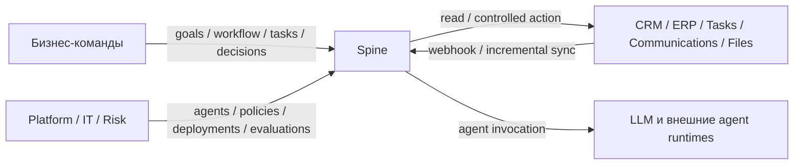
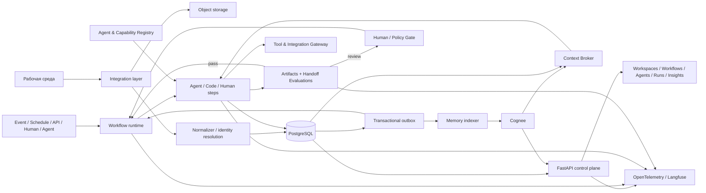
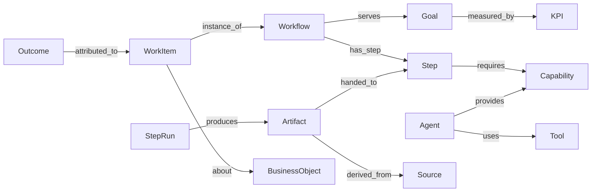
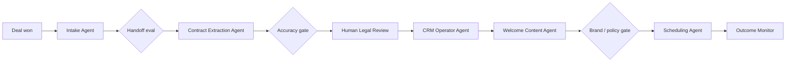

# Архитектура Spine

Статус: **предлагаемая архитектура**  
Версия: **0.6**
Область: переход от Q&A-прототипа на Cognee к платформе контекстно-зависимой оркестрации множества AI-агентов и людей.

## 1. Назначение

Spine — корпоративная платформа operational AI. Она подключает рабочую среду компании к каталогу специализированных AI-агентов, объединяет их с людьми в версионируемые workflow и контролирует качество каждого перехода между участниками процесса.

Spine не является одним Q&A-агентом или набором агентов для анализа задач и коммуникаций. Анализ сообщений — только один возможный capability. На той же платформе должны работать агенты для извлечения данных, исследования, квалификации лидов, подготовки документов, сверки финансовых данных, планирования, обновления CRM, контроля качества, найма и других процессов.

Продуктовый ориентир — публично описанная модель Trace: Workspaces, Workflows, Agents, Runs и Insights; context-aware agents внутри реальных процессов; сочетание AI- и human-задач; approvals, confidence gates, deployment safeguards и полная трассировка. Архитектура ниже является собственной целевой моделью Spine, а не описанием внутренней реализации Trace.

Главный пользовательский цикл:

```text
бизнес-цель и workflow
  → событие, расписание или команда запуска
  → work item с корпоративным контекстом
  → цепочка agent / code / human steps
  → проверяемый handoff после каждого шага
  → контролируемое действие и итоговый артефакт
  → измерение качества, стоимости и бизнес-результата
```

## 2. Цели и ограничения

### Цели

- Управлять каталогом многих специализированных агентов, их capabilities, версиями, tools и deployment status.
- Компоновать agent, deterministic и human steps в повторно используемые workflow.
- Объединять бизнес-объекты и знания из CRM, task trackers, коммуникаций, документов, финансовых и других систем.
- Давать ответы по корпоративному контексту с проверяемыми ссылками на источники.
- Передавать между агентами типизированные артефакты с проверкой качества каждого handoff.
- Исполнять долгоживущие процессы с retries, таймерами и ожиданием решений человека.
- Не позволять модели выполнять рискованные внешние действия без policy checks и, при необходимости, approval.
- Сохранять полную трассу: trigger → context → step → handoff → decision → action → outcome.
- Связывать каждый workflow с бизнес-целью, KPI, стоимостью и фактически достигнутым результатом.
- Поддерживать multi-tenant изоляцию и разграничение доступа.

### Продуктовые контуры

Spine должен восприниматься как единая платформа из нескольких равноправных поверхностей:

| Контур | Назначение |
|---|---|
| **Workspaces** | Интеграции, organizational context, identities, permissions и knowledge graph |
| **Agents** | Capability catalog, версии, tools, context profiles, evaluations и deployments |
| **Workflows** | Композиция agent/code/human steps, triggers, branches, gates и subworkflows |
| **Runs** | Work items, artifacts, handoffs, approvals, timeline, ошибки и replay/rollback controls |
| **Insights** | Качество agents/handoffs, drift, стоимость, automation rate и business outcomes |

Q&A, findings и inbox — приложения поверх этих контуров, а не архитектурный центр системы.

### Не-цели ближайших фаз

- Универсальный no-code конструктор любых бизнес-процессов.
- Автоматическое построение production-workflow только по текстовому описанию.
- Полностью автономные агенты с неограниченным доступом к инструментам.
- Kafka и микросервисное разбиение до появления измеримой потребности.
- Использование knowledge graph как единственного источника операционной истины.

## 3. Архитектурные принципы

1. **Postgres — источник истины.** Каталог агентов, workflow definitions, work items, артефакты, approvals и аудит хранятся независимо от LLM и knowledge graph.
2. **Cognee — перестраиваемая проекция.** Граф и векторный индекс могут быть заново созданы из канонических данных и оригиналов источников.
3. **Факт отделён от вывода.** Сырые данные, нормализованные факты и probabilistic conclusions модели имеют разные модели хранения.
4. **Контекст имеет происхождение.** Любой артефакт или вывод, влияющий на действие, должен ссылаться на использованные источники и upstream artifacts.
5. **At-least-once + идемпотентность.** Повторная доставка webhook, события или Activity не должна приводить к повторному внешнему действию.
6. **Агент заменяем.** Workflow зависит от capability и типизированного контракта, а не от конкретной модели или реализации агента.
7. **Durability принадлежит Temporal.** Собственные циклы агентов и дополнительные orchestration-библиотеки не должны создавать конкурирующее долговременное состояние.
8. **Модульный монолит сначала.** Границы модулей задаются заранее, но deployable units выделяются только по операционной необходимости.
9. **Контракты версионируются.** Workflow, prompt, detector, agent, доменная схема и формат событий имеют явные версии.
10. **Handoff — граница контроля.** Каждый переход agent→agent, agent→human и human→agent может иметь schema, evaluator и quality gate.
11. **Безопасное исполнение.** Policy определяет доступ к контексту и tools; workflow исполняет действие только после необходимых gates.
12. **Ценность измеряется на уровне workflow.** Успешный LLM-вызов не равен бизнес-результату; качество, стоимость и KPI агрегируются от шага до outcome.

## 4. Контекст системы



Внешняя система остаётся источником истины для собственных объектов: например, статус задачи принадлежит Bitrix24. Spine хранит локальную каноническую проекцию, историю наблюдений и результаты своей автоматизации.

## 5. Контейнеры и потоки



### Логические контейнеры

| Контейнер | Ответственность | Масштабирование |
|---|---|---|
| `api` | REST API, auth context, Q&A, команды и read models | Горизонтально, stateless |
| `connector-worker` | Webhooks, polling, cursors, rate limits источников | По источнику и workspace |
| `projection-worker` | Нормализация, identity resolution, Cognee indexing | По очередям и типам данных |
| `agent-runtime` | Запуск локальных agent handlers; extension seam для будущих remote adapters | По capability/model/tool profile |
| `evaluation-worker` | Проверка step output и handoff contracts | По evaluator type/version |
| `temporal-worker` | Workflow definitions, routing, timers, gates и Activities | По task queue/domain |
| `web` | Workspaces, Workflows, Agents, Runs, Insights, approvals | Статическая доставка + API |

На старте это один репозиторий и общий Python package. API и workers запускаются отдельными процессами, но не являются отдельными сервисами владения данными.

Архитектура делится на четыре plane:

- **Control plane** — каталог агентов, workflow definitions, policies, deployments и UI.
- **Execution plane** — Temporal, agent runtime, tools, handoffs и approvals.
- **Context plane** — integrations, canonical data, Cognee и retrieval policies.
- **Assurance plane** — tracing, evaluations, release gates, audit и outcome accounting.

## 6. Владение данными

| Хранилище | Назначение | Авторитетность |
|---|---|---|
| PostgreSQL | Каталог агентов, workflow, business objects, work items, artifacts, evaluations, runs, approvals, audit, outbox | Источник истины Spine |
| S3/MinIO | Сырые payload, оригиналы файлов и вложения | Неизменяемый первичный материал |
| Cognee relational/vector/graph stores | Семантический поиск и связи | Перестраиваемая проекция |
| Temporal persistence | Event history активных и завершённых workflow | Источник истины исполнения workflow |
| Langfuse/OTel backend | LLM traces, latency, tokens, costs, eval scores | Диагностическая телеметрия |
| Redis, опционально | Cache, rate limiting, краткоживущий pub/sub | Никогда не источник истины |

Состояние одного бизнес-объекта не должно одновременно независимо редактироваться в Postgres и Cognee. Сначала фиксируется каноническое изменение, затем outbox запускает обновление проекции.

## 7. Доменная модель

### Workspace и доступ

- `Workspace` — граница tenant isolation.
- `Environment` — изолированный контур `development`, `staging` или `production` внутри workspace; bindings, credentials, runs и policies не смешиваются между средами.
- `User`, `Team`, `Role`, `Membership` — люди и организационная структура.
- `ServicePrincipal` — идентичность connector или agent worker.
- `AccessPolicy` — правила чтения данных и исполнения действий.

### Интеграции и происхождение

- `Connection` — подключение конкретного workspace к внешней системе.
- `SyncCursor` — позиция incremental sync.
- `SourceObject` — внешний объект со стабильной парой `(connection_id, external_id)`.
- `SourceRevision` — неизменяемая наблюдавшаяся версия внешнего объекта.
- `Attachment` — ссылка на оригинал в object storage.
- `IngestionRun` — состояние и метрики одной синхронизации.

### Каталог возможностей и агентов

- `CapabilityDefinition` — стабильный контракт способности, например `extract_contract_terms`, `qualify_lead`, `reconcile_invoice` или `draft_customer_reply`.
- `AgentDefinition`, `AgentVersion` — идентичность агента и неизменяемая версия его конфигурации.
- `AgentDeployment` — активная версия в `dev`, `shadow`, `canary` или `production`.
- `AgentBinding` — выбор реализации для capability в конкретном workspace/workflow.
- `AgentPackage`, `Publisher`, `Certification` — пакет встроенного или стороннего агента, его издатель и результат проверки.
- `AgentOwner`, `RiskTier`, `SecurityReview` — ответственный человек/команда, класс риска и актуальность review.
- `ToolDefinition`, `ToolVersion`, `ToolGrant` — инструмент, контракт и разрешение на использование.
- `MCPServerDefinition`, `ExternalAPIGrant` — инвентаризация подключённых MCP/API и доступных операций.
- `PromptVersion`, `ModelProfile`, `ContextProfile` — независимо версионируемые компоненты runtime.

Агент может быть встроенным LLM-agent, детерминированным сервисом, внешним agent endpoint или адаптером к сторонней платформе. Workflow обращается к capability; binding выбирает конкретного исполнителя. Регистрация через SDK не даёт автоматического production-доступа: сторонний пакет проходит certification, получает owner и ограниченные grants.

### Workflow, работа и бизнес-результат

- `BusinessGoal`, `KPIDefinition`, `OutcomeRecord` — зачем существует автоматизация и какой результат она дала.
- `WorkflowDefinition`, `WorkflowVersion`, `TriggerDefinition` — схема процесса и способы запуска.
- `StepDefinition` — `agent`, `code`, `human`, `subworkflow` или `gate`; содержит title, status model, assignee, typed input/output и dependencies.
- `ActorRef` — равноправный assignee типа `human`, `team`, `agent` или `service`.
- `WorkItem` — единица работы, проходящая через workflow.
- `WorkflowRun`, `StepRun`, `AgentRun` — конкретные исполнения.
- `Artifact` — типизированный результат шага: документ, dataset, решение, план, draft, report или произвольный domain payload.
- `Handoff` — передача artifact между шагами с контрактом качества.
- `EvaluationResult`, `GateDecision` — проверка результата и решение о маршрутизации.
- `ApprovalRequest`, `Decision`, `ActionExecution` — human-in-the-loop и внешние действия.
- `WorkflowDraft`, `WorkflowCompilation` — результат преобразования process description в проверяемый черновик workflow.
- `AutomationOpportunity` — объяснимое предложение нового workflow/step на основе повторяющихся runs, но не автоматически развёрнутая автоматизация.

```text
WorkflowVersion
  └── StepDefinition[]
        ├── invokes CapabilityDefinition
        ├── produces ArtifactSchema
        └── HandoffPolicy
              ├── EvaluatorDefinition[]
              ├── pass/fail thresholds
              └── on_fail: retry | fallback | human | stop
```

### Канонические бизнес-объекты

- Общие: `Person`, `Organization`, `Team`, `Project`, `Document`.
- Расширяемые domain entities: `Task`, `Message`, `Contract`, `Lead`, `Deal`, `Invoice`, `Candidate`, `Order` и другие.
- `EntityLink` — связь канонической сущности с одним или несколькими `SourceObject`.
- `DomainEvent` — нормализованный факт изменения.

Новые предметные области подключаются модулями, не расширением одной универсальной таблицы. Каноническая модель не должна пытаться сохранить каждое поле всех источников: общие поля типизируются, а специфические остаются в `source_payload`/`attributes` с версией схемы.

### Сигналы, findings и доказательства

- `Finding` — обнаруженная ситуация: `unanswered`, `blocked`, `commitment`, `complaint`, `sla_risk`.
- `Evidence` — точная ссылка на `SourceRevision` и фрагмент.
- `FindingFeedback` — подтверждение, отклонение и комментарий оператора.
- `DetectorDefinition` и `DetectorVersion` — версия правил, prompt и порогов.

Detector — один из возможных producers событий и artifacts. Он не является центральной абстракцией платформы: workflow также запускаются расписанием, человеком, API, бизнес-событием или другим агентом.

```text
Finding
  id, workspace_id, type, severity, status
  detector_version_id, confidence
  subject_type, subject_id
  first_detected_at, last_observed_at
  deduplication_key

Evidence
  finding_id
  source_revision_id
  locator: page | row | message_id | char_range
  excerpt
  observed_at
```

### Версионирование исполнения

Все definitions версионируются неизменно. Существующий run продолжает выполняться на закреплённых версиях workflow, agents, prompts, context profiles, tools и evaluators. `AuditEvent` append-only фиксирует значимые переходы, решения и изменения deployment.

## 8. Ingestion pipeline

### Последовательность

1. Connector принимает webhook или читает следующую страницу API по `SyncCursor`.
2. Сырой payload сохраняется в object storage с checksum.
3. В Postgres создаются `SourceObject` и новая `SourceRevision`.
4. Проверяется уникальный ключ события:

   ```text
   workspace_id + connection_id + external_id + external_version/event_id
   ```

5. Normalizer создаёт или обновляет канонический объект.
6. Identity resolution связывает людей, клиентов и проекты между источниками.
7. В той же транзакции записываются `DomainEvent` и outbox record.
8. Consumers обновляют read models и Cognee, публикуют доступные triggers для workflow.
9. Cursor продвигается только после надёжной фиксации принятых данных.

### Семантика ошибок

- Временная ошибка API: retry с exponential backoff и jitter.
- Ошибка одного объекта: quarantine/dead-letter без остановки всего sync.
- Неизвестная схема: сохранить raw payload, пометить ingestion warning.
- Повторное событие: вернуть прежний результат по idempotency key.
- Удаление во внешней системе: создать tombstone, а не терять историю.
- Частичное обновление: собрать новую каноническую ревизию, не заменять неизвестные поля `null`.

## 9. Контекстный слой Cognee

Cognee отвечает за semantic retrieval и навигацию по связям, но не определяет актуальное состояние workflow или разрешение на действие.

### Два режима загрузки

1. **Неструктурированные материалы** — документы, сообщения, отчёты, спецификации и другие artifacts загружаются через `remember()` с provenance metadata.
2. **Структурированные сущности** — бизнес-объекты, workflow, agents, capabilities и результаты работы записываются как собственные Pydantic `DataPoint` с явными связями.

Базовая графовая схема:



### Идентичность и дедупликация

- ID структурированного `DataPoint` детерминированно выводится из `workspace_id`, типа и canonical entity ID.
- Для известных бизнес-ключей задаются deduplication fields.
- LLM-extracted entity не сливается с канонической сущностью без достаточного evidence.
- Результат ambiguous identity resolution хранит candidates и требует дополнительного сигнала или ручного подтверждения.

### Dataset strategy

Dataset — граница доступа, а не просто тематическая папка. Базовый ключ:

```text
workspace:{workspace_id}:security-domain:{domain}
```

`node_set` используется для типа источника, проекта или другого retrieval scope. Нельзя полагаться на `node_set` как на единственный security boundary.

### Retrieval contract

Контекстный слой возвращает не готовую строку, а типизированный результат:

```text
RetrievalResult:
  chunks[]
  entities[]
  relations[]
  references[]
  retrieval_strategy
  index_version
```

Q&A — один consumer этого контракта. Любой agent step получает контекст через `Context Broker` и собственный versioned `ContextProfile`: разрешённые datasets, relation traversal, freshness limits, token budget и retrieval strategy. Агент не подключается к общему графу с неограниченным запросом. Broker применяет tenant/role/purpose policy, журналирует выданный context bundle и возвращает минимально необходимый срез. Перед важным действием актуальность объектов дополнительно проверяется в Postgres или исходной системе.

### Среды

- Local development: Kuzu и локальный vector store.
- Production: Neo4j или другой concurrency-safe graph backend; vector backend выбирается нагрузочным тестом, предпочтительно `pgvector` на ранней стадии для сокращения инфраструктуры.
- Reindex выполняется отдельным workflow с shadow index и переключением версии после проверки.

## 10. Платформа агентов

### Агент как deployable component

Агент — версионируемый исполнитель одного или нескольких capabilities, а не глобальный чат-бот. Схемы принадлежат контракту capability, поэтому одна версия агента может безопасно предоставлять несколько capabilities с разными входами и выходами:

```text
CapabilityContract:
  capability
  input_schema
  output_schema
  handler_key

AgentVersion:
  capability_contracts[]
  runtime: llm | code | external
  model_profile
  prompt_version
  context_profile
  tool_grants[]
  resource_limits
  runtime_retry_policy
  evaluation_suite
```

`runtime_retry_policy` задаёт только короткие технические повторы одной попытки вызова. Долговременные retry, fallback, human review и stop определяются workflow и handoff policy; реализация агента не запускает собственный durable retry loop.

Платформа не ограничивает число или предметную область агентов. Возможные функциональные категории, не являющиеся иерархией Python-классов:

- intake/router — классификация и маршрутизация работы;
- extractor/normalizer — извлечение структурированных данных;
- researcher/retriever — сбор контекста и проверка источников;
- planner/coordinator — декомпозиция work item;
- domain specialist — legal, sales, finance, HR, operations;
- generator — документ, письмо, отчёт, план или другой artifact;
- reviewer/critic — проверка результата другого агента;
- operator — контролируемые изменения во внешних системах;
- monitor — проверка outcome и drift после выполнения.

Один агент может использовать разные модели в разных версиях. Один capability может иметь несколько bindings: дешёвый default, более сильный fallback или tenant-specific implementation; binding на внешний агент появится только вместе с будущим remote adapter.

### Agent runtime seam

В текущем scope Spine поддерживает две формы локальной реализации:

1. объект, структурно удовлетворяющий небольшому `AgentHandler` protocol;
2. обычную async-функцию, приведённую к тому же interface через adapter.

Наследование от framework-specific `BaseAgent` не требуется. Явный runtime registry сопоставляет стабильный `implementation_key` с factory и handlers конкретных capabilities. Автоматическое сканирование модулей и исполнение произвольных import paths из хранимой конфигурации запрещены.

```text
AgentHandler[InputT, OutputT]:
  invoke(AgentRequest[InputT], AgentExecutionContext)
    → AgentResponse[OutputT]
```

Одна `AgentVersion` может объединять несколько связанных handlers, но workflow step вызывает ровно один capability. Каждому capability соответствует отдельный типизированный handler; универсальный строковый router внутри реализации не является interface платформы.

Внешние agent endpoints, сторонний Agent SDK, package trust и transport protocol не входят в текущий scope четырёх приоритетных кейсов. Runtime seam должен позволить позднее добавить remote adapter без изменения workflow и capability contracts. Когда появится подтверждённый кейс внешнего агента, отдельно выбираются protocol, manifest, health, cancellation, artifact transfer и certification; Agno не становится обязательной зависимостью Spine.

`AgentPackage` остаётся каталоговой и дистрибуционной сущностью для встроенных и будущих сторонних реализаций: `Publisher → Package → Version → Certification → Deployment`. Это не runtime team и не скрытый workflow.

### Унифицированный контракт запуска

```text
AgentInvocation:
  workspace_id
  environment
  work_item_id
  workflow_run_id
  step_run_id
  agent_run_id
  capability
  acting_on_behalf_of
  input_artifacts[]
  context_request
  constraints
  idempotency_key
  trace_id

AgentResult:
  status
  output_artifacts[]
  evidence_refs[]
  confidence
  structured_metrics
  proposed_actions[]
  trace_ref
```

Платформенный `AgentInvocation` содержит ссылки на сохранённые artifacts и полный execution identity. До вызова локальной реализации runtime проверяет binding и grants, загружает input artifacts, валидирует capability schema и строит:

```text
AgentRequest[InputT]:
  capability
  input
  constraints

AgentExecutionContext:
  workspace_id
  environment
  work_item_id
  workflow_run_id
  step_run_id
  agent_run_id
  acting_on_behalf_of
  idempotency_key
  trace_id
  deadline
  context_profile
  permitted_tools
  event_sink
  cancellation

AgentResponse[OutputT]:
  status
  output
  evidence_refs[]
  confidence
  structured_metrics
  proposed_actions[]
```

Handler возвращает значение, а не сохраняет Spine artifacts. Runtime валидирует response, сохраняет output, evidence и proposed actions с lineage и формирует `AgentResult`. Так persistence, provenance и idempotency не дублируются в каждой реализации.

`EventSink` принимает версионированные progress, tool-call и usage events и не раскрывает chain-of-thought. Финальный response не смешивается с event iterator. Runtime управляет cancellation scope; handler получает cooperative cancellation через execution context. Для будущего remote adapter эти операции отображаются на transport-specific events и cancel.

Реализация stateless между вызовами: в объекте допустимы неизменяемые зависимости и безопасные технические caches, но состояние run, workflow, approvals и retries принадлежит платформе.

Реализация capability может кратковременно координировать внутренние model/agent calls. Все такие вызовы создают nested traces. Если внутренний переход создаёт самостоятельно оцениваемый artifact, требует approval, выполняет внешнее действие, имеет собственный retry lifecycle или должен пережить рестарт, он становится явным workflow step.

`AgentResult` не считается принятым автоматически. Workflow передаёт его в handoff evaluation.

### Handoff и evaluation gates

Каждый переход определяет:

- какую artifact schema обязан выдать upstream step;
- какие обязательные поля и evidence нужны;
- deterministic validators;
- semantic/domain evaluators;
- confidence, cost и latency thresholds;
- поведение при неуспехе: retry, fallback agent, human review, partial route или stop.

Проверка выполняется на каждом критичном handoff, а не только на финальном ответе. Это позволяет локализовать drift конкретного агента и не маскировать ошибку последующим правдоподобным результатом.

### Жизненный цикл агента

```text
draft
  → offline eval
  → shadow run
  → canary binding
  → production
  → continuous handoff eval
  → rollback / superseded
```

Публикация новой версии блокируется release gates: schema compatibility, regression suite, security/tool review, cost budget и минимальные quality thresholds.

### Централизованный governance

Agent inventory отвечает не только на вопрос «какая версия работает», но и:

- кто владелец и от чьего имени действует агент;
- где он развёрнут и какие workflow его вызывают;
- какие данные, tools, MCP servers и external APIs ему доступны;
- когда grants и security review истекают;
- какие downstream agents получают его artifacts;
- каковы risk tier, затраты, failure/drift history и текущий health;
- можно ли мгновенно отключить deployment или конкретный grant.

Для этого нужны periodic access review, expiring grants, orphaned-agent detection, kill switch и blast-radius query по графу зависимостей. Права пользователя, создавшего агента, нельзя молча наследовать как runtime-права агента.

### Инструменты

Каждый tool имеет типизированные input/output schemas, permissions, признак read-only/mutating, timeout, retry и idempotency strategy, redaction policy и audit metadata. Agent получает минимальный набор tools для конкретного step. Динамический выбор произвольного внешнего tool запрещён в первой production-версии.

## 11. Workflow orchestration

Temporal исполняет долгоживущие бизнес-процессы. Workflow содержит только детерминированное управление состоянием. Сеть, Postgres, Cognee, LLM и внешние системы вызываются из Activities.

Использование механизмов Temporal:

- `Workflow` — жизненный цикл work item и координация heterogeneous steps.
- `Activity` — LLM call, retrieval, DB operation или внешний API.
- `Signal` — approval, reject, cancel или внешнее изменение.
- `Update` — валидируемая синхронная команда к активному workflow.
- `Query` — чтение текущего состояния run.
- `Timer` — SLA, grace period и reminder.
- `Child Workflow` — изолированный повторно используемый процесс.
- `Schedule` — периодический sync или monitor cycle.

### Состав workflow

Workflow graph поддерживает пять типов step:

1. `agent` — вызов capability через Agent Binding.
2. `code` — детерминированное преобразование или бизнес-правило.
3. `human` — задача, решение или редактирование artifact.
4. `gate` — evaluation, policy, approval или branch.
5. `subworkflow` — повторно используемый процесс.

Форма Python-реализации не определяет тип step. Async-функция является `code` step, если workflow напрямую закрепляет детерминированное преобразование или бизнес-правило и для него не нужны Agent Binding и deployment lifecycle. Та же техническая форма может быть подключена function adapter как `agent` step, только если она является заменяемой версионируемой реализацией capability и управляется через каталог, binding, deployment и evaluations.

Human step является first-class узлом с теми же input/output contracts, deadline, status и handoff evaluation, что и agent step. Человек — не только аварийный fallback: workflow может изначально распределять judgement-heavy работу людям, а повторяемые операции — агентам.

Пример cross-functional onboarding:



Другие workflow используют те же платформенные примитивы: sales pipeline, invoice reconciliation, candidate screening, procurement, reporting, incident response, document production или customer operations.

Workflow ID выводится из бизнес-ключа trigger/work item. Это защищает от создания нескольких процессов на одно событие. Конкретный агент не зашит в workflow: step ссылается на capability и разрешает runtime выбрать подходящий versioned binding.

### Process description → workflow draft

Бизнес-команда может описать процесс естественным языком. `Workflow Compiler` извлекает tasks, dependencies, assignees, inputs, outputs, tools и gates, но создаёт только `WorkflowDraft`. Перед публикацией выполняются schema checks, cycle/dead-end detection, permission analysis, cost estimate, eval suite и human review. Автоматическая генерация не должна обходить обычный deployment lifecycle.

История runs может использоваться для process mining: повторяющиеся ручные переходы и bottlenecks превращаются в `AutomationOpportunity` с evidence и прогнозом эффекта. Предложение не публикуется и не меняет workflow без решения владельца процесса.

## 12. Policy и human-in-the-loop

Policy применяется к запуску агента, доступу к контексту, handoff и `ProposedAction`:

- кто инициировал действие;
- к какому workspace и объекту оно относится;
- какие данные использовались;
- какой tool и permission нужны;
- confidence и полнота evidence;
- стоимость и обратимость;
- внешняя аудитория и потенциальный ущерб.

Пример начальной матрицы:

| Действие | Политика |
|---|---|
| Read-only extraction/research | Автоматически в пределах разрешённого context profile |
| Передать artifact следующему агенту | После успешного handoff evaluation |
| Подготовить draft документа/ответа | Автоматически |
| Создать внутренний work item | По workflow policy |
| Внешняя коммуникация | Human или policy approval в зависимости от workspace |
| Изменить финансовые/договорные данные | Запрещено либо двойной approval |
| Удалить данные | Отдельное административное разрешение |

Approval должен иметь срок действия. Перед исполнением после длительного ожидания Activity повторно проверяет актуальность объекта и policy.

## 13. API

Базовый namespace: `/api/v1`.

```text
/workspaces              tenants, memberships и environments
/overview                role-aware operational summary
/activity                unified activity feed
/issues                  blocked/failed/review counters
/connections             управление подключениями
/connections/{id}/sync   запуск синхронизации
/source-objects           диагностика происхождения
/capabilities             контракты возможностей
/agents                   определения, версии и bindings
/agents/{id}/deployments  shadow/canary/production lifecycle
/agent-packages           third-party manifests и certification
/tools                    tool registry и grants
/mcp-servers              inventory и разрешённые operations
/workflows                определения и версии
/workflow-drafts          NL compilation и validation report
/automation-opportunities process-mining suggestions
/work-items               единицы работы
/runs                     workflow/step/agent runs и timeline
/artifacts                результаты и provenance
/handoffs                 передачи и evaluation results
/evaluations              suites, evaluators и regression runs
/approvals                очередь решений
/approvals/{id}/decision  approve/reject/edit
/actions                  предложенные и выполненные действия
/goals                    business goals, KPI и outcomes
/findings                 опциональный operational inbox
/ask                      Q&A с citations
/audit                    журнал действий
```

Q&A response:

```json
{
  "answer": "...",
  "citations": [
    {
      "source_object_id": "...",
      "source_revision_id": "...",
      "locator": {"message_id": "..."},
      "excerpt": "..."
    }
  ],
  "confidence": 0.86,
  "trace_id": "...",
  "as_of": "..."
}
```

Все list endpoints используют cursor pagination. Мутирующие команды принимают `Idempotency-Key`. Для обновления UI достаточно SSE; WebSocket добавляется только для сценариев с двусторонним real-time взаимодействием.

## 14. Продуктовый интерфейс

Интерфейс — обязательная часть control и assurance plane. Ценность Spine заключается не только в исполнении workflow, но и в том, что бизнес-команды видят работу людей и AI как одну управляемую систему, а IT/Risk контролируют deployments, permissions и качество.

### Инсайты из интерфейса Trace

Публичные макеты Trace показывают несколько устойчивых паттернов:

- breadcrumb задаёт `workspace / environment / section`, например `Nexflow / Production / Workflows`;
- верхний уровень разделён на `Overview`, `Runs`, `Workflows` и `Activity`, рядом всегда виден счётчик active issues;
- список workflow показывает status, компактный step progress, trigger/actor и duration, а также метки `auto`, `scheduled`, `manual`, `latest`, `requires review`;
- каталог агентов показывает active agents, tasks today, average confidence, current task и status каждого агента;
- integrations сгруппированы по доменам, показывают sync health, last sync и количество проиндексированных объектов;
- сводка context layer показывает entities, relationships и connected tools.

Отсюда следует UI-принцип Spine: **по умолчанию показывать операционное состояние и исключения, а не начинать работу с чата**. Q&A остаётся глобальным способом исследования контекста, но не домашним экраном платформы.

### App shell и навигация

Постоянная верхняя/боковая рамка содержит:

- workspace selector;
- environment selector с заметной маркировкой production;
- global search/command palette;
- active issues и approvals;
- текущую роль/acting context;
- профиль и audit-visible session information.

Основная навигация:

```text
Overview
Workflows
Agents
Runs
Work Queue / Approvals
Insights
Context
Integrations
Governance
Settings
```

Набор разделов и действий зависит от роли, но URL и сущности остаются едиными. Пользователь не должен случайно выполнять production-действие, находясь в development UI: среда входит в route/context каждого запроса.

### Основные экраны

#### Overview

- активные и заблокированные workflow;
- runs requiring attention;
- pending approvals;
- agent/context/integration health;
- automation rate, cost и выбранные business KPI;
- недавняя activity timeline;
- быстрые переходы к проблеме, а не только агрегированные графики.

#### Workflows

List view показывает status, version/deployment, progress, trigger, owner, assignee mix, duration и active issues. Detail view содержит:

- visual DAG/canvas;
- список steps с typed input/output;
- agent bindings и human assignees;
- gates, retries и fallback paths;
- trigger/schedule;
- версии и diff;
- validation report и deployment controls;
- связанные goals/KPI и последние runs.

Visual editor появляется после стабилизации DSL. До этого workflow можно хранить как code/config, а UI использовать для read-only визуализации, diff и deployment review.

#### Agents

List view показывает agent status, capability, current task, owner, deployment, confidence/quality и cost. Detail view содержит:

- manifest и publisher/certification;
- capabilities и schemas;
- active version и environment bindings;
- model, prompt и context profile;
- tools/MCP/API grants;
- dependent/downstream workflow graph;
- eval history, drift, latency и cost;
- security review и kill switch.

Confidence нельзя показывать как единственный показатель качества. Рядом должны быть sample size, evaluator/version, handoff pass rate и freshness окна.

#### Runs

List view следует паттерну status + progress + triggered by + duration. Run detail объединяет:

- workflow graph с текущим/неуспешным step;
- событийную timeline;
- inspector выбранного step;
- input/output artifacts и evidence;
- handoff evaluation и причины gate decision;
- model/tool/context versions и cost;
- retry, cancel, resume, fallback и replay controls согласно permissions.

UI не показывает скрытую chain-of-thought. Он показывает structured reasoning summary, источники, факторы решения и проверяемые артефакты.

#### Work Queue и approvals

Единая очередь работы для людей, где human steps являются first-class assignments:

- приоритет, deadline/SLA и причина назначения;
- требуемое решение или редактируемый artifact;
- upstream context и evidence;
- downstream impact;
- approve, reject, edit, reassign и request-more-context;
- optimistic locking, чтобы два человека не приняли конфликтующие решения.

#### Insights

- workflow outcome и business KPI;
- cost/time saved с явной методикой расчёта;
- automation/human-touch rate;
- agent version comparison;
- handoff failure и drift heatmap;
- bottlenecks и automation opportunities;
- фильтрация по workspace, environment, workflow, team, agent и периоду.

#### Context и Integrations

Integration view группирует источники по категориям и показывает health, last successful sync, lag, errors, indexed object counts и действие resync. Context Explorer показывает entities/relations, source revisions, access boundary и freshness. Редактировать канонические факты непосредственно в graph explorer нельзя.

#### Governance

- полный agent inventory;
- agents без owner, review или актуального deployment;
- tools/MCP/API access matrix;
- expiring grants и security reviews;
- acting identities и delegated authority;
- blast-radius explorer;
- audit search и emergency kill switch.

### Общие UI-состояния

Для workflow, agent, integration, run и gate используется единая status taxonomy:

```text
draft | validating | ready | scheduled | running | waiting
needs_review | blocked | failed | completed | cancelled | disabled
```

Цвет никогда не является единственным носителем статуса: нужны текст и icon. Для каждой async-команды UI показывает `accepted → running → terminal state`, idempotency key и ссылку на run. Empty, loading, partial, stale, permission-denied и degraded состояния проектируются явно.

### Frontend architecture

- TypeScript + React/Next.js.
- Сгенерированный из OpenAPI typed client; UI не дублирует серверные domain schemas вручную.
- TanStack Query для server state; URL хранит filters, selected workspace/environment и navigation state.
- React Flow или аналог только для visual DAG после стабилизации workflow DSL.
- SSE для runs, approvals, agent status и integration health; polling как fallback.
- Postgres read models/materialized projections для списков и dashboard; браузер не обращается напрямую к Temporal, Cognee или Langfuse.
- RBAC/ABAC проверяется сервером; скрытие кнопки в UI не является контролем доступа.
- Feature flags для canary UI и новых deployment controls.
- Общий design system для status, severity, confidence, lineage, diff и destructive-action/confirmation patterns.

### UI delivery slices

1. **Foundation:** app shell, workspace/environment, auth, design system и generated API client.
2. **Observe:** Overview, integrations health, agent/workflow/run lists и read-only run timeline.
3. **Decide:** Work Queue, approvals, artifact/evidence inspector и activity feed.
4. **Control:** agent detail, grants, deployments, validation reports и governance.
5. **Compose:** read/write workflow canvas, version diff и draft publication.
6. **Improve:** Insights, outcome attribution, drift и automation opportunities.

Первый UI-релиз должен позволять наблюдать и безопасно принимать решения; полноценный visual builder не должен блокировать ранний production-срез.

## 15. Предлагаемая структура кода

```text
src/spine/
  api/
    routers/
    dependencies/
    schemas/
  auth/
  domain/
    connections/
    sources/
    entities/
    capabilities/
    agents/
    work_items/
    artifacts/
    handoffs/
    evaluations/
    goals/
    findings/
    workflows/
    approvals/
    actions/
  application/
    commands/
    queries/
    policies/
  infrastructure/
    db/
    object_storage/
    outbox/
    telemetry/
  connectors/
    base.py
    bitrix24/
    telegram/
    files/
  ingestion/
    normalization/
    identity/
  memory/
    cognee/
      models/
      indexing/
      retrieval/
  agents/
    catalog/
    sdk/
    governance/
    runtime/
    adapters/
    tools/
    prompts/
  evaluations/
    handoff/
    regression/
    release_gates/
  detectors/
  workflows/
    temporal/
      definitions/
      activities/
  evals/
  workers/

web/
  app/
    overview/
    workflows/
    agents/
    runs/
    work-queue/
    insights/
    context/
    integrations/
    governance/
  components/
  features/
  api/generated/
  design-system/
```

Зависимости направлены внутрь: domain не импортирует FastAPI, Cognee, Temporal или конкретный database adapter.

## 16. Рекомендуемый стек

- Python, FastAPI, Pydantic.
- SQLAlchemy 2 async + Alembic + PostgreSQL.
- Cognee для graph/vector memory.
- Temporal Python SDK.
- LiteLLM + Instructor/Pydantic structured outputs.
- S3/MinIO для оригиналов.
- OpenTelemetry для end-to-end correlation.
- Langfuse для LLM tracing, prompt management и evals.
- Pytest, Testcontainers и Temporal time-skipping tests.
- React/Next.js для Ops UI, когда API-контракты стабилизируются.
- Storybook и Playwright для component, accessibility и end-to-end UI tests.

Версии ключевых зависимостей фиксируются совместимыми диапазонами или lock-файлом. Обновление Cognee, Temporal SDK, модели embeddings или dimension требует отдельной миграционной процедуры и regression eval.

## 17. Безопасность и multi-tenancy

- `workspace_id` обязателен во всех tenant-owned таблицах и событиях.
- Postgres Row-Level Security — дополнительная защита от ошибок application filters.
- Dataset Cognee выделяется по workspace и security domain.
- Credentials подключений хранятся в secrets manager, не в payload и не в graph.
- Каждый agent deployment работает как отдельный service principal и получает минимальные, ограниченные по scope и времени permissions.
- Вызов всегда содержит `acting_on_behalf_of`; права создателя агента не наследуются автоматически.
- Tool Gateway выдаёт краткоживущие credentials либо выполняет операцию от имени агента, не раскрывая постоянный secret.
- Third-party agent endpoints получают egress allowlist, data classification policy и явный список передаваемых полей.
- Реестр хранит owner, publisher, deployments, tools/MCP/API grants, дату security review и kill-switch status.
- PII и secrets редактируются перед отправкой в LLM/telemetry согласно policy.
- Все исходящие действия связываются с `actor`, `workflow_run`, `approval` и `trace_id`.
- Audit log append-only; административные операции также журналируются.
- Retention и право удаления распространяются на raw storage, Postgres, Cognee и observability backend.
- Prompt injection из документов считается недоверенным вводом: найденный текст никогда не меняет system policy или список tools.

## 18. Наблюдаемость и качество

Единый `trace_id` проходит через API, outbox, Temporal, Cognee retrieval, LLM generation и внешний action.

### Технические метрики

- ingestion lag и sync error rate;
- outbox age и retry count;
- Cognee indexing lag;
- Temporal workflow/activity failures;
- API latency и error rate;
- LLM latency, tokens и cost;
- connector rate-limit utilization.
- active agents без owner или с просроченным security review;
- grants по risk tier, expiring grants и orphaned deployments;
- blast radius агента/tool по числу зависимых workflow и downstream steps.

### Продуктовые метрики

- success, fallback и retry rate по agent version/capability;
- pass rate и drift по каждому handoff;
- доля human corrections и размер правки artifact;
- end-to-end workflow completion time и automation rate;
- стоимость на work item и на успешный outcome;
- approval wait time и rejection rate;
- business KPI до/после deployment и outcome attribution;
- для detectors как частного случая: precision, recall и false-positive rate.

### Eval strategy

- Golden dataset из реальных обезличенных кейсов.
- Детерминированные проверки evidence и schemas.
- Offline regression при изменении agent, prompt, model, tool или retrieval.
- Eval suite для каждого capability и contract tests для каждого handoff.
- Shadow/canary mode до полного production binding.
- Human corrections и неуспешные runs возвращаются в eval datasets.
- Continuous evaluation промежуточных artifacts, а не только финального результата workflow.
- LLM-as-a-judge используется как дополнительный сигнал, а не единственный критерий выпуска.
- Third-party agent package проходит тот же набор security, compatibility и quality gates, что и встроенный агент.

## 19. Тестовая стратегия

| Уровень | Проверяет |
|---|---|
| Unit | Domain rules, policies, deduplication, normalization |
| Contract | API источников, webhook schemas, tool contracts |
| Integration | Postgres/outbox, Cognee indexing/retrieval, object storage |
| Workflow | Timers, Signals, retries, cancellation, replay compatibility |
| Eval | Agent capability, handoff и Q&A quality на versioned datasets |
| UI component | Design-system states, permissions, artifact renderers, accessibility |
| UI end-to-end | Workspace/environment isolation, run inspection, approval и deployment flows |
| End-to-end | Trigger → multi-agent workflow → gates → outcome → audit |

Temporal workflow tests используют time skipping. Внешние API и LLM подменяются записанными контрактными fixtures. Для каждого mutating tool обязателен тест повторного вызова с тем же idempotency key.

## 20. План эволюции

Эволюция идёт вертикальными продуктовыми релизами. Data, context, execution,
assurance и UI развиваются вместе в объёме, необходимом очередному кейсу. Нельзя
считать отдельный технический слой законченным релизом без пользовательского
сценария и измеримого результата.

Порядок кейсов фиксирован:

1. **Q&A по внутренним документам** — надёжный context layer, provenance,
   object-level access control, citations, abstention, evals и Q&A UI.
2. **Генерация коммерческих предложений** — первый долгоживущий workflow:
   structured requirements, поиск аналогов, typed estimate, clarification loop,
   human edit/approval и экспорт документа.
3. **Мониторинг клиентских коммуникаций** — conversation model, versioned
   detectors, finding lifecycle, priority, notifications и Findings Inbox.
4. **Контроль исполнения внутренних задач** — task timeline, business calendars,
   SLA, responsibility resolution, escalation и управленческий overview.

Общие platform abstractions извлекаются из работающих vertical slices. Agent SDK,
third-party certification, универсальный visual builder и process mining не
опережают первые четыре кейса. Детальный scope, exit criteria и non-goals каждого
релиза определены в `docs/ROADMAP.md`.

## 21. Критерий первого production-среза

Первый production-срез — Q&A по внутренним документам. Он готов, когда система:

1. Версионирует исходные документы и сохраняет stable provenance locators.
2. Может удалить и полностью перестроить Cognee-проекцию из канонических данных.
3. Проверяет object-level access policy во время retrieval.
4. Возвращает structured answer с citations, freshness, trace ID и явным abstention.
5. Не позволяет цитате ссылаться на недоступную или несуществующую ревизию.
6. Проходит согласованные thresholds на versioned Q&A eval dataset.
7. Даёт пользователю выполнить основной сценарий и оставить feedback через web UI.
8. Наблюдается по latency, cost, retrieval/index errors и пользовательской полезности.

Целевая зрелость всей платформы оценивается после четырёх кейсов: общие contracts
должны поддерживать query, document-generation workflow и два класса continuous
detectors без специальных обходов в platform core.

## 22. Архитектурные решения, требующие отдельного ADR

- ADR-001: Postgres как canonical store, Cognee как derived projection.
- ADR-002: границы Cognee datasets и модель доступа.
- ADR-003: Temporal как единственный durable orchestrator.
- ADR-004: transactional outbox и гарантии доставки.
- ADR-005: identity resolution между источниками.
- ADR-006: policy levels и перечень действий, требующих approval.
- ADR-007: production graph/vector backends.
- ADR-008: хранение, редактирование и retention PII.
- ADR-009: prompt/model versioning и release gates по evals.
- [ADR-010](adr/0010-capability-based-agent-runtime.md): capability contracts, local agent runtime seam, bindings и retry/fallback ownership.
- ADR-011: artifact schemas и handoff evaluation protocol.
- ADR-012: business outcome attribution и cost accounting.
- ADR-013: future third-party Agent SDK, package trust и certification после появления подтверждённого внешнего кейса.
- ADR-014: service identity, delegated authority и short-lived tool credentials.
- ADR-015: Workflow Compiler и validation lifecycle для AI-generated drafts.
- ADR-016: frontend information architecture, environment context и read-model API.
- ADR-017: workflow canvas DSL, artifact renderers и real-time update protocol.

## 23. Источники и основания решений

- [Trace](https://www.trace.so/) — публичное описание продуктовых возможностей.
- [Trace: context layer and third-party agent SDK](https://www.trace.so/blog/trace-raised-dollar3m-to-build-the-context-layer-for-ai-at-work) — ecosystem agents, context-per-agent, natural-language workflow drafts и automation suggestions.
- [Trace: enterprise agent oversight](https://www.trace.so/blog/ai-agents-growing-faster-than-enterprise-oversight) — централизованный inventory, deployment, logging и permission management.
- [Trace: AI agents are working. ROI isn't.](https://www.trace.so/blog/ai-agents-are-working-roi-isnt) — необходимость связывать agents/workflows с измеримым бизнес-результатом.
- [Trace: evaluation in the handoff layer](https://www.trace.so/blog/why-we-build-evaluation-into-handoff-layer) — проверки на каждом переходе в multi-agent workflow.
- [Cognee: core concepts](https://docs.cognee.ai/core-concepts/overview) — relational/vector/graph architecture и основные операции.
- [Cognee: custom data models](https://docs.cognee.ai/guides/custom-data-models) — структурированные `DataPoint` и явные связи.
- [Cognee: DataPoints](https://docs.cognee.ai/core-concepts/building-blocks/datapoints) — identity, versioning и deduplication.
- [Cognee: permissions](https://docs.cognee.ai/core-concepts/multi-user-mode/permissions-system/overview) — dataset-scoped access control.
- [Cognee: graph stores](https://docs.cognee.ai/setup-configuration/graph-stores) — варианты local и production backends.
- [Temporal documentation](https://docs.temporal.io/) и [Python SDK](https://github.com/temporalio/sdk-python) — durable workflows, Activities, Signals, Updates и timers.
- [Langfuse documentation](https://langfuse.com/docs) — LLM tracing, prompt management, datasets и evaluations.
