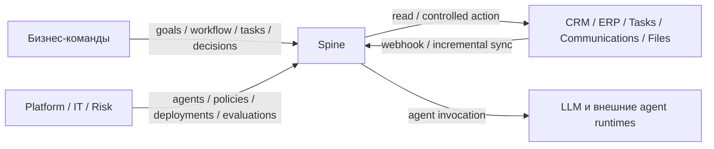
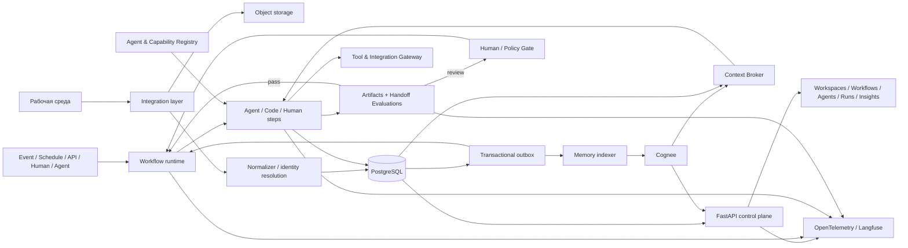
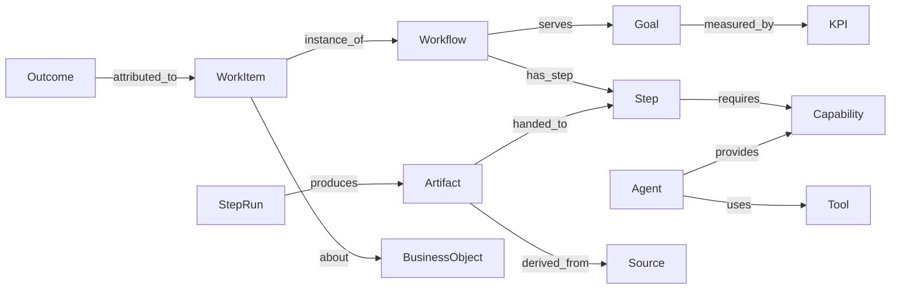
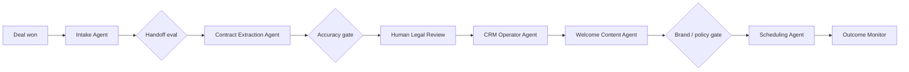

# Архитектура Spine

Статус: **предлагаемая архитектура**  
Версия: **0.9**
Область: переход от Q&A-прототипа на Cognee к платформе контекстно-зависимой оркестрации множества AI-агентов и людей.

Расшифровка технических и англоязычных понятий приведена в
[словаре архитектурных терминов](GLOSSARY.md). Канонические термины предметной
модели Spine определены в [`CONTEXT.md`](../CONTEXT.md).

## 1. Назначение

Spine — корпоративная платформа operational AI. Она подключает рабочую среду компании к каталогу специализированных AI-агентов, объединяет их с людьми в версионируемые workflow и контролирует качество каждого перехода между участниками процесса.

Spine не является одним Q&A-агентом или набором агентов для анализа задач и коммуникаций. Анализ сообщений — только один возможный capability. На той же платформе должны работать агенты для извлечения данных, исследования, квалификации лидов, подготовки документов, сверки финансовых данных, планирования, обновления CRM, контроля качества, найма и других процессов.

Продуктовый ориентир — публично описанная модель Trace: Workspaces, Workflows, Agents, Runs и Insights; context-aware agents внутри реальных процессов; сочетание AI- и human-задач; approvals, confidence gates, deployment safeguards и полная трассировка. Архитектура ниже является собственной целевой моделью Spine, а не описанием внутренней реализации Trace.

Главный пользовательский цикл:

```text
бизнес-цель и workflow
  → событие, расписание или команда запуска
  → work item с корпоративным контекстом
  → цепочка agent / code / human steps
  → проверяемый handoff после каждого шага
  → контролируемое действие и итоговый артефакт
  → измерение качества, стоимости и бизнес-результата
```

## 2. Цели и ограничения

### Цели

- Управлять каталогом многих специализированных агентов, их capabilities, версиями, tools и deployment status.
- Компоновать agent, deterministic и human steps в повторно используемые workflow.
- Объединять бизнес-объекты и знания из CRM, task trackers, коммуникаций, документов, финансовых и других систем.
- Давать ответы по корпоративному контексту с проверяемыми ссылками на источники.
- Передавать между агентами типизированные артефакты с проверкой качества каждого handoff.
- Исполнять долгоживущие процессы с retries, таймерами и ожиданием решений человека.
- Не позволять модели выполнять рискованные внешние действия без policy checks и, при необходимости, approval.
- Сохранять полную трассу: trigger → context → step → handoff → decision → action → outcome.
- Связывать каждый workflow с бизнес-целью, KPI, стоимостью и фактически достигнутым результатом.
- Поддерживать multi-tenant изоляцию и разграничение доступа.

### Продуктовые контуры

Spine должен восприниматься как единая платформа из нескольких равноправных поверхностей:

| Контур | Назначение |
|---|---|
| **Workspaces** | Интеграции, organizational context, identities, permissions и knowledge graph |
| **Agents** | Capability catalog, версии, tools, context profiles, evaluations и deployments |
| **Workflows** | Композиция agent/code/human steps, triggers, branches, gates и subworkflows |
| **Runs** | Work items, artifacts, handoffs, approvals, timeline, ошибки и replay/rollback controls |
| **Insights** | Качество agents/handoffs, drift, стоимость, automation rate и business outcomes |

Q&A, findings и inbox — приложения поверх этих контуров, а не архитектурный центр системы.

### Не-цели ближайших фаз

- Универсальный no-code конструктор любых бизнес-процессов.
- Автоматическое построение production-workflow только по текстовому описанию.
- Полностью автономные агенты с неограниченным доступом к инструментам.
- Kafka и микросервисное разбиение до появления измеримой потребности.
- Использование knowledge graph как единственного источника операционной истины.

## 3. Архитектурные принципы

1. **Postgres — источник истины.** Каталог агентов, workflow definitions, work items, артефакты, approvals и аудит хранятся независимо от LLM и knowledge graph.
2. **Cognee — перестраиваемая проекция.** Граф и векторный индекс могут быть заново созданы из канонических данных и оригиналов источников.
3. **Факт отделён от вывода.** Сырые данные, нормализованные факты и probabilistic conclusions модели имеют разные модели хранения.
4. **Контекст имеет происхождение.** Любой артефакт или вывод, влияющий на действие, должен ссылаться на использованные источники и upstream artifacts.
5. **At-least-once + идемпотентность.** Повторная доставка webhook, события или Activity не должна приводить к повторному внешнему действию.
6. **Агент заменяем.** Workflow зависит от capability и типизированного контракта, а не от конкретной модели или реализации агента.
7. **Durability принадлежит Temporal.** Собственные циклы агентов и дополнительные orchestration-библиотеки не должны создавать конкурирующее долговременное состояние.
8. **Модульный монолит сначала.** Границы модулей задаются заранее, но deployable units выделяются только по операционной необходимости.
9. **Контракты версионируются.** Workflow, prompt, detector, agent, доменная схема и формат событий имеют явные версии.
10. **Handoff — граница контроля.** Каждый переход agent→agent, agent→human и human→agent может иметь schema, evaluator и quality gate.
11. **Безопасное исполнение.** Policy определяет доступ к контексту и tools; workflow исполняет действие только после необходимых gates.
12. **Ценность измеряется на уровне workflow.** Успешный LLM-вызов не равен бизнес-результату; качество, стоимость и KPI агрегируются от шага до outcome.

## 4. Контекст системы


```mermaid
flowchart LR
    Teams[Бизнес-команды]
    Platform[Platform / IT / Risk]
    External[CRM / ERP / Tasks / Communications / Files]
    Runtimes[LLM и внешние agent runtimes]

    Spine[Spine]

    External -->|webhook / incremental sync| Spine
    Spine -->|read / controlled action| External
    Teams -->|goals / workflow / tasks / decisions| Spine
    Platform -->|agents / policies / deployments / evaluations| Spine
    Spine -->|agent invocation| Runtimes
```

Внешняя система остаётся источником истины для собственных объектов: например, статус задачи принадлежит Bitrix24. Spine хранит локальную каноническую проекцию, историю наблюдений и результаты своей автоматизации.

## 5. Контейнеры и потоки


```mermaid
flowchart LR
    Triggers[Event / Schedule / API / Human / Agent] --> Temporal[Workflow runtime]
    Sources[Рабочая среда] --> Connectors[Integration layer]
    Connectors --> Raw[Object storage]
    Connectors --> Normalize[Normalizer / identity resolution]

    Normalize --> DB[(PostgreSQL)]
    DB --> Outbox[Transactional outbox]

    Outbox --> Indexer[Memory indexer]
    Outbox --> Temporal

    Indexer --> Cognee[Cognee]
    Cognee --> ContextBroker[Context Broker]
    DB --> ContextBroker
    Temporal --> Steps[Agent / Code / Human steps]
    Registry[Agent & Capability Registry] --> Steps
    ContextBroker --> Steps
    Steps --> Handoff[Artifacts + Handoff Evaluations]
    Handoff -->|pass| Temporal
    Handoff -->|review| Approval[Human / Policy Gate]
    Approval --> Temporal
    Steps --> Tools[Tool & Integration Gateway]
    Steps --> DB

    DB --> API[FastAPI control plane]
    Cognee --> API
    API --> UI[Workspaces / Workflows / Agents / Runs / Insights]

    API --> Observability[OpenTelemetry / Langfuse]
    Temporal --> Observability
    Steps --> Observability
    Handoff --> Observability
```

### Логические контейнеры

| Контейнер | Ответственность | Масштабирование |
|---|---|---|
| `api` | REST API, auth context, Q&A, команды и read models | Горизонтально, stateless |
| `connector-worker` | Webhooks, polling, cursors, rate limits источников | По источнику и workspace |
| `projection-worker` | Нормализация, identity resolution, Cognee indexing | По очередям и типам данных |
| `agent-runtime` | Запуск локальных agent handlers; extension seam для будущих remote adapters | По capability/model/tool profile |
| `evaluation-worker` | Проверка step output и handoff contracts | По evaluator type/version |
| `temporal-worker` | Workflow definitions, routing, timers, gates и Activities | По task queue/domain |
| `web` | Workspaces, Workflows, Agents, Runs, Insights, approvals | Статическая доставка + API |

На старте это один репозиторий и общий Python package. API и workers запускаются отдельными процессами, но не являются отдельными сервисами владения данными.

Архитектура делится на четыре plane:

- **Control plane** — каталог агентов, workflow definitions, policies, deployments и UI.
- **Execution plane** — Temporal, agent runtime, tools, handoffs и approvals.
- **Context plane** — integrations, canonical data, Cognee и retrieval policies.
- **Assurance plane** — tracing, evaluations, release gates, audit и outcome accounting.

## 6. Владение данными

| Хранилище | Назначение | Авторитетность |
|---|---|---|
| PostgreSQL | Каталог агентов, workflow, business objects, work items, artifacts, ontology/projection definitions, evaluations, runs, approvals, audit, outbox | Источник истины Spine |
| S3/MinIO | Сырые payload, оригиналы файлов и вложения | Неизменяемый первичный материал |
| Cognee relational/vector/graph stores | Семантический поиск и связи | Перестраиваемая проекция |
| Temporal persistence | Event history активных и завершённых workflow | Источник истины исполнения workflow |
| Langfuse/OTel backend | LLM traces, latency, tokens, costs, eval scores | Диагностическая телеметрия |
| Redis, опционально | Cache, rate limiting, краткоживущий pub/sub | Никогда не источник истины |

Состояние одного бизнес-объекта не должно одновременно независимо редактироваться в Postgres и Cognee. Сначала фиксируется каноническое изменение, затем outbox запускает обновление проекции.

## 7. Доменная модель

### Workspace и доступ

- `Workspace` — граница tenant isolation.
- `Environment` — изолированный контур `development`, `staging` или `production` внутри workspace; bindings, credentials, runs и policies не смешиваются между средами.
- `User`, `Team`, `Role`, `Membership` — люди и организационная структура.
- `ActorRef` — идентичность для назначения, инициирования и аудита работы; сама
  по себе не является источником полномочий.
- `AccessPrincipal` — human subject, team/group или service identity, которой
  `AccessPolicy` может явно выдать полномочия.
- `ServicePrincipal` — идентичность connector, worker или Agent Deployment;
  deployment не наследует права создателя, разработчика или администратора.
- `AccessPolicy` — неизменно версионируемые правила доступа `SourceObject`.
  Текущая версия в PostgreSQL является единственным каноническим источником
  authorization; прошлые версии сохраняются только для provenance и audit.

Роль `administrator` даёт доступ к Control Plane, operational lifecycle, safe
metadata, diagnostics и управлению policy, но не делает человека content
superuser. Filename, title, parsed text, excerpt, citation и иные content-bearing
metadata требуют отдельного разрешения. Policy changes проходят явный,
авторизованный и append-only audited процесс; административная роль не может
молча выдать своему владельцу право чтения.

R1 использует только allow grants и deny-by-default:

- `read_content` разрешает human/team principal раскрытие original, protected
  metadata, parsed content, evidence, citations и derived answer content;
- `process_content` разрешает service principal только явно заданные purpose и
  operations в пределах workspace/environment, но само по себе не разрешает
  раскрытие результата человеку;
- lifecycle operations и policy administration являются полномочиями роли
  `administrator`, а не следствием `read_content`;
- direct и team grants объединяются, а on-behalf-of processing использует
  пересечение effective human `read_content` и service `process_content`.

Policy или membership change, повышающий effective `read_content` инициатора,
требует отдельного approval другого независимо авторизованного administrator.
Self-approval запрещён также через team membership и service-principal
configuration. Если approver недоступен, change остаётся pending или denied.
Break-glass access в R1 отсутствует; initial bootstrap использует отдельную
контролируемую и аудируемую процедуру.

Authorization bootstrap разрешён только до sealing authorization state и до
появления accepted `SourceObject`. Authenticated deployment owner вне обычного
Control Plane задаёт initial administrators, memberships, eligible Policy
Templates, Security Domains и service principals. Bootstrap создаёт immutable
receipt с operator, exact configuration hash, timestamp, environment и
resulting bindings, после чего необратимо отключается. Production deployment
настоятельно рекомендуется иметь минимум двух independent administrators; один
administrator допустим, но после sealing не получает исключения из approval policy.
Administrator-loss recovery является отдельной externally authorized процедурой,
не переоткрывает bootstrap и не выдаёт emergency content access. Predesignated
external deployment и data/security owners и способ их verification фиксируются
до инцидента. Recovery может только создать replacement administrator bindings
или исправить trusted identity mappings; она не меняет reader teams,
`SourceObject` policies и `read_content`. Request, approvals, before/after state,
configuration hash и execution receipt неизменяемы. После recovery действуют
обычные approval rules; production настоятельно рекомендуется восстановить
минимум двух independent administrators.

Policy Proposal неизменяем и связывает requester, exact change/version hash и
expected baseline version. Для self-benefiting change approver является другим,
независимо авторизованным human operator, а не вторым account того же человека.
Approver должен иметь current policy-administration authority в том же
workspace/environment. Перед atomic activation повторно проверяются authority
approver и baseline; optimistic concurrency отклоняет stale approval или
conflicting change. Edit создаёт новую proposal version и отменяет прежний
approval. Ordinary revocation и change, benefiting only other principals, может
активировать один authorized administrator; immutable record всё равно сохраняет
requester и activation. Request, approval, activation и rejection сохраняются
неизменно.

Каждый human `AccessPrincipal` связан с `CanonicalHumanIdentity` из trusted
identity mapping. Все известные aliases одного человека сводятся к одному
identity. Independent approval требует разных verified canonical identities;
разные account, username, token или OIDC subject сами по себе недостаточны.
Невозможность подтвердить independence приводит к fail-closed. Audit approval
сохраняет canonical identities requester и approver.

### Интеграции и происхождение

- `Connection` — подключение конкретного workspace к внешней системе.
- `SyncCursor` — позиция incremental sync.
- `SourceObject` — внешний объект со стабильной парой `(connection_id, external_id)`;
  upload получает стабильный generated ID. Filename, path и checksum не являются
  идентичностью объекта.
- `SourceRevision` — неизменяемая наблюдавшаяся версия внешнего объекта, включая
  content и явно определённые revision-bearing metadata. Admission disposition и
  canonical acceptance записываются отдельно append-only records; operational
  metadata не создают новую revision.
- Tombstone revision — deletion-kind `SourceRevision` с deletion provenance и
  без retrievable content; canonical current tombstone немедленно ограждает все
  предыдущие content revisions от disclosure.
- `Attachment` — ссылка на оригинал в object storage.
- `IngestionRun` — состояние и метрики одной синхронизации.

Новый upload до создания active Access Policy принимается только через узкую
`AdmissionAuthority`: secure staging, malware/format/size validation, checksum и
изоляция. Она не даёт `process_content`, retrieval или disclosure. Каждый
accepted `SourceObject` получает policy из eligible immutable Policy Template,
approved connector/source configuration или активированной explicit proposal.
Uploader не получает implicit `read_content` и не может выбрать template вне
approved source, Security Domain, ingestion purpose и workspace/environment
eligibility. Selection и activation аудируются. Missing/invalid policy оставляет
object в quarantine, где допустимы только явно разрешённые isolated admission и
security-validation operations; ordinary projection, retrieval и model
processing запрещены.

`SourceRevision` может быть записана до admission decision, но только accepted
revision может стать canonical current для `SourceObject`. Canonical acceptance
требует verified source identity, idempotency resolution, успешной security
admission, complete canonical observation и eligible active `AccessPolicy`.
Parsing, semantic extraction, embeddings и projection не являются условиями
canonical acceptance. Observed, quarantined и rejected content не допускается в
ordinary projection, retrieval, LLM processing или human content-disclosure
interfaces. До admission и policy activation raw bytes доступны только ранее
определённой `AdmissionAuthority` для разрешённых security-validation операций.
Quarantined и rejected payload подчиняются явным retention и cleanup rules.

Для tombstone canonical acceptance применяет deletion-specific checks: verified
existing `SourceObject` identity, trustworthy ordering/idempotency и complete
deletion provenance. Отсутствие content, content-oriented security admission или
active policy не может задержать authoritative deletion fence. Current
`AccessPolicy` продолжает управлять любым разрешённым historical disclosure, но
не выдаёт и не блокирует право удалить объект из ordinary retrieval.

Canonical current выбирается по trustworthy connector-defined source version или
ordering token, когда он существует. Late older observation сохраняется в
истории, но не заменяет более новую current revision. Источник без authoritative
ordering требует optimistic `expected_current_revision_id`; manual replacement и
restoration всегда передают такой precondition. Успешные acceptances получают
PostgreSQL-controlled commit-consistent order. Обычный PostgreSQL sequence и
timestamp, прочитанный внутри transaction, сами по себе не доказывают commit
order; реализация использует serialized transactional acceptance counter или
другой provably equivalent механизм. Failed optimistic check не создаёт новых
canonical effects.

Exact duplicate observation одного `SourceObject` не создаёт новую revision.
Изменение content или connector-defined revision-bearing metadata создаёт новую;
operational metadata — нет. Одинаковые file bytes никогда автоматически не
сливают разные `SourceObject`, provenance или policies. Новый local upload без
явного target создаёт новый object даже при совпадении filename/checksum; retry
или replacement существующего object использует stable object ID и idempotency /
expected-current preconditions.

Admission выполняет отдельный service principal и допускает только bounded
receive, immutable isolated staging, checksum/safe media metadata,
deterministic format/archive/malware/resource-limit validation, sanitized status,
reject и quarantine. Validators могут читать raw bytes только для этих проверок,
не вызывают semantic extraction, embeddings, Cognee, LLM, preview или retrieval
и не передают content во внешние services вне явно approved security boundary.
Staging физически и логически отделён от ordinary knowledge/retrieval pipeline.

### Онтология и Context projection

- `OntologyVersion` — неизменяемая опубликованная схема типов сущностей,
  отношений, aliases, extraction constraints и validation rules.
- `OntologyCandidate` — предложенное Cognee или человеком расширение онтологии,
  ещё не влияющее на production extraction.
- `ProjectionConfigVersion` — неизменяемая версия ontology, extraction rules,
  embedding configuration, implementation metadata и других processing settings.
- `ProjectionSnapshot` — неизменяемый logical publication manifest с точной
  canonical input boundary, source-revision membership, Security Domain partition
  receipts, validation results, configuration version и predecessor snapshot.
- `ProjectionRun` — идемпотентное построение, удаление или rebuild проекции из
  набора `SourceRevision`.
- `ProjectionReceipt` — результат adapter: source mappings, counts, warnings,
  failures и implementation metadata.
- `ContextBundle` — сохранённый срез chunks, entities, relations и evidence,
  фактически переданный agent run.

### Каталог возможностей и агентов

- `CapabilityDefinition` — стабильный контракт способности, например `extract_contract_terms`, `qualify_lead`, `reconcile_invoice` или `draft_customer_reply`.
- `AgentDefinition`, `AgentVersion` — идентичность агента и неизменяемая версия его конфигурации.
- `AgentDeployment` — активная версия в `dev`, `shadow`, `canary` или `production`.
- `AgentBinding` — выбор реализации для capability в конкретном workspace/workflow.
- `AgentPackage`, `Publisher`, `Certification` — версионируемый дистрибутив реализации агента, его издатель и результат проверки.
- `Skill` — переиспользуемый набор agent-readable инструкций, references, assets и объявленных utilities внутри `AgentPackage`; не является capability или самостоятельно запускаемым агентом.
- `AgentOwner`, `RiskTier`, `SecurityReview` — ответственный человек/команда, класс риска и актуальность review.
- `ToolDefinition`, `ToolVersion`, `ToolGrant` — инструмент, контракт и разрешение на использование.
- `MCPServerDefinition`, `ExternalAPIGrant` — инвентаризация подключённых MCP/API и доступных операций.
- `PromptVersion`, `ModelProfile`, `ContextProfile` — независимо версионируемые компоненты runtime.

Агент может быть встроенным LLM-agent, детерминированным сервисом, внешним agent endpoint или адаптером к сторонней платформе. Workflow обращается к capability; binding выбирает конкретного исполнителя. Регистрация через SDK не даёт автоматического production-доступа: сторонний пакет проходит certification, получает owner и ограниченные grants.

### Workflow, работа и бизнес-результат

- `BusinessGoal`, `KPIDefinition`, `OutcomeRecord` — зачем существует автоматизация и какой результат она дала.
- `WorkflowDefinition`, `WorkflowVersion`, `TriggerDefinition` — схема процесса и способы запуска.
- `StepDefinition` — `agent`, `code`, `human`, `subworkflow` или `gate`; содержит title, status model, assignee, typed input/output и dependencies.
- `ActorRef` — равноправный assignee типа `human`, `team`, `agent` или `service`.
- `WorkItem` — единица работы, проходящая через workflow.
- `WorkflowRun`, `StepRun`, `AgentRun` — конкретные исполнения.
- `Artifact` — типизированный результат шага: документ, dataset, решение, план, draft, report или произвольный domain payload.
- `Handoff` — передача artifact между шагами с контрактом качества.
- `EvaluationResult`, `GateDecision` — проверка результата и решение о маршрутизации.
- `ApprovalRequest`, `Decision`, `ActionExecution` — human-in-the-loop и внешние действия.
- `WorkflowDraft`, `WorkflowCompilation` — результат преобразования process description в проверяемый черновик workflow.
- `AutomationOpportunity` — объяснимое предложение нового workflow/step на основе повторяющихся runs, но не автоматически развёрнутая автоматизация.

```text
WorkflowVersion
  └── StepDefinition[]
        ├── invokes CapabilityDefinition
        ├── produces ArtifactSchema
        └── HandoffPolicy
              ├── EvaluatorDefinition[]
              ├── pass/fail thresholds
              └── on_fail: retry | fallback | human | stop
```

### Канонические бизнес-объекты

- Общие: `Person`, `Organization`, `Team`, `Project`, `Document`.
- Расширяемые domain entities: `Task`, `Message`, `Contract`, `Lead`, `Deal`, `Invoice`, `Candidate`, `Order` и другие.
- `EntityLink` — связь канонической сущности с одним или несколькими `SourceObject`.
- `DomainEvent` — нормализованный факт изменения.

Новые предметные области подключаются модулями, не расширением одной универсальной таблицы. Каноническая модель не должна пытаться сохранить каждое поле всех источников: общие поля типизируются, а специфические остаются в `source_payload`/`attributes` с версией схемы.

### Сигналы, findings и доказательства

- `Finding` — обнаруженная ситуация: `unanswered`, `blocked`, `commitment`, `complaint`, `sla_risk`.
- `Evidence` — точная ссылка на `SourceRevision` и фрагмент.
- `FindingFeedback` — подтверждение, отклонение и комментарий оператора.
- `DetectorDefinition` и `DetectorVersion` — версия правил, prompt и порогов.

Detector — один из возможных producers событий и artifacts. Он не является центральной абстракцией платформы: workflow также запускаются расписанием, человеком, API, бизнес-событием или другим агентом.

```text
Finding
  id, workspace_id, type, severity, status
  detector_version_id, confidence
  subject_type, subject_id
  first_detected_at, last_observed_at
  deduplication_key

Evidence
  finding_id
  source_revision_id
  locator: page | row | message_id | char_range
  excerpt
  observed_at
```

### Версионирование исполнения

Все definitions версионируются неизменно. Существующий run продолжает выполняться на закреплённых версиях workflow, agents, prompts, context profiles, tools и evaluators. `AuditEvent` append-only фиксирует значимые переходы, решения и изменения deployment.

## 8. Ingestion pipeline

### Последовательность

1. Connector принимает webhook или читает следующую страницу API по `SyncCursor`.
2. Сырой payload сохраняется в object storage с checksum.
3. Source identity проверяется до привязки observation к существующему
   `SourceObject`; в Postgres создаётся новая immutable `SourceRevision` либо
   возвращается результат точного duplicate observation.
4. Проверяется уникальный ключ события:

   ```text
   workspace_id + connection_id + external_id + external_version/event_id
   ```

5. Admission disposition записывается append-only record.
6. Для admitted revision Normalizer формирует complete canonical observation, а
   Identity resolution связывает людей, клиентов и проекты между источниками.
7. Canonical acceptance записывается отдельным append-only record; canonical
   current revision, canonical object, `DomainEvent` и outbox record фиксируются
   в одной транзакции независимо от будущего результата projection.
8. Для quarantined/rejected revision сохраняется disposition без canonical effect.
9. Consumers обновляют read models, создают идемпотентные команды построения
   Context projection и публикуют доступные triggers для workflow.
10. Cursor продвигается только после durable фиксации observation, disposition и
    всех положенных canonical/outbox effects.

### Семантика ошибок

- Временная ошибка API: retry с exponential backoff и jitter.
- Ошибка одного объекта: quarantine/dead-letter без остановки всего sync.
- Неизвестная схема: сохранить raw payload, пометить ingestion warning.
- Повторное событие: вернуть прежний результат по idempotency key.
- Та же source event/revision identity и тот же canonical digest: вернуть
  прежний idempotent result; та же identity и другой digest: integrity conflict.
- Verified удаление во внешней системе: создать tombstone revision, а не терять
  историю.
- Частичное обновление: собрать новую каноническую ревизию, не заменять неизвестные поля `null`.

Canonical acceptance tombstone немедленно прекращает ordinary disclosure из
published projections, caches, citations и derived evidence; asynchronous
physical cleanup не продлевает доступ. Verified reappearance создаёт новую
content revision того же `SourceObject` только при доказанной identity
continuity и заново проходит admission, policy eligibility, canonical acceptance
и projection. Local upload явно указывает tombstoned object ID и expected current
revision. Connector включает provider generation/namespace в external identity,
если provider переиспользует IDs; unverifiable continuity приводит к quarantine.
Reappearance не восстанавливает revoked authority и всегда подчиняется current
`AccessPolicy`.

## 9. Контекстный слой и Cognee

Cognee является первым движком построения graph/vector Context projection, а не
пассивным хранилищем и не источником истины. Он может выполнять значительную
часть интеллектуальной и технической работы: parsing и chunking, embeddings,
извлечение и consolidation сущностей и связей, применение ontology, запись в
graph/vector stores, graph traversal и hybrid retrieval. Spine не реализует
второй extraction engine поверх Cognee.

Разделение ответственности проходит между управлением знаниями и выполнением
семантической обработки:

| Spine владеет | Cognee adapter может выполнять |
|---|---|
| `workspace_id`, source identity, immutable revisions и Access Policy | Parsing/chunking, если сохраняются требуемые stable locators |
| Published ontology/configuration versions | Извлечение entities и relations по опубликованной ontology |
| Projection lifecycle, idempotency, activation, audit и eval gates | Embeddings, entity/relation consolidation и graph/vector indexing |
| Каноническими бизнес-фактами и решениями identity resolution | Предложение ontology candidates и вероятностных identity candidates |
| Внешним `RetrievalResult`, evidence и access policy | Graph/vector/hybrid retrieval и traversal внутри разрешённого scope |

Владение означает контроль interface, версий и продуктовых гарантий, а не
обязательную собственную реализацию алгоритма. Cognee остаётся глубокой
реализацией за seam Context projection; API, workflow и агенты не вызывают его
напрямую.

### Projection interface и поток наполнения

После canonical acceptance current `SourceRevision` и фиксации outbox projection
worker формирует команду, а выбранный adapter выполняет внутренний pipeline и
возвращает receipt:

```text
Accepted current SourceRevision + AccessPolicy reference
  → ProjectionCommand
  → Cognee adapter
      → parse/chunk
      → embeddings
      → ontology/entity/relation extraction
      → consolidation
      → graph/vector writes
  → ProjectionReceipt
  → validation/evals
  → validated ProjectionSnapshot
  → atomic active publication switch
```

```text
ProjectionCommand:
  workspace_id
  environment
  source_revision_ids[]
  security_domain
  ontology_version
  projection_config_version
  target_snapshot_id
  idempotency_key

ProjectionReceipt:
  target_snapshot_id
  source_to_projection_refs[]
  counts
  warnings[]
  failures[]
  implementation_metadata

ContextProjection:
  project(ProjectionCommand) → ProjectionReceipt
  remove(RemoveProjectionCommand) → ProjectionReceipt
  retrieve(RetrievalRequest) → RetrievalResult
```

`implementation_metadata` может содержать необходимые для диагностики версии
Cognee pipeline, parser, extractor, embedding model и физических stores, но не
просачивается в capability или workflow contracts. `source_to_projection_refs`
позволяет adapter сопоставить graph/chunk identifiers с конкретными
`SourceRevision` и stable locators.

Spine хранит в Postgres source revisions, versioned Access Policies, опубликованные ontology и
projection configurations, logical snapshot manifests, состояние runs, receipts, activation history и
evidence/context bundles, использованные значимыми agent runs. Все graph nodes,
edges, chunks и embeddings не обязаны дублироваться в Postgres: они могут
оставаться в Cognee-managed stores как перестраиваемая проекция. Извлечённое
утверждение переносится в каноническую модель только после отдельного domain
validation или human decision; до этого оно остаётся вероятностной частью
Context Graph.

### Два режима проекции

1. **Неструктурированные материалы** — документы, сообщения, отчёты,
   спецификации и другие artifacts adapter передаёт во внутренний Cognee
   pipeline, включая `remember()`, с source revision, policy reference и provenance metadata.
2. **Структурированные сущности** — бизнес-объекты, workflow, agents,
   capabilities и результаты работы adapter проецирует как собственные Pydantic
   `DataPoint` с детерминированными ID и явными связями.

Конкретные вызовы Cognee являются деталями adapter. Внешний projection contract
не возвращает Cognee answer string и не требует от caller знания datasets,
`DataPoint` или внутренних pipeline tasks.

### Онтология и извлечение

Production extraction использует закреплённую `OntologyVersion`: набор типов
сущностей, допустимых отношений, aliases, extraction constraints и validation
rules. Cognee применяет эту ontology и создаёт её экземпляры в графе. Для новой
предметной области Cognee может выполнить discovery и предложить новые entity /
relation types, но они сохраняются как `OntologyCandidate`; после evaluation или
review публикуется новая `OntologyVersion` и запускается reindex. Один документ
не может неявно изменить production-онтологию всего workspace.

Аналогично, автоматическое consolidation создаёт вероятностный identity
candidate. Только достаточно доказанное правило или отдельное решение переводит
его в канонический `EntityLink`. Это позволяет использовать сильные стороны
Cognee без смешивания LLM-вывода с фактом внешней системы.

Базовая графовая схема:


```mermaid
flowchart LR
    Goal -->|measured_by| KPI
    Workflow -->|serves| Goal
    Workflow -->|has_step| Step
    Step -->|requires| Capability
    Agent -->|provides| Capability
    Agent -->|uses| Tool
    WorkItem -->|instance_of| Workflow
    StepRun -->|produces| Artifact
    Artifact -->|derived_from| Source
    Artifact -->|handed_to| Step
    WorkItem -->|about| BusinessObject
    Outcome -->|attributed_to| WorkItem
```

### Идентичность и дедупликация

- ID структурированного `DataPoint` детерминированно выводится из `workspace_id`, типа и canonical entity ID.
- Для известных бизнес-ключей задаются deduplication fields.
- LLM-extracted entity не сливается с канонической сущностью без достаточного evidence.
- Результат ambiguous identity resolution хранит candidates и требует дополнительного сигнала или ручного подтверждения.

### Версии, обновление и удаление

`ProjectionConfigVersion` закрепляет ontology, extraction, embedding,
implementation и processing settings. `ProjectionRun` и append-only validation
records несут состояния `building`, `validating`, `failed`, `complete`. После
получения required receipts и validation results создаётся immutable
`ProjectionSnapshot`: logical publication manifest, а не обязательная полная
физическая копия stores. Он содержит точную `CanonicalBoundary`, included source
revisions, Security Domain partition receipts, validation results, configuration
version и predecessor. Snapshot manifest после создания не меняется; `active` и
`retired` являются производными от append-only activation history, а не mutable
полями snapshot.

`CanonicalBoundary` идентифицирует workspace/environment, durable monotonic
commit-consistent acceptance boundary, durable server-side boundary timestamp и
точную accepted-current revision либо tombstone каждого source в declared
publication scope. Она представляет один committed database state. Позднее
принятое observation остаётся за boundary, даже если его external timestamp
раньше. Boundary не выводится из build start, activation time, source timestamp,
обычного PostgreSQL sequence или timestamp, sampled inside transaction.
Реализация должна durable и verifiably зафиксировать boundary и timestamp; если
выбранная СУБД не даёт exact commit timestamp, API документирует более слабое
значение server-recorded boundary time, не называя его exact commit time.

Для каждой пары `(workspace_id, environment, projection_kind)` до первой успешной
publication существует zero active snapshot, после неё — exactly one active
snapshot pointer. При отсутствии active snapshot retrieval fail-closed. Candidate
сначала строится в shadow scope и не
обслуживает ordinary retrieval, проходит все required partition updates,
evidence, retrieval-regression и ACL leakage checks, затем активируется atomic
compare-and-swap относительно expected predecessor. Один logical manifest может
ссылаться на физически изолированные Security Domain partitions; эти partitions
не выдают authority. Каждый Q&A run фиксирует snapshot и server-selected `as_of`
input boundary, включая exact snapshot ID и boundary sequence. `published_at`,
boundary sequence и boundary timestamp являются разными значениями. R1 API
`as_of` описывает server-selected canonical publication boundary и не утверждает,
что canonical changes после boundary уже спроецированы.

Snapshot, корректный для boundary B, может активироваться после появления более
новых canonical changes, если manifest complete и internally consistent для B,
все mandatory partition validation и safety gates пройдены, boundary продвигает
active publication монотонно, а compare-and-swap подтверждает expected
predecessor. Changes после B durable записываются как `ProjectionDrift` и не могут
быть потеряны или сочтены спроецированными; durable, retryable и observable
catch-up создаёт successor snapshot в пределах explicit operational retry/age
policies. Activation success не является доказательством отсутствия drift.

Каждый source в declared boundary имеет verifiable manifest status:
`included(expected_revision)`, `tombstoned` или `excluded(typed_reason)`.
Неучтённый source делает manifest invalid. Snapshot с exclusions может успешно
активироваться только после manifest/partition validation, zero ACL leakage,
проверок citations и approved coverage, freshness, retrieval и evidence-quality
gates. Численные thresholds определяются evaluation baseline и release decision,
не этим lifecycle contract. Пока обязательный threshold не определён, automatic
partial-failure publication запрещена. Successful publication, manifest
completeness и coverage completeness являются разными свойствами.

Excluded source не возвращает предыдущую revision и может быть повторно включён
только successor snapshot. Operational status не меняет immutable manifest и
вычисляется из canonical state, append-only processing/validation records и
current reconciliation results по двум независимым осям:

- `freshness_status = current | stale`: unresolved canonical drift за active
  boundary или нарушение applicable freshness requirement даёт `stale`;
- `health_status = healthy | degraded`: typed exclusions, failed required
  processing, missing/corrupt artifacts, receipt inconsistency или unresolved
  reconciliation failure дают `degraded`.

Все четыре комбинации допустимы; manifest completeness и coverage completeness
остаются отдельными facts. До первой successful publication состояние
`unpublished`/`unavailable` означает отсутствие active snapshot и не кодируется
как freshness/health combination. `Stale` запускает catch-up и freshness
monitoring; `degraded` — repair, reconciliation и source-specific retry.

API/UI показывают обе оси и safe operational diagnostics без protected filename,
content, source identity или sensitive processing detail. Context Broker для
каждого request отдельно проверяет current authorization, revision validity,
tombstone, evidence availability и applicable `ContextProfile`. `Healthy` само по
себе не означает safe-to-answer. При невыполненной freshness/coverage request
abstains или fail-safe отклоняется; comprehensive query не выдаёт partial result
как exhaustive.

Contract tests покрывают все четыре freshness/health combinations и переходы от
canonical update, partial failure, successful catch-up и projection recovery,
не выводя completeness или answerability только из operational status.

#### Activation, rollback и recovery

PostgreSQL является единственной authority активации. Durable и addressable
shadow artifacts, partition receipts и validation results существуют до
activation. Одна PostgreSQL transaction проверяет expected predecessor,
candidate eligibility и monotonic boundary, переключает active snapshot pointer,
увеличивает `activation_generation`, добавляет immutable activation record и
сохраняет outbox, invalidation и catch-up intents. Crash до commit оставляет
predecessor authoritative; crash после commit оставляет authoritative новый
snapshot, а pending outbox work восстанавливается и повторяется.

Activation command идемпотентна: повтор activation identity с тем же canonical
digest возвращает committed result, а другой digest даёт integrity conflict.
Stale predecessor compare-and-swap fail-safe отклоняется. Context Broker
проверяет PostgreSQL-controlled activation generation; delayed Cognee alias или
cache update не являются второй authority. Невозможность установить valid active
publication приводит к fail-closed, сохраняя проверки current revision,
tombstone и `AccessPolicy`. Distributed transaction между PostgreSQL и Cognee не
используется; конкретный backend routing доказывается в Issue #28.

Projection rollback никогда не переводит pointer на старый snapshot. Он создаёт
новый immutable successor с новым ID, non-regressing `CanonicalBoundary`, полным
manifest текущих revisions/tombstones и immutable rollback activation record.
Successor проходит applicable safety/publication gates и может восстановить
previously validated `ProjectionConfigVersion`. Старые physical artifacts можно
reuse только при доказанных source-revision identity, provenance, configuration
compatibility и integrity. Superseded, tombstoned или incompatible artifacts
остаются fenced/excluded; при недоказанной корректности они rebuild либо остаются
excluded до следующего valid successor. Rollback не меняет canonical
`SourceObject` state и не восстанавливает revoked access.

Каждая partition operation адресует immutable snapshot candidate и несёт stable
idempotency identity и canonical payload digest. Тот же identity/digest безопасно
resume operation или возвращает verified receipt; другой digest является
integrity conflict. Partial writes остаются вне ordinary retrieval. Reconciliation
сравнивает canonical manifest, partition receipts, activation generation,
expected physical artifacts, source-revision identity/integrity и configuration
version. Missing, corrupt, incomplete или ambiguous backend state fenced и
reported degraded.

Artifact существующего immutable snapshot можно reconstruct только при
доказуемой artifact identity и integrity. Byte equality не предполагается для
nondeterministic ML/LLM processing. Если требуемая эквивалентность не доказана,
recovery создаёт successor snapshot вместо скрытой мутации публикации. Orphaned
shadow artifacts и obsolete physical tombstone data удаляются bounded,
auditable, idempotent retention procedures.

Failed или abandoned snapshot candidate никогда не становится active и не
обслуживает ordinary retrieval; authoritative остаётся прежний active pointer.
Retry продолжает ту же idempotent operation, когда identity/integrity доказаны,
либо создаёт новый successor candidate. Candidate status и safe diagnostics
сохраняются для audit и recovery.

Новая `SourceRevision` не перезаписывает старую: adapter деактивирует её chunks,
embeddings и relation assertions в новой проекции и индексирует новую ревизию.
Tombstone исключает материал из retrieval согласно retention policy, сохраняя
audit history. Полный rebuild повторно выполняет versioned projection commands
из originals и canonical revisions; он может дать улучшенную проекцию при новой
версии extractor и не обязан побитово воспроизводить старый граф.

### Dataset strategy

Dataset — workspace/environment/security-domain partition для defense in depth,
а не канонический источник authorization и не способ выдать доступ. Базовый ключ:

```text
workspace:{workspace_id}:security-domain:{domain}
```

`node_set` используется для типа источника, проекта или другого retrieval scope. Нельзя полагаться на `node_set` как на единственный security boundary.

### Retrieval contract

Контекстный слой возвращает не готовую строку, а типизированный результат:

```text
RetrievalResult:
  chunks[]
  entities[]
  relations[]
  references[]
  retrieval_strategy
  projection_snapshot_id
```

Q&A — один consumer этого контракта. Любой agent step получает контекст через
`Context Broker` и собственный versioned `ContextProfile`: разрешённые datasets,
relation traversal, freshness limits, token budget и retrieval strategy. Агент не
подключается к общему графу с неограниченным запросом. Broker deny-by-default и
fail-closed проверяет в PostgreSQL workspace/environment, текущую Access Policy,
effective permissions acting subject и service principal, затем применяет
Security Domain и ContextProfile только как дополнительные ограничения. Для
on-behalf-of execution действует пересечение полномочий service principal и
acting human. Лишь после этого Broker журналирует и выдаёт минимальный
`ContextBundle`; недоступный content не достигает модели, citations, metadata,
relations или diagnostics.

R1 Q&A извлекает данные только из PostgreSQL-selected active
`ProjectionSnapshot`; request не принимает client-controlled historical time или
snapshot selection. Historical revisions доступны только через authorized
revision-history и citation-inspection flows с учётом retention/deletion policy.

`SourceRevision`, chunks, entities, relations, references и citations не имеют
независимой authority: они наследуют текущую Access Policy своего
`SourceObject`. Историческая policy подтверждает provenance, но не разрешает
текущий доступ. Context Broker, evidence endpoints и сохранённая answer history
повторно проверяют текущую policy перед раскрытием content. Revocation не ждёт
reindex, а authorization cache не может продлить отозванное право.

Кроме authorization, перед ordinary retrieval, model use и evidence disclosure
Context Broker проверяет, что projected evidence по-прежнему соответствует
canonical current revision и что `SourceObject` не tombstoned. Проверка
распространяется на cached evidence, derived graph relations, citations и model
context. Projection lag, snapshot activation или rollback не могут сделать
superseded или tombstoned content current либо вернуть его в ordinary Q&A.

Явный authorized revision-history или citation-inspection flow может раскрыть
точно запрошенную historical revision, если current `AccessPolicy`, retention и
deletion policy всё ещё разрешают это disclosure. Он не использует historical
policy, не передаёт revision в Q&A/model context и не объявляет её current.
Конкретная реализация consistent multi-domain publication, shadow activation и
rollback проверяется prototype/feasibility work из Issue #28.

Каждый service `process_content` grant материализуется в policy конкретного
`SourceObject` и фиксирует service principal, workspace/environment, purpose,
permitted operations и optional validity period. Ingestion, projection,
retrieval и Q&A не получают неявного workspace-wide content access. Background
processing без human subject допускается только для approved service purpose;
interactive Q&A дополнительно требует пересечения с human `read_content`.

Purpose, operation, acting identity и service principal образуют
`TrustedAuthorizationContext` и выводятся только из authenticated route/command,
registered Capability и Agent Version, workflow/activity definition и deployment
configuration. Client business input не может подменить эти значения.
ContextProfile только сужает контекст. Trusted authorization context связывается
с immutable run и access-decision records; operation grant не может быть
переиспользован для другого purpose как confused deputy.

Projected entity/property/assertion/relation/summary сохраняет полный набор
contributing `SourceObject`. Disclosure требует current authorization ко всем
источникам exposed unit. Unauthorized properties, edges и derived claims
удаляются до model access; incomplete, ambiguous или непартиционируемый
provenance приводит к omission всего affected item. Graph topology, IDs, counts,
scores, summaries и diagnostics не сообщают о filtered material.

Administrator без `read_content` видит только явно разрешённый operational
shell: opaque source ID, lifecycle/processing status, timestamps, media type,
byte size, Security Domain ID, policy version и sanitized warning/error data.
Filename, title, uploader identity, extracted structure, previews, citations,
entities, relations, model inputs/outputs и raw provider errors являются
protected. Undiscoverable resources не попадают в lists/search/retrieval и дают
uniform not-found; при разрешённой operational visibility content endpoint
возвращает safe permission-denied без утечки существования или содержания через
details, counts или diagnostics.

Если viewer теряет доступ хотя бы к одному `SourceObject`, участвовавшему в
stored answer, весь content-bearing history entry скрывается: question, answer,
ContextBundle, citations и evidence. Разрешены только safe run metadata и status
`content_unavailable_due_to_access_change`. Partial redaction откладывается до
контракта с полной claim-to-evidence lineage и доказанно безопасной семантикой.

Effective authorization повторно проверяется перед model invocation, перед
раскрытием protected output и перед каждым content-bearing SSE event. Commit
policy, team/workspace/environment membership, human/service principal,
delegation или scope change является точкой invalidation для последующих
authorization decisions. Positive cache/lease не переносится через такую
версию; cross-instance invalidation ускоряет cancellation, но correctness
опирается на проверку канонической версии. При обнаружении change generation по
возможности отменяется, undisclosed output отбрасывается, а stream получает
только safe terminal authorization-changed event. Уже переданные bytes не могут
быть отозваны; event, проверенный непосредственно перед concurrent commit, может
успеть уйти до обнаружения invalidation, поэтому zero-latency revocation не
гарантируется.

### Среды

- Local development: поддерживаемый graph backend через adapter и локальный vector
  store; архивированный Kuzu допустим только для изолированных compatibility
  tests, но не является target default.
- Production: Neo4j или другой concurrency-safe graph backend; vector backend выбирается нагрузочным тестом, предпочтительно `pgvector` на ранней стадии для сокращения инфраструктуры.
- Reindex выполняется отдельным workflow с shadow projection и переключением
  версии после проверки; Cognee pipeline остаётся внутренней работой
  идемпотентных Activities, а не бизнес-workflow.

## 10. Платформа агентов

### Агент как deployable component

Агент — версионируемый исполнитель одного или нескольких capabilities, а не глобальный чат-бот. Схемы принадлежат контракту capability, поэтому одна версия агента может безопасно предоставлять несколько capabilities с разными входами и выходами:

```text
CapabilityContract:
  capability
  input_schema
  output_schema
  handler_key

AgentVersion:
  capability_contracts[]
  runtime: llm | code | external
  model_profile
  prompt_version
  context_profile
  tool_grants[]
  resource_limits
  runtime_retry_policy
  evaluation_suite
```

`runtime_retry_policy` задаёт только короткие технические повторы одной попытки вызова. Долговременные retry, fallback, human review и stop определяются workflow и handoff policy; реализация агента не запускает собственный durable retry loop.

Платформа не ограничивает число или предметную область агентов. Возможные функциональные категории, не являющиеся иерархией Python-классов:

- intake/router — классификация и маршрутизация работы;
- extractor/normalizer — извлечение структурированных данных;
- researcher/retriever — сбор контекста и проверка источников;
- planner/coordinator — декомпозиция work item;
- domain specialist — legal, sales, finance, HR, operations;
- generator — документ, письмо, отчёт, план или другой artifact;
- reviewer/critic — проверка результата другого агента;
- operator — контролируемые изменения во внешних системах;
- monitor — проверка outcome и drift после выполнения.

Один агент может использовать разные модели в разных версиях. Один capability может иметь несколько bindings: дешёвый default, более сильный fallback или tenant-specific implementation; binding на внешний агент появится только вместе с будущим remote adapter.

### Agent runtime seam

В текущем scope Spine поддерживает две формы локальной реализации:

1. объект, структурно удовлетворяющий небольшому `AgentHandler` protocol;
2. обычную async-функцию, приведённую к тому же interface через adapter.

Наследование от framework-specific `BaseAgent` не требуется. Явный runtime registry сопоставляет стабильный `implementation_key` с factory и handlers конкретных capabilities. Автоматическое сканирование модулей и исполнение произвольных import paths из хранимой конфигурации запрещены.

```text
AgentHandler[InputT, OutputT]:
  invoke(AgentRequest[InputT], AgentExecutionContext)
    → AgentResponse[OutputT]
```

Одна `AgentVersion` может объединять несколько связанных handlers, но workflow step вызывает ровно один capability. Каждому capability соответствует отдельный типизированный handler; универсальный строковый router внутри реализации не является interface платформы.

Внешние agent endpoints, сторонний Agent SDK, package trust и transport protocol не входят в текущий scope четырёх приоритетных кейсов. Runtime seam должен позволить позднее добавить remote adapter без изменения workflow и capability contracts. Когда появится подтверждённый кейс внешнего агента, отдельно выбираются protocol, manifest, health, cancellation, artifact transfer и certification; Agno не становится обязательной зависимостью Spine.

`AgentPackage` остаётся каталоговой и дистрибуционной сущностью для встроенных и будущих сторонних реализаций: `Publisher → Package → Version → Certification → Deployment`. Это не runtime team и не скрытый workflow.

### Agent packages и skills

Локальная реализация может поставляться как каталог с machine-readable manifest,
handlers, schemas, инструкциями, skills, тестами и evaluation assets:

```text
src/spine/agents/packages/document_qa/
  spine-agent.yaml
  AGENT.md
  handler.py
  schemas.py
  skills/
    search_documents/
      SKILL.md
      tools.py | scripts/
      references/
      assets/
  tests/
  evals/
```

Spine поддерживает совместимое подмножество распространённого формата skill
`SKILL.md + scripts/references/assets`. `SKILL.md` содержит инструкции и
навигацию для реализации агента, но не заменяет manifest агента. Manifest
фиксирует как минимум package/version, `implementation_key`, capability handlers,
input/output schemas, используемые skills, tool requirements, context profile и
resource limits.

Один `AgentPackage` может использовать несколько skills; один skill может
объявлять несколько utilities. Skill не вызывается workflow напрямую и не
получает собственное durable состояние. Если переиспользуемое поведение должно
выбираться через binding, иметь отдельные input/output, deployment и evaluation,
оно моделируется как Capability, а не как skill.

Наличие Python- или shell-файла внутри skill не даёт ему права на исполнение.
Package loader проверяет schema manifest и checksum, а явный runtime registry
разрешает только зарегистрированные handlers. Utilities, которым нужен доступ к
данным, сети или внешним системам, публикуются как типизированные tools и
вызываются через Tool Gateway с grants, timeout, audit и idempotency policy.
Произвольное исполнение файлов, найденных сканированием каталога, запрещено.
Developer skills из `.agents/skills/` могут служить источником инструкций и
references, но не считаются production-агентами без manifest, handlers, schemas,
permissions и evals.

### Agent frameworks внутри реализации

Spine не требует LangChain, LangGraph, Agno или другой agent framework для
реализации `AgentHandler`. Обычная async-функция и прямой model adapter являются
полноценными реализациями; для первого Q&A-среза предпочтителен именно этот
минимальный путь: retrieval через Context Broker, model call, typed response и
проверка citations.

Framework может быть опциональной зависимостью отдельного `AgentPackage` и
оставаться за runtime seam. LangChain допустим для готового model/tool-calling
loop и model integrations. LangGraph допустим для краткоживущего внутреннего
графа одного handler, например `plan → retrieve → inspect → synthesize → check`,
если сложность такого цикла уже подтверждена реализацией.

LangGraph не является вторым durable orchestrator. Межшаговое состояние,
долгоживущие retries, timers, approvals, внешние side effects и восстановление
после рестарта принадлежат Temporal. Внутренний graph state ограничен одним
agent step; его independently evaluated artifact, approval, внешний action или
собственный durable lifecycle выносится в явный workflow step. Framework adapter
обязан:

- получать identity, deadline, grants и cancellation из `AgentExecutionContext`;
- направлять tool calls через Spine Tool Gateway, не обходя policy и audit;
- отображать progress/tool/usage events в `EventSink` без chain-of-thought;
- создавать nested traces для внутренних model и agent calls;
- возвращать единый типизированный `AgentResponse`, валидируемый Spine runtime;
- не использовать framework checkpoint/store как источник истины Spine.

### Унифицированный контракт запуска

```text
AgentInvocation:
  workspace_id
  environment
  work_item_id
  workflow_run_id
  step_run_id
  agent_run_id
  capability
  acting_on_behalf_of
  input_artifacts[]
  context_request
  constraints
  idempotency_key
  trace_id

AgentResult:
  status
  output_artifacts[]
  evidence_refs[]
  confidence
  structured_metrics
  proposed_actions[]
  trace_ref
```

Платформенный `AgentInvocation` содержит ссылки на сохранённые artifacts и полный execution identity. До вызова локальной реализации runtime проверяет binding и grants, загружает input artifacts, валидирует capability schema и строит:

```text
AgentRequest[InputT]:
  capability
  input
  constraints

AgentExecutionContext:
  workspace_id
  environment
  work_item_id
  workflow_run_id
  step_run_id
  agent_run_id
  acting_on_behalf_of
  idempotency_key
  trace_id
  deadline
  context_profile
  permitted_tools
  event_sink
  cancellation

AgentResponse[OutputT]:
  status
  output
  evidence_refs[]
  confidence
  structured_metrics
  proposed_actions[]
```

Handler возвращает значение, а не сохраняет Spine artifacts. Runtime валидирует response, сохраняет output, evidence и proposed actions с lineage и формирует `AgentResult`. Так persistence, provenance и idempotency не дублируются в каждой реализации.

`EventSink` принимает версионированные progress, tool-call и usage events и не раскрывает chain-of-thought. Финальный response не смешивается с event iterator. Runtime управляет cancellation scope; handler получает cooperative cancellation через execution context. Для будущего remote adapter эти операции отображаются на transport-specific events и cancel.

Реализация stateless между вызовами: в объекте допустимы неизменяемые зависимости и безопасные технические caches, но состояние run, workflow, approvals и retries принадлежит платформе.

Реализация capability может кратковременно координировать внутренние model/agent calls. Все такие вызовы создают nested traces. Если внутренний переход создаёт самостоятельно оцениваемый artifact, требует approval, выполняет внешнее действие, имеет собственный retry lifecycle или должен пережить рестарт, он становится явным workflow step.

`AgentResult` не считается принятым автоматически. Workflow передаёт его в handoff evaluation.

### Handoff и evaluation gates

Каждый переход определяет:

- какую artifact schema обязан выдать upstream step;
- какие обязательные поля и evidence нужны;
- deterministic validators;
- semantic/domain evaluators;
- confidence, cost и latency thresholds;
- поведение при неуспехе: retry, fallback agent, human review, partial route или stop.

Проверка выполняется на каждом критичном handoff, а не только на финальном ответе. Это позволяет локализовать drift конкретного агента и не маскировать ошибку последующим правдоподобным результатом.

### Жизненный цикл агента

```text
draft
  → offline eval
  → shadow run
  → canary binding
  → production
  → continuous handoff eval
  → rollback / superseded
```

Публикация новой версии блокируется release gates: schema compatibility, regression suite, security/tool review, cost budget и минимальные quality thresholds.

### Централизованный governance

Agent inventory отвечает не только на вопрос «какая версия работает», но и:

- кто владелец и от чьего имени действует агент;
- где он развёрнут и какие workflow его вызывают;
- какие данные, tools, MCP servers и external APIs ему доступны;
- когда grants и security review истекают;
- какие downstream agents получают его artifacts;
- каковы risk tier, затраты, failure/drift history и текущий health;
- можно ли мгновенно отключить deployment или конкретный grant.

Для этого нужны periodic access review, expiring grants, orphaned-agent detection, kill switch и blast-radius query по графу зависимостей. Права пользователя, создавшего агента, нельзя молча наследовать как runtime-права агента.

### Инструменты

Каждый tool имеет типизированные input/output schemas, permissions, признак read-only/mutating, timeout, retry и idempotency strategy, redaction policy и audit metadata. Agent получает минимальный набор tools для конкретного step. Динамический выбор произвольного внешнего tool запрещён в первой production-версии.

## 11. Workflow orchestration

Temporal исполняет долгоживущие бизнес-процессы. Workflow содержит только детерминированное управление состоянием. Сеть, Postgres, Cognee, LLM и внешние системы вызываются из Activities.

Использование механизмов Temporal:

- `Workflow` — жизненный цикл work item и координация heterogeneous steps.
- `Activity` — LLM call, retrieval, DB operation или внешний API.
- `Signal` — approval, reject, cancel или внешнее изменение.
- `Update` — валидируемая синхронная команда к активному workflow.
- `Query` — чтение текущего состояния run.
- `Timer` — SLA, grace period и reminder.
- `Child Workflow` — изолированный повторно используемый процесс.
- `Schedule` — периодический sync или monitor cycle.

### Состав workflow

Workflow graph поддерживает пять типов step:

1. `agent` — вызов capability через Agent Binding.
2. `code` — детерминированное преобразование или бизнес-правило.
3. `human` — задача, решение или редактирование artifact.
4. `gate` — evaluation, policy, approval или branch.
5. `subworkflow` — повторно используемый процесс.

Форма Python-реализации не определяет тип step. Async-функция является `code` step, если workflow напрямую закрепляет детерминированное преобразование или бизнес-правило и для него не нужны Agent Binding и deployment lifecycle. Та же техническая форма может быть подключена function adapter как `agent` step, только если она является заменяемой версионируемой реализацией capability и управляется через каталог, binding, deployment и evaluations.

Human step является first-class узлом с теми же input/output contracts, deadline, status и handoff evaluation, что и agent step. Человек — не только аварийный fallback: workflow может изначально распределять judgement-heavy работу людям, а повторяемые операции — агентам.

Пример cross-functional onboarding:


```mermaid
flowchart LR
    Trigger[Deal won] --> Intake[Intake Agent]
    Intake --> E1{Handoff eval}
    E1 --> Contract[Contract Extraction Agent]
    Contract --> E2{Accuracy gate}
    E2 --> Legal[Human Legal Review]
    Legal --> CRM[CRM Operator Agent]
    CRM --> Welcome[Welcome Content Agent]
    Welcome --> Approval{Brand / policy gate}
    Approval --> Schedule[Scheduling Agent]
    Schedule --> Verify[Outcome Monitor]
```

Другие workflow используют те же платформенные примитивы: sales pipeline, invoice reconciliation, candidate screening, procurement, reporting, incident response, document production или customer operations.

Workflow ID выводится из бизнес-ключа trigger/work item. Это защищает от создания нескольких процессов на одно событие. Конкретный агент не зашит в workflow: step ссылается на capability и разрешает runtime выбрать подходящий versioned binding.

### Process description → workflow draft

Бизнес-команда может описать процесс естественным языком. `Workflow Compiler` извлекает tasks, dependencies, assignees, inputs, outputs, tools и gates, но создаёт только `WorkflowDraft`. Перед публикацией выполняются schema checks, cycle/dead-end detection, permission analysis, cost estimate, eval suite и human review. Автоматическая генерация не должна обходить обычный deployment lifecycle.

История runs может использоваться для process mining: повторяющиеся ручные переходы и bottlenecks превращаются в `AutomationOpportunity` с evidence и прогнозом эффекта. Предложение не публикуется и не меняет workflow без решения владельца процесса.

## 12. Policy и human-in-the-loop

Policy применяется к запуску агента, доступу к контексту, handoff и `ProposedAction`:

- кто инициировал действие;
- к какому workspace и объекту оно относится;
- какие данные использовались;
- какой tool и permission нужны;
- confidence и полнота evidence;
- стоимость и обратимость;
- внешняя аудитория и потенциальный ущерб.

Пример начальной матрицы:

| Действие | Политика |
|---|---|
| Read-only extraction/research | Автоматически в пределах разрешённого context profile |
| Передать artifact следующему агенту | После успешного handoff evaluation |
| Подготовить draft документа/ответа | Автоматически |
| Создать внутренний work item | По workflow policy |
| Внешняя коммуникация | Human или policy approval в зависимости от workspace |
| Изменить финансовые/договорные данные | Запрещено либо двойной approval |
| Удалить данные | Отдельное административное разрешение |

Approval должен иметь срок действия. Перед исполнением после длительного ожидания Activity повторно проверяет актуальность объекта и policy.

## 13. API

Базовый namespace: `/api/v1`.

```text
/workspaces              tenants, memberships и environments
/overview                role-aware operational summary
/activity                unified activity feed
/issues                  blocked/failed/review counters
/connections             управление подключениями
/connections/{id}/sync   запуск синхронизации
/source-objects           диагностика происхождения
/capabilities             контракты возможностей
/agents                   определения, версии и bindings
/agents/{id}/deployments  shadow/canary/production lifecycle
/agent-packages           third-party manifests и certification
/tools                    tool registry и grants
/mcp-servers              inventory и разрешённые operations
/workflows                определения и версии
/workflow-drafts          NL compilation и validation report
/automation-opportunities process-mining suggestions
/work-items               единицы работы
/runs                     workflow/step/agent runs и timeline
/artifacts                результаты и provenance
/handoffs                 передачи и evaluation results
/evaluations              suites, evaluators и regression runs
/approvals                очередь решений
/approvals/{id}/decision  approve/reject/edit
/actions                  предложенные и выполненные действия
/goals                    business goals, KPI и outcomes
/findings                 опциональный operational inbox
/ask                      Q&A с citations
/audit                    журнал действий
```

Q&A response:

```json
{
  "answer": "...",
  "citations": [
    {
      "source_object_id": "...",
      "source_revision_id": "...",
      "locator": {"message_id": "..."},
      "excerpt": "..."
    }
  ],
  "confidence": 0.86,
  "trace_id": "...",
  "projection_snapshot_id": "...",
  "as_of": "..."
}
```

Все list endpoints используют cursor pagination. Мутирующие команды принимают `Idempotency-Key`. Для обновления UI достаточно SSE; WebSocket добавляется только для сценариев с двусторонним real-time взаимодействием.

## 14. Продуктовый интерфейс

Интерфейс — обязательная часть control и assurance plane. Ценность Spine заключается не только в исполнении workflow, но и в том, что бизнес-команды видят работу людей и AI как одну управляемую систему, а IT/Risk контролируют deployments, permissions и качество.

Детальные продуктовые требования и границы первого интерфейсного среза описаны в
[`INTERFACE.md`](INTERFACE.md). В R1 интерфейс начинается с администраторской
Control Plane: администратор загружает документы, наблюдает parsing/indexing,
проверяет Company Brain через встроенный Q&A Chat и прослеживает ответ до
citations и run. Чат для обычных сотрудников и общая agent/workflow Control
Plane в первый срез не входят.

### Инсайты из интерфейса Trace

Публичные макеты Trace показывают несколько устойчивых паттернов:

- breadcrumb задаёт `workspace / environment / section`, например `Nexflow / Production / Workflows`;
- верхний уровень разделён на `Overview`, `Runs`, `Workflows` и `Activity`, рядом всегда виден счётчик active issues;
- список workflow показывает status, компактный step progress, trigger/actor и duration, а также метки `auto`, `scheduled`, `manual`, `latest`, `requires review`;
- каталог агентов показывает active agents, tasks today, average confidence, current task и status каждого агента;
- integrations сгруппированы по доменам, показывают sync health, last sync и количество проиндексированных объектов;
- сводка context layer показывает entities, relationships и connected tools.

Отсюда следует UI-принцип Spine: **по умолчанию показывать операционное состояние и исключения, а не начинать работу с чата**. Q&A остаётся глобальным способом исследования контекста, но не домашним экраном платформы.

### App shell и навигация

Постоянная верхняя/боковая рамка содержит:

- workspace selector;
- environment selector с заметной маркировкой production;
- global search/command palette;
- active issues и approvals;
- текущую роль/acting context;
- профиль и audit-visible session information.

Основная навигация:

```text
Overview
Workflows
Agents
Runs
Work Queue / Approvals
Insights
Context
Integrations
Governance
Settings
```

Набор разделов и действий зависит от роли, но URL и сущности остаются едиными. Пользователь не должен случайно выполнять production-действие, находясь в development UI: среда входит в route/context каждого запроса.

### Основные экраны

#### Overview

- активные и заблокированные workflow;
- runs requiring attention;
- pending approvals;
- agent/context/integration health;
- automation rate, cost и выбранные business KPI;
- недавняя activity timeline;
- быстрые переходы к проблеме, а не только агрегированные графики.

#### Workflows

List view показывает status, version/deployment, progress, trigger, owner, assignee mix, duration и active issues. Detail view содержит:

- visual DAG/canvas;
- список steps с typed input/output;
- agent bindings и human assignees;
- gates, retries и fallback paths;
- trigger/schedule;
- версии и diff;
- validation report и deployment controls;
- связанные goals/KPI и последние runs.

Visual editor появляется после стабилизации DSL. До этого workflow можно хранить как code/config, а UI использовать для read-only визуализации, diff и deployment review.

#### Agents

List view показывает agent status, capability, current task, owner, deployment, confidence/quality и cost. Detail view содержит:

- manifest и publisher/certification;
- capabilities и schemas;
- active version и environment bindings;
- model, prompt и context profile;
- tools/MCP/API grants;
- dependent/downstream workflow graph;
- eval history, drift, latency и cost;
- security review и kill switch.

Confidence нельзя показывать как единственный показатель качества. Рядом должны быть sample size, evaluator/version, handoff pass rate и freshness окна.

#### Runs

List view следует паттерну status + progress + triggered by + duration. Run detail объединяет:

- workflow graph с текущим/неуспешным step;
- событийную timeline;
- inspector выбранного step;
- input/output artifacts и evidence;
- handoff evaluation и причины gate decision;
- model/tool/context versions и cost;
- retry, cancel, resume, fallback и replay controls согласно permissions.

UI не показывает скрытую chain-of-thought. Он показывает structured reasoning summary, источники, факторы решения и проверяемые артефакты.

#### Work Queue и approvals

Единая очередь работы для людей, где human steps являются first-class assignments:

- приоритет, deadline/SLA и причина назначения;
- требуемое решение или редактируемый artifact;
- upstream context и evidence;
- downstream impact;
- approve, reject, edit, reassign и request-more-context;
- optimistic locking, чтобы два человека не приняли конфликтующие решения.

#### Insights

- workflow outcome и business KPI;
- cost/time saved с явной методикой расчёта;
- automation/human-touch rate;
- agent version comparison;
- handoff failure и drift heatmap;
- bottlenecks и automation opportunities;
- фильтрация по workspace, environment, workflow, team, agent и периоду.

#### Context и Integrations

Integration view группирует источники по категориям и показывает health, last successful sync, lag, errors, indexed object counts и действие resync. Context Explorer показывает entities/relations, source revisions, access boundary и freshness. Редактировать канонические факты непосредственно в graph explorer нельзя.

#### Governance

- полный agent inventory;
- agents без owner, review или актуального deployment;
- tools/MCP/API access matrix;
- expiring grants и security reviews;
- acting identities и delegated authority;
- blast-radius explorer;
- audit search и emergency kill switch.

### Общие UI-состояния

Для workflow, agent, integration, run и gate используется единая status taxonomy:

```text
draft | validating | ready | scheduled | running | waiting
needs_review | blocked | failed | completed | cancelled | disabled
```

Для каждой async-команды UI показывает `accepted → running → terminal state`, idempotency key и ссылку на run. Empty, loading, partial, stale, permission-denied и degraded состояния проектируются явно.

### Frontend architecture

- TypeScript strict + React SPA, Vite и React Router Data Mode.
- `pnpm` с закреплённой версией и lock-файлом.
- Base UI для headless primitives; адаптированные Halaska patterns задают
  визуальный язык.
- CSS variables + CSS Modules для tokens и локальных styles.
- Сгенерированный из OpenAPI typed client; UI не дублирует серверные domain schemas вручную.
- TanStack Query для server state; URL хранит filters, selected workspace/environment и navigation state.
- React Flow или аналог только для visual DAG после стабилизации workflow DSL.
- SSE для runs, approvals, agent status и integration health; polling как fallback.
- Postgres read models/materialized projections для списков и dashboard; браузер не обращается напрямую к Temporal, Cognee или Langfuse.
- RBAC/ABAC проверяется сервером; скрытие кнопки в UI не является контролем доступа.
- Feature flags для canary UI и новых deployment controls.
- Общий design system для status, severity, confidence, lineage, diff и destructive-action/confirmation patterns.

### UI delivery slices

1. **R1 Knowledge Control Plane:** administrator-only app shell,
   workspace/environment context, document upload and revisions, ingestion /
   projection status, diagnostic Q&A Chat, citations inspector and Q&A run
   timeline.
2. **Observe:** Overview, integrations health, agent/workflow/run lists и read-only run timeline.
3. **Decide:** Work Queue, approvals, artifact/evidence inspector и activity feed.
4. **Control:** agent detail, grants, deployments, validation reports и governance.
5. **Compose:** read/write workflow canvas, version diff и draft publication.
6. **Improve:** Insights, outcome attribution, drift и automation opportunities.

Первый UI-релиз должен позволять наблюдать и безопасно принимать решения; полноценный visual builder не должен блокировать ранний production-срез.

## 15. Предлагаемая структура кода

```text
src/spine/
  api/
    routers/
    dependencies/
    schemas/
  auth/
  domain/
    connections/
    sources/
    entities/
    capabilities/
    agents/
    work_items/
    artifacts/
    handoffs/
    evaluations/
    goals/
    findings/
    workflows/
    approvals/
    actions/
  application/
    commands/
    queries/
    policies/
  infrastructure/
    db/
    object_storage/
    outbox/
    telemetry/
  connectors/
    base.py
    bitrix24/
    telegram/
    files/
  ingestion/
    normalization/
    identity/
  memory/
    cognee/
      models/
      indexing/
      retrieval/
  agents/
    catalog/
    sdk/
    governance/
    runtime/
    adapters/
    packages/
    tools/
    prompts/
  evaluations/
    handoff/
    regression/
    release_gates/
  detectors/
  workflows/
    temporal/
      definitions/
      activities/
  evals/
  workers/

web/
  app/
    overview/
    workflows/
    agents/
    runs/
    work-queue/
    insights/
    context/
    integrations/
    governance/
  components/
  features/
  api/generated/
  design-system/
```

Зависимости направлены внутрь: domain не импортирует FastAPI, Cognee, Temporal или конкретный database adapter.

## 16. Рекомендуемый стек

- Python, FastAPI, Pydantic.
- SQLAlchemy 2 async + Alembic + PostgreSQL.
- Cognee для graph/vector memory.
- Temporal Python SDK.
- LiteLLM + Instructor/Pydantic structured outputs.
- S3/MinIO для оригиналов.
- OpenTelemetry для end-to-end correlation.
- Langfuse для LLM tracing, prompt management и evals.
- Pytest, Testcontainers и Temporal time-skipping tests.
- React SPA, Vite, React Router Data Mode, Base UI и TanStack Query для Ops UI.
- Vitest, Testing Library и Playwright для frontend contract, component и
  end-to-end UI tests.

Версии ключевых зависимостей фиксируются совместимыми диапазонами или lock-файлом. Обновление Cognee, Temporal SDK, модели embeddings или dimension требует отдельной миграционной процедуры и regression eval.

## 17. Безопасность и multi-tenancy

- `workspace_id` обязателен во всех tenant-owned таблицах и событиях.
- Environment является обязательной изолирующей границей для policy evaluation
  и всей retrieval/evidence pipeline; grant не пересекает workspace или environment.
- Postgres Row-Level Security — дополнительная защита от ошибок application filters.
- PostgreSQL хранит текущую каноническую Access Policy; при невозможности
  установить authorization запрос запрещается.
- PostgreSQL также хранит effective workspace/environment memberships и role
  bindings. Validated OIDC claims или deployment configuration могут поступать
  в controlled mapping, но arbitrary token group names не становятся grants или
  authoritative Access Principals.
- Dataset Cognee выделяется по workspace, environment и security domain только
  как defense in depth и никогда не является authority для выдачи доступа.
- Credentials подключений хранятся в secrets manager, не в payload и не в graph.
- Каждый agent deployment работает как отдельный service principal и получает минимальные, ограниченные по scope и времени permissions.
- Вызов всегда содержит `acting_on_behalf_of`; effective authority является
  пересечением service principal и acting human, а права создателя, разработчика
  или deployment administrator не наследуются автоматически.
- Tool Gateway выдаёт краткоживущие credentials либо выполняет операцию от имени агента, не раскрывая постоянный secret.
- Third-party agent endpoints получают egress allowlist, data classification policy и явный список передаваемых полей.
- Реестр хранит owner, publisher, deployments, tools/MCP/API grants, дату security review и kill-switch status.
- PII и secrets редактируются перед отправкой в LLM/telemetry согласно policy.
- Все исходящие действия связываются с `actor`, `workflow_run`, `approval` и `trace_id`.
- Audit log append-only; административные операции также журналируются.
- Access decisions и policy changes сохраняются как immutable audit records;
  историческая policy не может авторизовать текущий запрос.
- Self-benefiting content grants и membership/service configuration требуют
  independent approval; normal operation не имеет break-glass bypass в R1.
- Interactive acting human выводится только из authenticated request context и
  не принимается как client-controlled identity field. Human delegation и
  administrator impersonation отсутствуют в R1.
- Policy Templates, eligibility rules, Security Domain assignments и connector
  policy configurations изменяются только immutable Policy Proposals. Potential
  future indirect self-benefit требует independent approval. Template version
  approval не переписывает уже activated object policies, а eligible template
  определяется server-side trusted source/configuration context.
- Retention и право удаления распространяются на raw storage, Postgres, Cognee и observability backend.
- Prompt injection из документов считается недоверенным вводом: найденный текст никогда не меняет system policy или список tools.

## 18. Наблюдаемость и качество

Единый `trace_id` проходит через API, outbox, Temporal, Cognee retrieval, LLM generation и внешний action.

### Технические метрики

- ingestion lag и sync error rate;
- outbox age и retry count;
- Cognee indexing lag;
- Temporal workflow/activity failures;
- API latency и error rate;
- LLM latency, tokens и cost;
- connector rate-limit utilization.
- active agents без owner или с просроченным security review;
- grants по risk tier, expiring grants и orphaned deployments;
- blast radius агента/tool по числу зависимых workflow и downstream steps.

### Продуктовые метрики

- success, fallback и retry rate по agent version/capability;
- pass rate и drift по каждому handoff;
- доля human corrections и размер правки artifact;
- end-to-end workflow completion time и automation rate;
- стоимость на work item и на успешный outcome;
- approval wait time и rejection rate;
- business KPI до/после deployment и outcome attribution;
- для detectors как частного случая: precision, recall и false-positive rate.

### Eval strategy

- Golden dataset из реальных обезличенных кейсов.
- Детерминированные проверки evidence и schemas.
- Offline regression при изменении agent, prompt, model, tool или retrieval.
- Eval suite для каждого capability и contract tests для каждого handoff.
- Shadow/canary mode до полного production binding.
- Human corrections и неуспешные runs возвращаются в eval datasets.
- Continuous evaluation промежуточных artifacts, а не только финального результата workflow.
- LLM-as-a-judge используется как дополнительный сигнал, а не единственный критерий выпуска.
- Third-party agent package проходит тот же набор security, compatibility и quality gates, что и встроенный агент.

## 19. Тестовая стратегия

| Уровень | Проверяет |
|---|---|
| Unit | Domain rules, policies, deduplication, normalization |
| Contract | API источников, webhook schemas, tool contracts |
| Integration | Postgres/outbox, Cognee indexing/retrieval, object storage |
| Workflow | Timers, Signals, retries, cancellation, replay compatibility |
| Eval | Agent capability, handoff и Q&A quality на versioned datasets |
| UI component | Design-system states, permissions и artifact renderers |
| UI end-to-end | Workspace/environment isolation, run inspection, approval и deployment flows |
| End-to-end | Trigger → multi-agent workflow → gates → outcome → audit |

Temporal workflow tests используют time skipping. Внешние API и LLM подменяются записанными контрактными fixtures. Для каждого mutating tool обязателен тест повторного вызова с тем же idempotency key.

## 20. План эволюции

Эволюция идёт вертикальными продуктовыми релизами. Data, context, execution,
assurance и UI развиваются вместе в объёме, необходимом очередному кейсу. Нельзя
считать отдельный технический слой законченным релизом без пользовательского
сценария и измеримого результата.

Порядок кейсов фиксирован:

1. **Q&A по внутренним документам** — надёжный context layer, provenance,
   object-level access control, citations, abstention, evals и Q&A UI.
2. **Генерация коммерческих предложений** — первый долгоживущий workflow:
   structured requirements, поиск аналогов, typed estimate, clarification loop,
   human edit/approval и экспорт документа.
3. **Мониторинг клиентских коммуникаций** — conversation model, versioned
   detectors, finding lifecycle, priority, notifications и Findings Inbox.
4. **Контроль исполнения внутренних задач** — task timeline, business calendars,
   SLA, responsibility resolution, escalation и управленческий overview.

Общие platform abstractions извлекаются из работающих vertical slices. Agent SDK,
third-party certification, универсальный visual builder и process mining не
опережают первые четыре кейса. Детальный scope, exit criteria и non-goals каждого
релиза определены в `docs/ROADMAP.md`.

## 21. Критерий первого production-среза

Первый production-срез — Q&A по внутренним документам. Он готов, когда система:

1. Версионирует исходные документы и сохраняет stable provenance locators.
2. Может удалить и полностью перестроить Cognee-проекцию из канонических данных.
3. Проверяет object-level access policy во время retrieval.
4. Возвращает structured answer с citations, freshness, trace ID и явным abstention.
5. Не позволяет цитате ссылаться на недоступную или несуществующую ревизию.
6. Проходит согласованные thresholds на versioned Q&A eval dataset.
7. Даёт администратору загрузить и диагностировать документы, выполнить
   контрольный Q&A и оставить feedback через web UI без CLI.
8. Наблюдается по latency, cost, retrieval/index errors и пользовательской полезности.

Целевая зрелость всей платформы оценивается после четырёх кейсов: общие contracts
должны поддерживать query, document-generation workflow и два класса continuous
detectors без специальных обходов в platform core.

## 22. Архитектурные решения, требующие отдельного ADR

- [ADR-001](adr/0001-canonical-store-and-context-graph.md): Postgres как canonical store, обязательный Context Graph как derived projection.
- ADR-002: production backend isolation и физические границы Cognee datasets;
  каноническая R1 authorization model зафиксирована в ADR-011.
- ADR-003: Temporal как единственный durable orchestrator.
- ADR-004: transactional outbox и гарантии доставки.
- ADR-005: identity resolution между источниками.
- ADR-006: policy levels и approval для внешних действий; document access-policy
  approval для R1 зафиксирован в ADR-011.
- ADR-007: production graph/vector backends.
- ADR-008: хранение, редактирование и retention PII.
- ADR-009: prompt/model versioning и release gates по evals.
- [ADR-010](adr/0010-capability-based-agent-runtime.md): capability contracts, local agent runtime seam, bindings и retry/fallback ownership.
- [ADR-011](adr/0011-canonical-document-access-policy.md): canonical document
  Access Policy, delegated retrieval authority, bootstrap и approval.
- [ADR-018](adr/0018-canonical-source-and-projection-publication-lifecycle.md):
  immutable source observations, canonical revision acceptance, publication
  snapshots, drift, rollback и recovery.
- ADR-TBD: artifact schemas и handoff evaluation protocol.
- ADR-012: business outcome attribution и cost accounting.
- ADR-013: future third-party Agent SDK, package trust и certification после появления подтверждённого внешнего кейса.
- ADR-014: service identity и short-lived credentials для Tool Gateway;
  R1 document-processing authority и отсутствие delegation зафиксированы в ADR-011.
- ADR-015: Workflow Compiler и validation lifecycle для AI-generated drafts.
- ADR-016: frontend information architecture, environment context и read-model API.
- ADR-017: workflow canvas DSL, artifact renderers и real-time update protocol.

## 23. Источники и основания решений

- [Trace](https://www.trace.so/) — публичное описание продуктовых возможностей.
- [Trace: context layer and third-party agent SDK](https://www.trace.so/blog/trace-raised-dollar3m-to-build-the-context-layer-for-ai-at-work) — ecosystem agents, context-per-agent, natural-language workflow drafts и automation suggestions.
- [Trace: enterprise agent oversight](https://www.trace.so/blog/ai-agents-growing-faster-than-enterprise-oversight) — централизованный inventory, deployment, logging и permission management.
- [Trace: AI agents are working. ROI isn't.](https://www.trace.so/blog/ai-agents-are-working-roi-isnt) — необходимость связывать agents/workflows с измеримым бизнес-результатом.
- [Trace: evaluation in the handoff layer](https://www.trace.so/blog/why-we-build-evaluation-into-handoff-layer) — проверки на каждом переходе в multi-agent workflow.
- [Cognee: core concepts](https://docs.cognee.ai/core-concepts/overview) — relational/vector/graph architecture и основные операции.
- [Cognee: custom data models](https://docs.cognee.ai/guides/custom-data-models) — структурированные `DataPoint` и явные связи.
- [Cognee: DataPoints](https://docs.cognee.ai/core-concepts/building-blocks/datapoints) — identity, versioning и deduplication.
- [Cognee: permissions](https://docs.cognee.ai/core-concepts/multi-user-mode/permissions-system/overview) — dataset-scoped access control.
- [Cognee: graph stores](https://docs.cognee.ai/setup-configuration/graph-stores) — варианты local и production backends.
- [Temporal documentation](https://docs.temporal.io/) и [Python SDK](https://github.com/temporalio/sdk-python) — durable workflows, Activities, Signals, Updates и timers.
- [LangChain overview](https://docs.langchain.com/oss/python/langchain/overview) — high-level agent loop и model/tool integrations поверх LangGraph.
- [LangGraph overview](https://docs.langchain.com/oss/python/langgraph/overview) — stateful agent graph runtime, persistence и human-in-the-loop; в Spine допустим только внутри одного handler, без конкуренции с Temporal.
- [Langfuse documentation](https://langfuse.com/docs) — LLM tracing, prompt management, datasets и evaluations.
