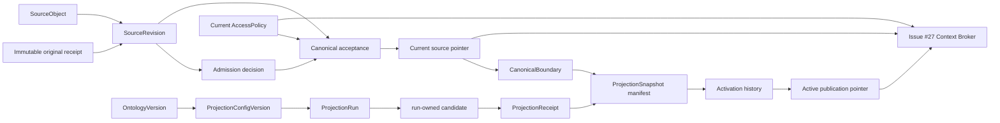
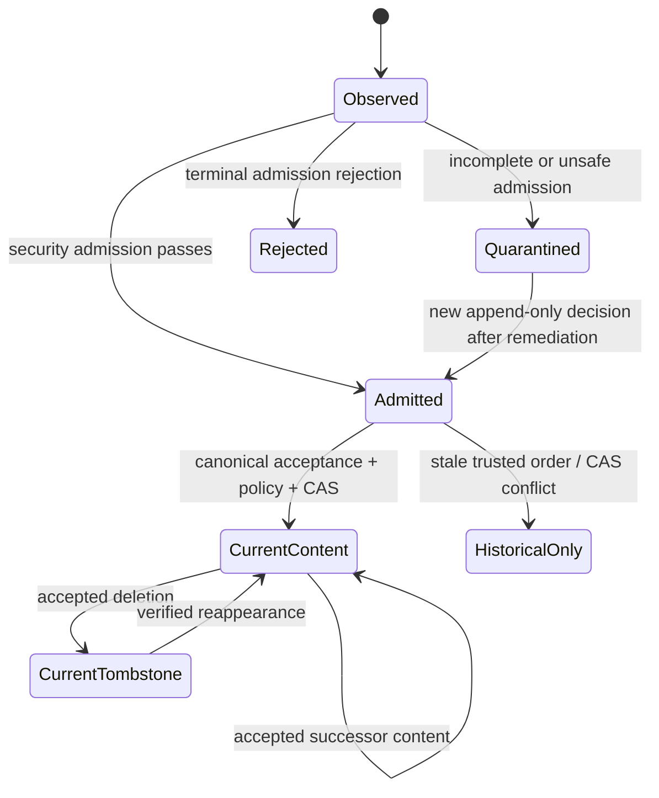
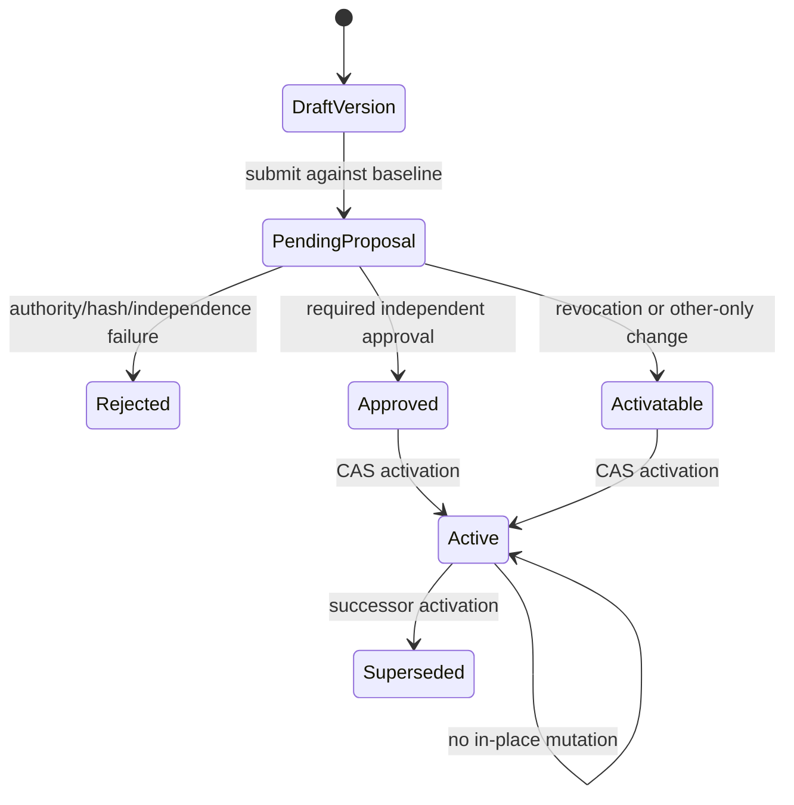
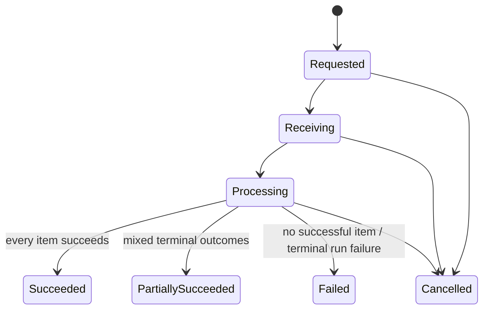
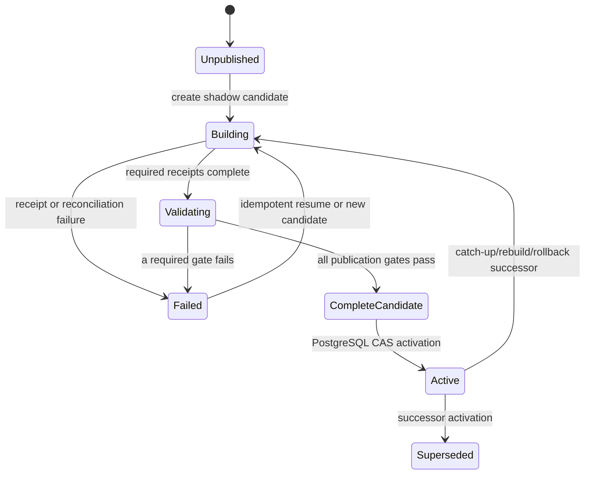

# R1 Canonical Source, Access, Ingestion, and Projection Ledgers

Status: **draft for independent review**

Parent planning issue: **GitHub Issue #7**

Prerequisites accepted for this draft: **Issues #2, #8, and #14**

## Problem Statement

R1 governed document Q&A needs one authoritative account of which logical sources
exist, which immutable observation is current, who may read or process each source,
which observations entered ingestion, and which exact canonical cut a published
Context Graph represents. The current prototype loads files directly into Cognee
and exposes retrieval contracts that do not carry the canonical revision, policy,
publication, or provenance guarantees required for production use.

Without PostgreSQL-owned ledgers, a parser completion, a Cognee alias, a cache, a
filename, or a checksum could accidentally become the effective authority for
source state or disclosure. That would permit stale revisions to replace current
ones, deleted or revoked content to reappear, concurrent updates to race silently,
partial projection writes to become visible, and cross-workspace data to leak.

The accepted architecture already fixes the governing decisions:

- PostgreSQL is authoritative for Spine-owned source state, current policy,
  projection manifests, and publication; object storage owns immutable original
  bytes; Cognee and its stores are rebuildable projections.
- `SourceObject` identity is independent of filename, path, and checksum.
- `SourceRevision` is an immutable observation. Admission and canonical
  acceptance are separate append-only decisions, and parsing or indexing success
  never selects canonical current state.
- ADR 0011 makes the current immutable-versioned `AccessPolicy` the sole content
  authorization authority. Authorization is allow-only, deny-by-default, and
  rechecked at every protected disclosure.
- ADR 0018 distinguishes immutable `ProjectionConfigVersion` from immutable
  `ProjectionSnapshot`; PostgreSQL alone owns active publication and monotonic
  activation generation.
- Canonical mutations, idempotency receipts, and minimal typed outbox intents
  commit atomically through the implemented Issue #8 Unit of Work.

Issue #7 is too large to implement safely as one change: it combines source
identity and concurrency, a security-critical authorization ledger, ingestion
operations, projection manifests, and publication. It is nevertheless one
coherent parent specification because those slices share canonical generations,
tenant keys, provenance, and fail-closed invariants. Implementation must use the
bounded slices in this specification; `/to-tickets` may create the eventual ticket
graph after independent review.

### Current Repository Assessment

- The PostgreSQL 17 kernel is implemented with SQLAlchemy, Alembic, a trusted
  environment-scoped Unit of Work, forced RLS, restricted runtime grants,
  deterministic idempotency receipts, transactional outbox intents, named
  constraints, and real-PostgreSQL contract tests.
- The Unit of Work currently exposes only Workspace, Environment, idempotency,
  and outbox repositories. It is intentionally designed to accept additional
  purpose-specific repositories without a generic CRUD abstraction.
- The canonical source domain package and target ingestion/projection packages
  are scaffolds. No production `SourceObject`, `SourceRevision`, `AccessPolicy`,
  `CanonicalBoundary`, `ProjectionConfigVersion`, or `ProjectionSnapshot` model
  currently exists.
- The legacy file loader flattens documents, uses filenames/paths as provenance,
  converts some parser failures into text, and cannot provide citation-grade
  locators. It remains compatibility code and is not a source of canonical
  contracts.
- The current Context Broker contract carries untyped locator dictionaries and
  an optional index string. Issue #27 must replace or adapt that surface to the
  typed revision, policy, snapshot, boundary, and decision references defined
  here.
- The accepted document-locator prototype establishes format-discriminated,
  revision-scoped locators and pinned parser/configuration references. Actual
  parsing and locator production remain Issue #3 responsibilities.

## Solution

Add environment-scoped, PostgreSQL-owned ledgers for four bounded concerns:

1. canonical source identity, immutable observations, admission, canonical
   acceptance, current selection, tombstones, and server-recorded boundaries;
2. immutable Access Policy versions plus proposal, approval, activation, and
   current-policy selection under ADR 0011;
3. minimal ingestion-run, per-source, transition, warning, failure, and
   processing-receipt records consumed by Issue #3;
4. immutable projection configuration, boundary manifests, runs, receipts,
   validation, snapshots, drift, and compare-and-swap publication under ADR 0018.

All records use the existing trusted persistence context, tenant-aware Unit of
Work, RLS convention, idempotency receipts, outbox registry, error translation,
and transaction retry rules. External I/O never occurs inside a database
transaction. Protected content is not copied into policy, audit, outbox,
idempotency, or projection-control records.

The highest shared behavioral test seam is an environment-scoped application
service opened through one Unit of Work. Commands for observing/accepting a
source, activating policy, recording ingestion progress, assembling a snapshot,
and publishing it are tested through typed repositories against both the
in-memory and PostgreSQL adapters. Database-only guarantees—RLS, grants,
immutability, constraints, row locking, compare-and-swap, and concurrency—are
tested against real PostgreSQL. Cognee, object storage, OIDC, and parsers are
represented by their ports in the default suite.



## User Stories

1. **US-001** As a knowledge administrator, I want one stable source identity across renames, so that filename changes do not fragment history.
2. **US-002** As a connector, I want external identity and generation recorded separately from content digest, so that reused provider identifiers do not merge unrelated objects.
3. **US-003** As an uploader, I want a new upload without an explicit target to create a new source, so that equal bytes do not merge ownership or policy.
4. **US-004** As an uploader, I want replacement to require the source identity and expected current revision, so that concurrent edits do not overwrite each other.
5. **US-005** As an ingestion worker, I want exact duplicate observations to return one stable revision reference, so that at-least-once delivery creates one logical effect.
6. **US-006** As an ingestion worker, I want changed content or revision-bearing metadata to create a new immutable revision, so that history is reproducible.
7. **US-007** As an operator, I want operational metadata changes not to create content revisions, so that noise does not manufacture history.
8. **US-008** As a connector, I want authoritative source ordering honored, so that a late old event cannot replace newer canonical state.
9. **US-009** As a security administrator, I want incomplete or unverified provenance quarantined, so that unknown content cannot enter ordinary processing.
10. **US-010** As a security administrator, I want canonical acceptance independent of parser and projection completion, so that derived systems cannot select truth.
11. **US-011** As a user, I want a verified deletion to fence prior content immediately, so that asynchronous cleanup cannot prolong disclosure.
12. **US-012** As an operator, I want deletion history retained as a tombstone revision, so that audit and rebuild behavior remain explainable.
13. **US-013** As an uploader, I want reappearance to require proven identity continuity and a fresh admission path, so that deletion does not silently restore access.
14. **US-014** As an evidence reviewer, I want historical references bound to exact revision and original digest, so that a locator cannot drift to replacement content.
15. **US-015** As a human reader, I want content access denied unless the current policy grants `read_content`, so that historical or projected grants cannot authorize disclosure.
16. **US-016** As a service owner, I want processing authority limited by service principal, purpose, and operation, so that a worker cannot reuse a broad grant.
17. **US-017** As an interactive user, I want processing to require both my read authority and the service grant, so that the service cannot become a confused deputy.
18. **US-018** As an administrator, I want lifecycle authority separated from content authority, so that operating the platform does not expose documents.
19. **US-019** As a policy requester, I want policy versions immutable and current selection explicit, so that every decision is reproducible.
20. **US-020** As a security reviewer, I want a self-benefiting policy change approved by a different verified human, so that one person cannot grant themselves access.
21. **US-021** As a security reviewer, I want account aliases resolved to canonical human identity for separation of duties, so that a second login is not a second approver.
22. **US-022** As an administrator, I want ordinary revocation activatable without a second approver, so that access can be removed promptly.
23. **US-023** As an administrator, I want stale policy proposals rejected by optimistic concurrency, so that approval cannot apply to a changed baseline.
24. **US-024** As a user, I want policy revocation enforced before every model use and disclosure, so that stale indexes and caches cannot preserve authority.
25. **US-025** As an admission worker, I want newly observed content isolated until an eligible policy is active, so that upload does not imply access.
26. **US-026** As a compliance reviewer, I want denied historical evidence to remain undisclosed after deletion or policy change, so that provenance does not bypass current rules.
27. **US-027** As an ingestion operator, I want each batch and source item to have typed state, warnings, failures, and receipts, so that partial outcomes are visible.
28. **US-028** As an ingestion operator, I want one failed file not to hide successful files, so that batch recovery is precise.
29. **US-029** As a parser owner, I want receipts to pin parser and locator contract versions, so that evidence can be reproduced.
30. **US-030** As a parser owner, I want partial coverage and exclusions explicit, so that unsupported structures do not appear complete.
31. **US-031** As an ingestion worker, I want run and item retries idempotent, so that recovery does not duplicate sources, revisions, or downstream commands.
32. **US-032** As an operator, I want warnings and failures sanitized and typed, so that diagnostics do not leak protected text.
33. **US-033** As a projection owner, I want processing configuration immutable and digest-addressed, so that rebuild inputs are reproducible.
34. **US-034** As a projection owner, I want configuration separated from a published snapshot, so that settings are not confused with indexed state.
35. **US-035** As a projection worker, I want each build tied to one durable canonical boundary, so that its input cut is exact.
36. **US-036** As a projection worker, I want each partition command idempotent by identity and digest, so that retries cannot overwrite a different build.
37. **US-037** As a provenance reviewer, I want source-to-projection references tied to revision and locator, so that every result can be traced back.
38. **US-038** As a security reviewer, I want shadow artifacts invisible to ordinary retrieval, so that unvalidated content cannot serve traffic.
39. **US-039** As a release owner, I want manifest, ACL-leakage, evidence, and quality validations recorded immutably, so that publication is reviewable.
40. **US-040** As a release owner, I want every boundary source accounted for as included, tombstoned, or excluded, so that omission cannot masquerade as completeness.
41. **US-041** As a retrieval user, I want absence of an active snapshot reported as unpublished, so that unavailable knowledge is not mistaken for an empty answer.
42. **US-042** As an operator, I want freshness and health reported independently, so that drift and projection damage are not conflated.
43. **US-043** As a user, I want stale or incomplete projections to abstain when the request requires freshness or completeness, so that partial evidence is not overstated.
44. **US-044** As a publisher, I want activation to compare against the expected predecessor, so that concurrent publications cannot split authority.
45. **US-045** As a publisher, I want activation generation to increase monotonically in PostgreSQL, so that aliases and caches cannot become publication authority.
46. **US-046** As an operator, I want a publication commit and its activation history, audit, and outbox intents atomic, so that recovery has one authoritative result.
47. **US-047** As an operator, I want failed candidates to leave the existing publication authoritative, so that rebuild failure does not disrupt serving.
48. **US-048** As an operator, I want rollback to publish a validated successor at a non-regressing boundary, so that rollback cannot revive deleted or revoked content.
49. **US-049** As an operator, I want reconciliation to fence missing or ambiguous artifacts, so that backend corruption cannot silently serve.
50. **US-050** As a security engineer, I want every record constrained to one workspace and environment, so that application mistakes fail closed.
51. **US-051** As a security engineer, I want RLS and application policy checks to remain distinct, so that tenant isolation is never mistaken for content authorization.
52. **US-052** As a retrying client, I want the same command key and digest to return the same safe reference, so that commit uncertainty is recoverable.
53. **US-053** As a retrying client, I want a reused key with changed content rejected, so that one identity cannot mean two operations.
54. **US-054** As an auditor, I want every meaningful source, policy, ingestion, and publication transition linked to trace, actor/service, and audit records, so that decisions are attributable.
55. **US-055** As an outbox consumer, I want minimal typed event payloads containing identifiers rather than content, so that asynchronous delivery does not widen disclosure.
56. **US-056** As a Context Broker owner, I want current source, tombstone, policy, active generation, and evidence checked on every request, so that no stale projection can override PostgreSQL.
57. **US-057** As a service authority owner, I want optional grant expiry and membership/authority generation changes revalidated, so that superseded authority cannot survive in a cached decision.
58. **US-058** As an admission owner, I want initial-policy eligibility recorded for the exact source, policy, and approved origin, so that newly admitted content cannot inherit an unproved policy.
59. **US-059** As a projection owner, I want a minimal immutable published ontology version pinned by configuration, so that rebuild semantics are reproducible without creating a general ontology platform.
60. **US-060** As a projection worker, I want every shadow receipt and validation tied to one run-owned candidate identity, so that pre-snapshot evidence cannot attach to an invented manifest.
61. **US-061** As an operator, I want runtime reconciliation to append health evidence and repair lineage, so that backend corruption is fenced without mutating a snapshot.
62. **US-062** As a security reviewer, I want self-benefiting membership, template, and service-authority changes independently approved, so that policy separation of duties cannot be bypassed indirectly.

## Implementation Decisions

### Scope, Authority, and Terminology

Issue #7 owns the canonical records and application contracts described here. It
does not own upload transport, byte storage, parsing, Cognee indexing, retrieval,
OIDC, generic audit dispatch, or durable workflow orchestration.

The Issue #7 term `ProjectionVersion` is retired as ambiguous. Existing prose
using it must be interpreted as one of:

- `ProjectionConfigVersion`: immutable processing definition; or
- `ProjectionSnapshot`: immutable logical publication manifest for one canonical
  boundary.

No third `ProjectionVersion` entity, table, alias, or API type is introduced.
Physical backend artifact versions are opaque receipt fields and are not
canonical publication identities.

All records in this specification are environment-scoped. Each carries
`workspace_id` and `environment_id`, and every child-to-parent relationship uses
a composite foreign key including both tenant keys even when the child identity
is globally unique. The existing forced-RLS convention applies to every table.

### Canonical Domain Models and Relationships

Domain and application contracts are typed, framework-independent Pydantic v2
models with forbidden extra fields. Immutable observations, definitions,
decisions, manifests, receipts, and events are frozen. Mutable current-pointer
models expose only explicit compare-and-swap commands, never general update.

| Model | Required contract | Mutability and relationships |
| --- | --- | --- |
| `SourceObject` | stable ID, tenant scope, source kind, connection/external identity or generated upload identity, identity namespace/generation, created time | Immutable identity record. It does not store filename, checksum, parser state, or an implicit current revision. |
| `SourceRevision` | revision ID, source ID, kind `content \| tombstone`, revision digest/schema version, original object reference and SHA-256 for content, byte length, validated media type, revision-bearing metadata digest/schema | Immutable. Content requires an immutable original receipt; tombstone forbids content/original reference and requires deletion provenance. Revision identity excludes delivery/event/command identity. |
| `SourceRevisionProvenance` | provenance ID, revision ID, observation/event identity and digest, connection or upload command reference, origin locator safe metadata, source-order scheme/token when authoritative, observer service, received/observed times | Immutable one-to-many observation evidence. Multiple deliveries may prove the same revision without manufacturing another revision. |
| `AdmissionDecision` | decision ID, revision ID, decision version and predecessor, `admitted \| quarantined \| rejected`, validator/profile version, typed reasons, authority reference, trace/audit reference, decided time | Append-only CAS chain. Only the effective admitted decision can support content acceptance. Tombstone acceptance uses deletion-specific checks instead. |
| `CanonicalAcceptance` | acceptance ID, source/revision IDs, accepted generation, predecessor revision/acceptance, ordering basis, admission/policy/provenance references, idempotency receipt, accepted time | Append-only successful transition. A stale or invalid attempt is an audit outcome, not an acceptance row. |
| `CurrentSourceRevision` | source ID, current revision and acceptance IDs, current generation, CAS version | Mutable control row changed only with expected predecessor and serialized generation allocation. |
| `CanonicalBoundary` | boundary ID, tenant scope, projection kind/scope version, accepted-through generation, server-recorded boundary time, manifest digest | Immutable server-selected cut. It is not a client timestamp, build time, source timestamp, or publication time. |
| `CanonicalBoundaryMember` | boundary ID, source ID, exact current revision/acceptance/generation, `content \| tombstone` | Immutable exact membership. It makes the cut reproducible without querying mutable heads. |
| `AccessPolicyVersion` | policy version ID, source ID, version number, predecessor, canonical document hash/schema version, origin kind/reference, created by/time | Immutable definition. An empty grant set is a valid deny-all/revocation version. |
| `AccessGrant` | policy version, principal kind/reference, `read_content \| process_content`, allowed purpose/operation where required, optional service validity interval | Immutable child. Human/team grants may only use `read_content`; service grants may only use `process_content`, require bounded purpose and operation, and may be valid only in `[valid_from, valid_until)`. |
| `PolicyProposal` | proposal ID/version, proposed policy version/hash, requester canonical identity, expected active policy/generation, benefit classification, submitted time | Immutable. Editing creates a successor proposal and invalidates prior approval. |
| `PolicyApproval` | proposal ID/version, approver canonical identity, identity-proof reference, authority snapshot reference, decision and time | Immutable. Self-benefiting approval requires verified independence from requester. |
| `PolicyActivation` | activation ID, source, predecessor/new policy, policy generation, proposal/approval or eligible-template reference, actor, trace/audit reference, activated time | Append-only. Records both initial activation and later replacement/revocation. |
| `CurrentAccessPolicy` | source ID, current policy version, policy generation, CAS version | Mutable control row changed only by the policy activation application service. |
| `IngestionRun` | run ID, command/idempotency reference, trigger kind/reference, requested scope, started time | Immutable identity; aggregate state is derived from append-only transitions and item outcomes. |
| `IngestionRunSource` | item ID, run ID, stable input identity and digest, per-item idempotency identity | Immutable item identity. It never acquires late source, revision, or original-receipt columns. |
| `IngestionRunSourceBinding` | binding ID, item ID, source/revision/original-receipt references, binding command/audit references, bound time | Immutable append-only result of identity resolution and observation. A database uniqueness constraint permits at most one binding per item. |
| `IngestionTransition` | run or item target, typed state, predecessor transition, attempt, safe metrics, actor/service, trace, occurred time | Append-only state transition. Illegal transitions are rejected. |
| `IngestionWarning` / `IngestionFailure` | item/attempt, typed code, stage, retryability, safe detail reference, occurred time | Immutable and content-free. Raw provider/parser detail is not stored here. |
| `ProcessingReceipt` | item/revision, processor kind, parser and parser-config versions, locator-contract version, output reference/digest, coverage `complete \| partial \| failed`, warning/failure refs | Immutable. It records processing evidence but cannot change admission or current source state. |
| `OntologyVersion` | ontology ID/name, version number, predecessor, definition schema/payload/digest, publication decision reference, published by/time | Immutable, PostgreSQL-owned published R1 ontology contract. There is no `OntologyCandidate`; a projection config may reference only a publication-eligible ontology version in the same tenant. |
| `ProjectionConfigVersion` | config ID/version, predecessor, ontology version, parser/locator/extraction/embedding/adapter contract references, typed config payload schema, canonical digest, created time | Immutable definition. Configuration payload is versioned and validated before persistence. |
| `ProjectionRun` | run ID, immutable candidate ID, operation `build \| catch_up \| rebuild \| rollback`, config, boundary, predecessor snapshot, command identity/digest, started time | Immutable operation and pre-snapshot candidate identity; lifecycle is append-only. External work occurs outside its recording transaction. |
| `ProjectionRunTransition` | run, predecessor transition, `requested \| building \| validating \| complete \| failed \| abandoned`, attempt, safe reason, time | Append-only. `complete` does not mean active. |
| `ProjectionPartition` | run/candidate, Security Domain reference, opaque partition identity, expected command identity/digest | Immutable isolation unit. It narrows processing but grants no authority. |
| `ProjectionReceipt` | receipt ID, run/partition, command identity/digest, artifact reference/integrity, counts, typed warnings/failures, implementation metadata schema/version, completed time | Immutable. Duplicate identity/same digest returns the receipt; different digest is integrity conflict. |
| `SourceProjectionReference` | run/candidate and receipt, source/revision, parsed segment and stable locator reference, projected object kind/opaque ID, config version, Security Domain | Immutable pre-snapshot provenance mapping. It contains no protected excerpt. |
| `ProjectionValidation` | run/candidate, gate kind/version, input/result digest, `passed \| failed`, safe metrics, evaluator/reference, time | Immutable. Required safety gates cannot be waived by mutable status. |
| `ProjectionSnapshot` | snapshot ID, run/candidate, projection kind, config, boundary, predecessor, manifest digest, created time | Immutable logical manifest and proof of the candidate evidence from which it was assembled. It has no mutable `active`, `retired`, freshness, or health column. |
| `ProjectionSnapshotMember` | snapshot/source, expected revision, `included \| tombstoned \| excluded`, typed exclusion reason, receipt/partition references | Immutable and exhaustive for its boundary. Missing members invalidate the manifest. |
| `ProjectionActivation` | activation ID, projection kind, predecessor/new snapshot, activation generation, activation kind `publish \| rollback`, command/audit references, activated time | Append-only publication history. Generation is strictly increasing. |
| `ActiveProjection` | projection kind, active snapshot, activation generation, CAS version | Mutable PostgreSQL pointer. Zero rows means unpublished; after first activation exactly one row exists per scope. |
| `ProjectionDrift` | active snapshot/generation, source acceptance/revision/generation, detected time | Append-only record created for canonical changes beyond the active boundary. It is resolved only by a successor publication that covers it. |
| `ProjectionReconciliationResult` | result ID, active snapshot and activation generation, attempt identity/digest, predecessor result, outcome, safe findings/artifact evidence digest, checked time | Append-only runtime-health evidence. Rechecks and repairs append successors; they never mutate snapshot manifests. |

Opaque references are typed by kind, identity, schema version, and integrity digest
where applicable. JSON is used only for explicitly versioned source metadata,
configuration, safe metrics, and implementation metadata; it is not a substitute
for tenant keys, lifecycle state, policy grants, or relationships.

### Entity Ownership Matrix

| Entity or decision | Canonical owner | Producer/consumer | Explicit non-owner |
| --- | --- | --- | --- |
| Source identity, revision, acceptance, current pointer, boundary | PostgreSQL / Issue #7 | Issue #3 produces; Issues #15, #27 consume | filenames, object storage, parser, Cognee |
| Immutable original bytes and storage integrity receipt | Issue #6 object-storage port | Issue #3 produces; Issue #7 stores opaque receipt/reference | PostgreSQL blob columns, Cognee |
| Current Access Policy and activation ledger | PostgreSQL / Issue #7 | Issue #5 supplies trusted identity; Issue #27 decides disclosure | OIDC claims, administrator role alone, Security Domain, Cognee ACL |
| Authentication, canonical human identity, memberships, administrator authority, service identity | Issue #5 | Issue #7 policy service consumes trusted snapshots | Issue #7 does not validate OIDC |
| Ingestion orchestration, parsing, locator production | Issue #3 | Writes Issue #7 runs/receipts through ports | Issue #7 tables do not execute parsers |
| Audit event schema/ledger and outbox delivery | Issue #4 | Issue #7 emits typed records/intents atomically | Issue #7 does not dispatch or retry delivery |
| Published R1 ontology definitions | PostgreSQL / Issue #7 | Issue #15 consumes pinned identity/digest | Cognee extraction, an ontology candidate/editor platform |
| Projection configuration, logical manifest, validation lineage, active pointer | PostgreSQL / Issue #7 | Issue #15 writes receipts; Issue #27 consumes active identity | Cognee alias/cache/store |
| Physical graph/vector/chunk artifacts and backend routing | Issues #15/#29 and the ContextProjection adapter | Receipts link back to Issue #7 | PostgreSQL does not duplicate all nodes/embeddings |
| Retrieval authorization and persisted Context Bundle | Issue #27 | Reads Issue #7 current heads and active generation | dataset or `node_set` selection |

### Source Identity, Revision, and Acceptance Rules

`SourceObject` has exactly one identity mode:

- connector source: `connection_id`, `external_namespace`,
  `external_generation`, and `external_object_id` are all required and form the
  normalized unique identity with workspace/environment; or
- explicit upload: `upload_identity` is required and unique with
  workspace/environment, while all connector columns are NULL. A replacement
  names that source ID; an untargeted upload always creates another source.
  Database checks reject mixed or incomplete modes, and the partial unique
  indexes contain no nullable identity component. Connector generation is part
  of identity (a provider reuse with a new generation is a new source unless
  Issue #3 supplies an explicit continuity proof); checksum never participates
  in identity. Concurrent duplicate inserts serialize on the unique index and
  one transaction replays the existing source identity.

Filename, path, title, object-storage key, checksum, and media type are metadata,
not source identity. Equal bytes across source objects remain separate. Revision
identity and delivery identity are deliberately different:

- `source-revision:v1` is a canonical envelope containing `kind`, optional
  `reappearance_after_tombstone_revision_id`, and, for content, original SHA-256,
  byte length, validated media type, `revision-metadata:r1-document-v1`, and its
  canonical payload. For a tombstone it contains `kind=tombstone`,
  `deletion-fact:r1-v1`, and an allowlisted deletion reason; it contains no content
  fields or reappearance field. A content observation names that field exactly
  when the locked current head is the referenced tombstone; all concurrent/retried
  observations after the same tombstone therefore deduplicate, while reappearance
  is a new revision even when prior bytes recur.
- `revision-metadata:r1-document-v1` has exactly two optional fields:
  `embedded_title` and `document_language`. Title is accepted only when embedded
  in the original document, normalized to Unicode NFC and LF line endings, with
  leading/trailing Unicode whitespace removed and internal text/case preserved.
  Language is a syntactically validated BCP 47 tag serialized lowercase. Empty
  normalized values are rejected rather than converted to absent. Validated media
  type is lowercase ASCII `type/subtype` without parameters; byte length is a
  nonnegative base-10 integer. No connector extension or format flag is
  revision-bearing in R1; adding one requires a new reviewed metadata schema.
  The profile is pinned as `r1-c14n-2026-10`, using vendored Unicode 15.1 NFC
  and whitespace tables plus a pinned BCP-47 registry table. Implementations may
  not delegate table selection to the host Python runtime. The profile identifier
  and table digests are persisted with the revision schema, and Python 3.10--3.14
  adapters must produce identical golden vectors.
- Filename, path, storage key/receipt ID, source-native event/version ID, order
  token, command/idempotency key, actor/service, trace, and observed/received time
  are operational provenance and are excluded from the revision digest. Changing
  only those fields appends provenance evidence, not a `SourceRevision`.
- The envelope and metadata payload use the Issue #8 canonical command encoding:
  UTF-8 JSON with sorted object keys, no insignificant whitespace, canonical UUID,
  enum, integer, boolean and UTC timestamp forms, arrays retaining semantic order,
  and rejection of floats, duplicate keys, unknown fields, and Unicode ambiguity.
  The revision digest is SHA-256 over the schema tag and canonical bytes. Binary
  content is represented by its verified digest and length, never embedded bytes.

Every observation command separately has a command/event idempotency identity and
`source-observation-command:v1` digest covering the requested target/source
identity, revision digest, original receipt identity/digest, order evidence, and
safe provenance references. Same command identity and digest replays; the same
identity with a changed command digest is an integrity conflict. A new event or
command with the same revision digest reuses the revision and appends a distinct
immutable `SourceRevisionProvenance` row. Thus operational history is retained
without manufacturing content history.

Trusted connector ordering is accepted only through a registered ordering
scheme/version that validates a normalized comparable order key. A later key may
advance current; an equal key must be an exact replay; a lower or incomparable key
is stored as non-current history and cannot create `CanonicalAcceptance`.
Connectors without such ordering, and every manual replacement or restoration,
must supply `expected_current_revision_id` (including an explicit `none` for the
first acceptance). A mismatch is an optimistic conflict with no acceptance,
pointer, generation, audit-success, or outbox effect.

Canonical acceptance follows the implemented Issue #8 idempotency protocol with
two explicit branches:

- **Replay.** `claim()` returns `IdempotencyReplay`; the service resolves the
  committed opaque result reference and rechecks current tenant, source, policy,
  identity, and disclosure authority before returning any protected result. It
  performs no acceptance, pointer, generation, audit-success, or outbox effect.
- **Owned claim.** `claim()` returns `OwnedIdempotencyClaim`; in that same Unit of
  Work the service performs every canonical mutation below, appends mutation audit
  and outbox records, calls `complete()` exactly once with an opaque safe result
  reference, then commits. An owned claim that is not completed cannot commit.
  Any exception, cancellation, stale CAS, audit/outbox failure, or lost eligibility
  rolls back the claim and every effect together.

The owned branch for content requires, in one transaction:

1. verified source identity and complete immutable provenance;
2. ownership of an incomplete idempotency claim with matching command digest;
3. an effective `admitted` decision from an allowed admission profile;
4. a complete canonical observation and durable original receipt;
5. an eligible active Access Policy for the same source and tenant scope;
6. successful source-order or expected-current check;
7. allocation of the next environment canonical generation under a serialized
   counter/lock that is provably commit-consistent;
8. append of acceptance, current-pointer CAS, drift record when an active
   publication exists, required audit record, minimal outbox intents, and exactly
   one idempotency completion immediately before commit.

A database sequence or transaction timestamp alone is not accepted as commit
order. Failed transactions consume no authoritative generation. The chosen
counter implementation must prove that committed generations have no ambiguous
relative order; unused reserved values, if any, must never represent boundaries.

A verified tombstone is a contentless revision. Acceptance requires existing
source identity, trustworthy deletion ordering/idempotency, complete deletion
provenance, and the expected-current rule where ordering is absent. It does not
wait for content validation, parsing, projection removal, or an active policy.
Commit of the tombstone immediately fences all prior revisions from ordinary
retrieval and disclosure. Current policy still governs any separately allowed
historical inspection.

Reappearance creates a new content revision of the same source only when source
identity continuity is verified. It repeats admission, policy eligibility,
expected-current/ordering, and canonical acceptance; it does not restore old
grants or make old projection artifacts eligible.



### Canonical Boundary and `as_of`

A boundary is created by a server command, never accepted from a client. R1 keeps
Issue #8's `READ COMMITTED` isolation and uses an executable lock protocol rather
than assuming repeatable reads:

1. In an idempotent Unit of Work, lock the workspace/environment row in
   `canonical_generation_counters` with `SELECT ... FOR UPDATE`. Every canonical
   acceptance acquires this same row first, before any source-head lock; this is
   the global lock order.
2. Read `current_generation` as `G` and record the server clock value while the
   lock is held. All acceptances committed before lock acquisition are at or below
   `G`; in-flight or later acceptances cannot allocate or change a head until the
   boundary transaction ends.
3. Query the declared R1 projection scope and materialize exactly one current head
   for every accepted source in it. Each member must reference an acceptance with
   `accepted_generation <= G`; non-current, observed-only, quarantined, and
   rejected revisions are excluded. New observed objects without acceptance are
   irrelevant; accepting them requires the held counter lock.
4. Insert the boundary and all members, compute and persist the canonical manifest
   digest from their ordered identities, complete the owned idempotency claim, and
   commit. Commit releases the counter lock. Any deadlock/serialization-class
   error retries the whole reproducible Unit of Work; cancellation or any other
   failure rolls back boundary, members, and claim.

Consequently an acceptance racing capture is wholly before the boundary (its
commit precedes lock acquisition and its generation/member is present) or wholly
after it (it waits and receives a generation greater than `G`). No `READ
COMMITTED` statement sequence can mix those cases. Acceptance, activation, and
boundary code must never acquire source/active-pointer locks before the canonical
counter row.

For R1, the declared scope is the complete projection-eligible governed document
set for one workspace, environment, and projection kind. Arbitrary per-user or
ad hoc source subsets are out of scope. The boundary may include tombstones and
sources later excluded by projection, but it cannot include observed,
quarantined, rejected, or non-current revisions.

The external `as_of` identity is the boundary ID plus accepted-through generation
and server-recorded boundary time. It is selected from the active snapshot by the
server. R1 clients cannot request historical time travel or select a snapshot.

### AccessPolicy Decision and Activation Rules

The current `AccessPolicyVersion` selected by PostgreSQL is the only content
authorization authority. Every lookup is by `SourceObject`, workspace, and
environment. Missing current policy, missing identity evidence, unknown grant,
unknown purpose/operation, stale policy generation, incomplete provenance, or
decision-service failure returns deny without exposing whether protected content
exists.

Grant rules are exact:

- human and team principals may receive `read_content` only;
- service principals may receive `process_content` only, restricted to an
  allowlisted server-selected purpose and operation and either no validity
  interval (both endpoints NULL) or a closed database representation of
  `[valid_from, valid_until)` (both endpoints non-NULL and
  `valid_until > valid_from`); evaluation uses an injected decision clock,
  allows at `valid_from`, and denies at or after `valid_until`;
- direct and current team grants union for effective human read authority;
- interactive processing requires the intersection of effective human
  `read_content` and service `process_content` for every source;
- non-interactive processing requires the service grant and an authorized
  server-owned workflow/operation context; it does not grant human disclosure;
- Security Domains, projection partitions, Context Profiles, and backend ACLs
  may narrow results but never grant missing policy authority;
- administrator authority permits lifecycle and policy administration, not
  `read_content` or `process_content`.

Issue #5 must supply a `TrustedIdentityAuthority` port that resolves an already
authenticated request or worker to one immutable `TrustedAuthorizationContext`:
canonical human identity when interactive, current effective team identities,
membership generation, administrator/policy-administration authorities, service
principal identity, service-authority generation, server-selected purpose and
operation, workspace/environment, identity-proof references, and issued time. It
must also decide whether requester and approver are independently verified humans.
Issue #5 owns authentication, membership and authority records and generation
increments; Issue #7 stores only their opaque snapshot references and evaluates
them. This specification does not parse tokens or implement OIDC.

Issue #7 supplies a `ContentAuthorizationDecision` application port with three
non-interchangeable operations:

- `decide_human_disclosure(context, source_ids, clock)` requires one trusted human
  context and current `read_content` for every source;
- `decide_interactive_processing(context, source_ids, clock)` accepts one trusted
  context containing both the acting human and executing service and requires the
  same human's current effective `read_content` **and** that service's unexpired
  `process_content` grant for the exact server-selected purpose/operation, for
  every contributing source;
- `decide_noninteractive_processing(context, source_ids, clock)` accepts a service
  context without a human only for a registered server-owned workflow/operation
  authority and requires the service's unexpired `process_content` grant for every
  source. It can never authorize human or model-result disclosure.

Every result is a typed allow/deny decision with source IDs, current policy IDs
and generations, membership and service-authority generations, trusted identity
snapshot reference, purpose/operation, allowlisted safe reason codes, opaque
decision/audit references, trace, and evaluated time. It never returns content,
principal display data, source existence detail, or arbitrary strings.
Multi-source authorization allows only when every contributing source allows.
The decision clock is injected and deterministic in tests. A cached decision is
keyed by all policy, membership, service-authority and activation generations;
any generation change invalidates it. Current policy and trusted generations are
re-resolved immediately before model access and again before every disclosure.

Issue #7 also owns an explicit `InitialPolicyEligibilityDecision` contract. Its
input is the source identity, proposed immutable policy ID/hash, origin kind and
opaque origin version (`eligible_template`, `approved_source_configuration`, or
`approved_proposal`), security-domain reference, purpose, and Issue #5 identity/
authority generations. Its output is `eligible` or `ineligible` plus decision ID,
origin version/hash, allowlisted reason code, evaluator contract version,
authority snapshot, audit reference, and time. Only an `eligible` result for the
exact policy and source can support initial activation and content acceptance.
Issue #5 owns the authoritative membership/authority and template/source-config
inputs; their exact reference schemas are a category-B, pre-2A joint contract,
not an OIDC implementation invented here.

Policy mutation is proposal-and-activation, not in-place edit:

1. Build and hash a complete immutable successor policy against the current
   policy ID and generation.
2. Resolve the requester through Issue #5 and classify whether the effective
   change can benefit that canonical human directly, through a team, or through
   a service configuration they control.
3. A self-benefiting change requires approval by a different independently
   verified human administrator with current authority in the same scope.
4. An ordinary revocation or change benefiting only other principals may be
   activated by one authorized administrator, but still records proposal and
   activation.
5. Immediately before activation, re-resolve requester/approver authority and
   identity independence, verify the exact proposal hash, and CAS the expected
   current policy/generation.
6. Atomically append activation and audit, switch the current policy, enqueue
   cache-invalidation/recheck intents, and complete idempotency.

Edits create a successor proposal and invalidate approval of the older proposal.
There is no R1 break-glass, impersonation, delegation, or administrator content
override. Bootstrap and administrator-loss recovery remain Issue #5 concerns and
must not mutate source policies or grant content access.

Separation of duties is normative across the authority graph, not limited to a
policy row. A membership change, eligible-template/source-configuration change,
or service ownership/authority change that can give the requester direct, team,
or controlled-service benefit requires a different independently verified human
approver under Issue #5. Approval is checked against canonical humans, not
accounts. Each committed membership or authority change increments its Issue #5
generation. Policy activation re-resolves those generations; stale approval or
benefit analysis cannot activate, and later generation changes invalidate cached
authorization and require a fresh decision before model access or disclosure.

New content without an eligible active policy remains quarantined. An initial
policy may originate only from an eligible immutable template, an approved
connector/source configuration, or an explicit approved proposal. The origin
reference and eligibility decision are recorded. Uploader identity creates no
implicit grant and cannot choose an ineligible template.

Here, `admitted` is the security validator's disposition, while the derived
source lifecycle remains `quarantined`/not canonical until policy eligibility
and every acceptance precondition passes. Ordinary parsing beyond the isolated
admission profile, projection, retrieval, model use, and human disclosure remain
forbidden during that gap.

Historical policy versions are provenance only. Historical citation inspection
rechecks the current policy and current identity, plus retention/deletion rules,
for the exact historical revision. A current tombstone, revocation, or missing
retention authority denies ordinary disclosure even if an older policy allowed
it. Already transmitted bytes cannot be retracted; all future model use, stream
events, stored-answer hydration, citation resolution, and downloads reauthorize.



### Ingestion Record Lifecycle

Ingestion records are the minimum operational ledger for Issue #3. They do not
contain parsed document text, raw payloads, uploaded bytes, or workflow history.

Run states are `requested`, `receiving`, `processing`, `partially_succeeded`,
`succeeded`, `failed`, and `cancelled`. Item states are `received`, `stored`,
`observed`, `admission_pending`, `quarantined`, `rejected`, `accepted`,
`processing`, `processed`, `processing_failed`, and `projection_requested`.
Transitions are append-only and validated against a finite state machine. Batch
aggregate state is derived from item terminal states and never hides mixed
outcomes.

An ingestion item has one stable command identity and digest. The item row is
immutable and initially unbound. Identity resolution and revision observation
append one `IngestionRunSourceBinding` in the same transaction as the source/
revision resolution, provenance append, item `observed` transition, audit/outbox
participation, and idempotency completion. A unique `(workspace_id,
environment_id, ingestion_run_source_id)` constraint permits exactly one binding;
composite foreign keys prove that revision belongs to source and all references
share the tenant. Replay with the same command/digest returns the binding; another
binding value or changed digest conflicts and rolls back. Failure or cancellation
before commit leaves the immutable item unbound and retryable—there is no partially
updated item. Different upload commands with equal content remain different source
objects unless the command explicitly targets an existing source.

`ProcessingReceipt` references the accepted or observed revision, immutable
original digest, parser name/version/configuration, locator-contract version,
output artifact identity/digest, coverage, and exclusions. Format-specific
locators remain Issue #3 typed outputs and are always scoped to the revision and
original digest. Partial or failed processing cannot change current revision or
policy and cannot silently count as projection coverage.

Issue #3 owns upload and parsing orchestration. Issue #6 owns staging/finalize and
orphan cleanup. The no-distributed-transaction protocol is: write and verify an
immutable staged/finalized original, then commit its opaque receipt with the
revision; on database failure, retry by stable receipt or clean the orphan by a
bounded auditable procedure. PostgreSQL never records an original as durable
unless Issue #6's receipt says it is readable and integrity-verified.



### Projection Configuration, Manifest, and Publication

`OntologyVersion` is the minimal PostgreSQL-owned R1 ledger for a published
ontology definition consumed by document Q&A. It is immutable and tenant-scoped,
has a stable ontology name and monotonically unique version number, predecessor,
versioned typed definition payload and digest, publication-eligibility decision,
publisher authority reference, and publication time. It describes only the R1
entity/relation types and constraints needed by the accepted projection contract;
there is no ontology candidate, editor, inference platform, or generic ontology
workflow. Issue #15 consumes the pinned identity/digest and must reject unsupported
definition schema or adapter compatibility.

`ProjectionConfigVersion` pins every processing input needed to interpret
receipts: a publication-eligible same-tenant `OntologyVersion`, parser and locator
contracts, extraction rules, embedding profile, adapter contract, and
implementation compatibility metadata. A config cannot be edited or activated by
itself; a snapshot references it.

A `ProjectionRun` targets one immutable boundary and owns one server-generated
`projection_candidate_id`, unique in the tenant. The run is inserted before any
partition work with `candidate_state=open`, `candidate_evidence_digest=NULL`, and
`candidate_sealed_at=NULL`. Partitions, receipts, source references, and
validations carry both run and candidate IDs and use a composite foreign key to
that exact run; they cannot name a reserved/unproven UUID. Workers perform
external adapter work outside database transactions, then record immutable
evidence in short idempotent Unit of Work transactions. Each evidence insert
locks the run row first and rejects a sealed candidate. Snapshot assembly locks
the run, verifies the complete evidence set, computes its ordered
`candidate_evidence_digest`, and changes the run exactly once from `open` to
`sealed` in the same transaction that inserts the immutable snapshot. A trigger
rejects evidence inserts for `sealed` runs; the snapshot stores the sealed digest
and its manifest digest covers the run/candidate identities, boundary members,
and every sealed evidence identity/digest. A unique constraint allows at most one
snapshot per candidate. Partial or failed artifacts remain shadow and cannot be
selected by ordinary retrieval.

Snapshot assembly verifies:

- boundary and configuration identities and digests;
- one manifest member for every boundary member;
- an exact revision match for every included member;
- tombstones represented as tombstoned, never by an older included revision;
- every exclusion has an approved typed reason and applicable evaluation result;
- required partition receipts exist, match command digests, and reconcile to
  artifact identity/integrity;
- source-to-projection references resolve to the same tenant, revision, parser
  receipt, stable locator, config, and Security Domain;
- required manifest, evidence, citation, retrieval-regression, integrity,
  coverage/freshness, and ACL-leakage gates passed.

Automatic publication with any exclusion is forbidden until an approved
evaluation baseline defines the applicable gate and threshold. Successful
publication, manifest completeness, and coverage completeness are distinct.

Candidate sealing is an enforceable database boundary, not a publication-time
claim. The sealing transaction locks `projection_runs` first, locks and reads
all candidate partitions/receipts/source references/validations, verifies the
complete required set, computes a canonical ordered digest using
`projection-evidence:r1` (the same pinned `r1-c14n-2026-10` tables), sets
`candidate_state=sealed`, `candidate_evidence_digest`, and
`candidate_sealed_at`, and inserts a snapshot header in `assembling` state with
that digest. Evidence
tables have a trigger which obtains `FOR UPDATE` on the parent run and rejects
inserts when its state is `sealed`; writers must take that lock before their
external receipt is recorded. A failed seal rolls back the state and snapshot
and may be retried with the same command/digest. After sealing, no partition,
receipt, reference, or validation can be appended; a rebuild or repair creates
a new run and candidate. The snapshot has an immutable composite FK to the
sealed `(workspace_id, environment_id, projection_run_id, projection_candidate_id)`;
a validation trigger compares its stored digest with the parent sealed digest.
It stores the frozen evidence digest, so later candidate activity cannot alter
the evidence that justified an active snapshot.

`projection-evidence:r1` canonicalizes one row per partition, receipt, source
reference, and validation (including type, immutable ID, schema/version, and
digest), sorted by `(evidence_kind, evidence_id)` and hashed with SHA-256. The
same ordered set is persisted as the snapshot's `candidate_evidence_digest`;
reordering rows, changing safe metrics, or adding an unlisted evidence type
changes the digest and is rejected. Snapshot assembly also persists the exact
member/receipt/partition references, so the digest is independently checkable
without reading backend artifacts.

Snapshot membership uses a database-enforced two-state header. In the same
environment-scoped Unit of Work that owns snapshot assembly:

1. lock the sealed `projection_runs` row and insert one
   `projection_snapshots` header with a server-generated ID,
   `snapshot_state=assembling`, the sealed candidate evidence digest, and the
   expected boundary/config identities;
2. lock that header `FOR UPDATE`, then insert the complete
   `projection_snapshot_members` set. A member-insert trigger locks the same
   header and permits insertion only while its state is `assembling`; it checks
   tenant, boundary-member, source/revision, partition, and receipt ownership;
3. while retaining the header lock, re-read the members in canonical order,
   verify exact one-per-boundary-member membership and the manifest digest
   (which includes the candidate evidence digest and every member identity,
   disposition, partition, and receipt digest), then transition the header once
   from `assembling` to `finalized` through a database trigger;
4. commit the header and all members together. Active-pointer and ordinary
   publication queries accept only `finalized` snapshots.

`projection_snapshot_members` has immutable rows: UPDATE and DELETE are always
rejected by a trigger, and INSERT after the header is `finalized` is rejected.
The 5B migration also creates a separate initial-state guard on the header:

```sql
CREATE FUNCTION spine.guard_projection_snapshot_initial_state()
RETURNS trigger
LANGUAGE plpgsql SECURITY INVOKER
SET search_path = pg_catalog, spine
AS $fn$
BEGIN
  IF NEW.snapshot_state IS DISTINCT FROM 'assembling' THEN
    RAISE EXCEPTION 'Snapshot headers must begin assembling.'
      USING ERRCODE = '23514',
            CONSTRAINT = 'ck_projection_snapshot_initial_assembling';
  END IF;
  RETURN NEW;
END; $fn$;
REVOKE ALL ON FUNCTION spine.guard_projection_snapshot_initial_state() FROM PUBLIC;
CREATE TRIGGER trg_projection_snapshots_initial_assembling
  BEFORE INSERT ON spine.projection_snapshots
  FOR EACH ROW
  EXECUTE FUNCTION spine.guard_projection_snapshot_initial_state();
```

This is a trigger, not a `CHECK`: every new header must be `assembling`, while
the separate finalization trigger is the only permitted `assembling` to
`finalized` transition. A direct runtime `INSERT` of a plausible finalized
header is rejected before it can be publication-eligible.

The member-insert trigger takes the parent row lock before checking state, so a
concurrent inserter either contributes before the assembler's locked exact-set
verification (and is rejected if it makes the set invalid) or waits until
finalization and is rejected. A failed or cancelled assembly rolls back the
assembling header and every member. A retry resolves the owned idempotency claim
or repeats the complete assembly with the same snapshot digest; no assembling
header is publication-eligible or externally visible as complete.

Publication is one environment-scoped PostgreSQL transaction. It uses the same
idempotency replay/owned-claim branches as canonical acceptance; replay resolves
the committed opaque activation result under current authorization and performs
no effects. In the owned branch:

1. claim an incomplete owned idempotency receipt for the activation command;
2. lock the canonical generation counter first, read current canonical generation
   `G`, then lock the active pointer and verify expected predecessor snapshot and
   activation generation;
3. lock and verify an already sealed candidate, compare its frozen evidence-set
   digest and complete validation membership, then verify
   manifest completeness, artifact reconciliation, and a boundary not lower than
   the active boundary;
4. insert the pointer on first publication or CAS it to the candidate;
5. allocate exactly predecessor activation generation plus one (or one for first
   publication); the database transition trigger rejects gaps, reuse, or regression;
6. append `ProjectionActivation`; materialize one `ProjectionDrift` for every
   applicable canonical acceptance in the declared scope with generation greater
   than the candidate boundary and at most `G`; append audit and minimal
   invalidation/catch-up outbox intents;
7. complete the idempotency receipt exactly once and commit.

Crash before commit leaves the predecessor authoritative. Crash after commit
leaves the new pointer authoritative and outbox recovery resumes downstream
work. A stale expected predecessor fails with no partial effect. Acceptances
through `G` cannot be missed because the counter is locked. Acceptances after `G`
wait, then observe the new active pointer and append their own drift in the
acceptance transaction. Uniqueness on `(activation_generation, acceptance_id)`
makes retries idempotent. This covers first publication, activation of a stale
candidate, concurrent acceptance, repeated activation, and rollback-successor
activation; an active snapshot is `current` only when no applicable drift exists
for its activation generation. A Cognee alias, cache, delayed routing update, or
physical artifact state cannot override the PostgreSQL pointer or generation.

Rollback uses the same protocol. It builds and validates a new successor snapshot
with a new identity, current/non-regressing boundary, complete current manifest,
and `rollback` activation record. It may reuse an older config or artifacts only
when revision identity, provenance, compatibility, and integrity are proved.
It never decrements generation, rewinds a pointer, changes source current state,
or restores revoked authority.



`unpublished` means no active pointer. For an active publication:

- freshness is `current` only when no unresolved canonical drift violates the
  applicable freshness policy; otherwise it is `stale`;
- health is `healthy` only when required processing, artifacts, receipts, and
  reconciliation are sound and no health-degrading exclusion applies; otherwise
  it is `degraded`.

All four current/stale × healthy/degraded combinations are valid. These values
are derived query results, not mutable snapshot fields. Deleted is a source
state, not a snapshot state. Failed is a run/validation state, not a publication
state. A degraded or stale publication may remain active, but Issue #27 must
apply request-specific freshness, coverage, authorization, and evidence gates
and abstain when they are not satisfied.

Post-activation reconciliation appends `ProjectionReconciliationResult`; it never
updates the snapshot. Each result is tied to the exact snapshot and activation
generation, an idempotent attempt identity/digest, optional predecessor result,
typed outcome `healthy | degraded | failed | interrupted`, allowlisted findings,
and opaque artifact evidence/integrity digest. A partial unique index permits
exactly one root where `predecessor_result_id IS NULL` for each activation, and
a second unique index permits at most one non-root successor per predecessor;
the predecessor FK includes snapshot, activation, projection kind, and generation.
Concurrent roots or successors therefore lose a deterministic CAS/unique-index
race and retry by resolving the committed attempt. Missing or
corrupt artifacts, ambiguous/missing required receipts, an interrupted check with
no successful successor, or absence of a required initial result derives degraded
and makes Issue #27 fail closed for affected evidence. A repair performs external
work outside the transaction and appends a new checked result linked to the prior
result; it never rewrites earlier evidence. If a worker crashes after checking but
before recording, the same command is safely rechecked/replayed. A known
interruption may append `interrupted`; restart appends a successor. Only a current
`healthy` successor restores health, and current policy/source checks still apply.

### PostgreSQL Tables, Constraints, Indexes, and RLS

The migration uses the existing `spine` schema, one linear Alembic history,
schema-qualified objects, transactional DDL, stable constraint names, and
separate migration/runtime roles. It extends rather than replaces the existing
kernel mappings and readiness audit.

The retained design has **36 Issue #7 tables**: the original 33, plus the required
`ontology_versions`, immutable ingestion binding, and reconciliation-result
ledgers. Candidate identity is a constrained key owned by `projection_runs`, not
an otherwise empty table. No Issue #8 workspace, environment, idempotency, audit,
or outbox table is duplicated.

The following notation is normative for every row in the inventory:

- `T` means required `workspace_id, environment_id`. Every table has
  `UNIQUE (workspace_id, environment_id, <primary-id>)`; every relationship below
  is an explicitly enumerated composite `T` foreign key with `ON DELETE RESTRICT`,
  including relationships whose UUID is globally unique. `?x` is nullable; all
  other listed columns are `NOT NULL`.
- Issue #8 `idempotency_receipts` is the one compatibility exception: its only
  existing key is `receipt_id` and `environment_id` is nullable. Each Issue #7
  `idempotency_receipt_id` therefore has a `NOT NULL` single-column FK to
  `idempotency_receipts(receipt_id)` plus the deferred K0 tenant constraint
  trigger specified below. Issue #7 rows are environment-scoped, so they may
  reference only environment-scoped receipts; workspace-scoped receipts
  (`environment_id IS NULL`) remain valid for Issue #8 workspace commands but
  are rejected for Issue #7 rows. This avoids a nullable composite FK silently
  skipping tenant validation. The required FK-supporting uniqueness is the
  existing receipt primary key, not the partial command-key indexes. K0 adds no
  redundant receipt index, and does not alter command, receipt, RLS, or UoW
  semantics or rewrite migration `20261010_03`.
- `AO` means append-only: runtime `SELECT, INSERT`, no `UPDATE, DELETE, TRUNCATE`.
  `CAS(cols)` adds column-level `UPDATE` only for the named pointer/version columns
  through a transition trigger. `CTR` permits only the checked increment of the
  counter. No runtime role owns objects or has `BYPASSRLS`.
- Every row has forced RLS with both `USING` and `WITH CHECK` equal to the Issue #8
  trusted transaction-local workspace **and** environment predicates. Missing or
  malformed settings match no row. Repositories repeat both predicates. Thus the
  mode in each row is also that table's RLS/grant contract.
- UUID primary keys are server-generated; digests are fixed-length SHA-256; times
  are `timestamptz`; typed codes use constrained text/checks or migration-safe
  enums. Safe JSON is admitted only with a schema/version column and allowlisted
  validator. Principal indexes listed below are in addition to PK, composite
  tenant unique targets, and FK-supporting indexes.

For `source_objects`, the identity checks and indexes are mandatory: connector
mode requires `connection_id`, `external_namespace`, `external_generation`, and
`external_object_id` all non-NULL and `upload_identity IS NULL`; upload mode
requires `upload_identity` non-NULL and all connector columns NULL. The connector
index is unique on `(workspace_id, environment_id, connection_id,
external_namespace, external_generation, external_object_id)` with
`WHERE identity_mode='connector'`; the upload index is unique on
`(workspace_id, environment_id, upload_identity)` with
`WHERE identity_mode='upload'`. These are database constraints, not merely
application checks.

| Table / canonical responsibility | Required and optional columns; composite relationships | Database uniqueness/checks; principal indexes | Mode / migration slice |
| --- | --- | --- | --- |
| `source_objects` — stable logical identity. PK `source_object_id`. | `T`, source kind, identity mode, `?connection_id`, `?external_namespace`, `?external_generation`, `?external_object_id`, `?upload_identity`, created time. | `identity_mode=connector` requires all four connector columns NOT NULL and upload_identity NULL; `identity_mode=upload` requires upload_identity NOT NULL and all connector columns NULL. Partial unique indexes cover the complete non-null connector tuple or upload identity. Index connection/external lookup. | `AO` / 1A |
| `source_revisions` — content/tombstone identity. PK `source_revision_id`. | `T`, source FK, kind, `?reappearance_after_tombstone_revision_id` self-FK, revision digest/schema, `?original_ref`, `?original_sha256`, `?byte_length`, `?media_type`, metadata digest/schema/payload, created time. | Unique `(T, source, revision_digest)`; content requires original fields; tombstone forbids them and requires deletion metadata; reappearance FK must be a tombstone of the same source (trigger/app lock check); nonnegative length. Index source/time and original digest. | `AO` / 1A |
| `source_revision_provenance` — observation/delivery evidence. PK `provenance_id`. | `T`, source+revision FKs, producer kind/ref, event/command identity and digest, origin-ref kind/value/schema/digest, `?order_scheme`, `?order_token`, observer, received/observed times. | Unique `(T, producer kind/ref, event identity)`; same event/different digest conflicts; order fields both null or both present. Index revision and order lookup. | `AO` / 1A |
| `admission_decisions` — versioned security disposition. PK `admission_decision_id`. | `T`, source+revision FKs, version, `?predecessor_id`, disposition, profile/version, reason-code set/schema, authority/audit refs, decided time. | Unique revision/version; partial unique root `(T, source_revision_id) WHERE predecessor_id IS NULL`; unique `(T, predecessor_id)` for non-root successors; predecessor same revision; allowlisted dispositions/reasons. Index effective decision per revision. | `AO` / 1B |
| `canonical_acceptances` — successful canonical transitions. PK `canonical_acceptance_id`. | `T`, source+revision FKs, accepted generation, `?predecessor_acceptance_id`, `?predecessor_revision_id`, ordering basis, `?admission_id`, `?policy_version_id`, provenance ID, idempotency receipt FK, audit ref, accepted time. | Unique environment generation and accepted revision transition; content requires admission/policy, tombstone forbids content admission dependency; predecessor consistency. Index source/generation and generation. | `AO` / 3A |
| `current_source_revisions` — current source head. PK/FK `source_object_id`. | `T`, revision+acceptance FKs, current generation, CAS version. | One per source; acceptance must name same source/revision/generation; positive generations/CAS. Index generation/revision. | `CAS(revision_id, acceptance_id, current_generation, cas_version)` / 3A |
| `canonical_generation_counters` — serialized environment order. PK `(workspace_id, environment_id)`. | `T`, current generation, updated time. | Nonnegative; trigger permits only old+1 in acceptance and no decrement/arbitrary assignment. | `CTR` / 3A |
| `canonical_boundaries` — immutable canonical cut. PK `canonical_boundary_id`. | `T`, projection kind, scope schema/version/digest, accepted-through generation, boundary time, member count, manifest digest, idempotency receipt FK. | Unique idempotency result and `(T, projection kind, manifest digest)`; nonnegative generation/count. Index kind/generation/time. | `AO` / 3B |
| `canonical_boundary_members` — exact heads at cut. PK `canonical_boundary_member_id`. | `T`, boundary, source, revision, acceptance FKs, accepted generation, kind. | Unique boundary/source; acceptance tuple must match source/revision/generation; member generation <= boundary. Index boundary/order and source/revision. | `AO` / 3B |
| `access_policy_versions` — immutable complete policy. PK `access_policy_version_id`. | `T`, source FK, version, `?predecessor_id`, document schema/hash, origin kind/ref/version/hash, creator identity ref, created time. | Unique source/version and source/hash; predecessor same source; allowlisted origins. Index source/version. | `AO` / 2A |
| `access_policy_grants` — normalized allow grants. PK `access_grant_id`. | `T`, policy FK, principal kind/ref, permission, `?purpose`, `?operation`, `?valid_from`, `?valid_until`. | Human/team only `read_content` with no service fields; service only `process_content` with purpose/operation; either both validity endpoints NULL or both non-NULL with `valid_until > valid_from`; unique normalized grant (`NULLS NOT DISTINCT`). Index policy/principal and service-purpose-operation/expiry. | `AO` / 2A |
| `policy_proposals` — immutable change request. PK `policy_proposal_id`. | `T`, source/proposed-policy FKs, proposal version/hash, requester canonical-human ref, `?expected_policy_id`, expected generation, benefit classification/schema, submitted time. | Unique source/proposal version/hash; proposed policy belongs source; nonnegative generation. Index source/baseline. | `AO` / 2A |
| `policy_approvals` — approval evidence. PK `policy_approval_id`. | `T`, proposal FK, proposal version/hash, approver canonical-human ref, identity/authority snapshot refs+generations, decision, reason, decided time. | Unique proposal/approver/decision; approver ID differs from requester (canonical independence and current authority remain app checks). Index proposal/time. | `AO` / 2A |
| `policy_activations` — policy history. PK `policy_activation_id`. | `T`, source/new-policy FKs, `?predecessor_policy_id`, policy generation, `?proposal_id`, `?approval_id`, `?initial_eligibility_decision_ref`, identity/membership/authority generations, idempotency receipt/audit refs, activated time. | Unique source/policy and source/generation; predecessor/new policy same source; initial activation requires exact eligibility and approved origin, successor requires proposal, self-benefit requires approval (app classification). Index source/generation. | `AO` / 2A |
| `current_access_policies` — current policy head. PK/FK `source_object_id`. | `T`, policy+activation FKs, policy generation, CAS version. | One per source; activation tuple consistency; positive generation/CAS. Index policy/generation. | `CAS(policy_id, activation_id, policy_generation, cas_version)` / 2A |
| `ontology_versions` — published R1 ontology definitions. PK `ontology_version_id`. | `T`, ontology name, version, `?predecessor_id`, definition schema/payload/digest, publication decision/authority/audit refs, published time. | Unique ontology name/version and name/digest; predecessor same ontology; payload passes registered R1 schema; publication refs required. Index name/version. | `AO` / 5A |
| `ingestion_runs` — logical batch identity. PK `ingestion_run_id`. | `T`, command identity/digest, idempotency receipt FK, trigger kind/ref/schema, requested-scope schema/digest, requested time. | Unique command identity; allowlisted trigger/scope schemas. Index requested time. | `AO` / 4 |
| `ingestion_run_sources` — immutable run item. PK `ingestion_run_source_id`. | `T`, run FK, input ordinal, stable input identity/digest, command identity/digest, created time. | Unique run/ordinal, run/input identity, and command identity. Index run/input. | `AO` / 4 |
| `ingestion_run_source_bindings` — exactly-one late binding. PK `binding_id`. | `T`, item FK, source+revision FKs, original receipt kind/ref/digest, binding command/idempotency/audit refs, bound time. | Unique item; revision must belong source; verified receipt fields required. Index source/revision and receipt digest. | `AO` / 4 |
| `ingestion_transitions` — run/item state history. PK `ingestion_transition_id`. | `T`, target kind, run FK, `?item_id`, `?predecessor_id`, state, attempt, safe metrics schema/payload, actor/service ref, trace, time. | Exactly target shape; partial unique root `(T, target_kind, run_id, item_id) WHERE predecessor_id IS NULL`; unique non-root `(T, predecessor_id)`; positive attempt; typed state. Legal graph is transactional app check under target lock. Index target/time/state. | `AO` / 4 |
| `ingestion_warnings` — safe warning. PK `ingestion_warning_id`. | `T`, item FK, attempt, stage/code, safe-detail schema/payload, `?opaque_detail_ref`, time. | Only registered code/schema and allowlisted keys/types/lengths; no free text. Unique item/attempt/code/detail digest. Index item/attempt. | `AO` / 4 |
| `ingestion_failures` — safe failure. PK `ingestion_failure_id`. | `T`, item FK, attempt, stage/code, retryability, safe-detail schema/payload, `?opaque_detail_ref`, time. | Same allowlist constraint; typed retryability; unique item/attempt/stage/code/detail digest. Index retryable/code. | `AO` / 4 |
| `processing_receipts` — parser/locator evidence. PK `processing_receipt_id`. | `T`, item+binding+source+revision FKs, processor/parser/config/locator versions, original digest, output kind/ref/digest, coverage, exclusion schema/payload, idempotency receipt FK, completed time. | Unique processor command receipt; revision/binding tuple consistency; `complete` forbids exclusions; typed coverage. Index revision/parser and item. | `AO` / 4 |
| `projection_config_versions` — immutable processing config. PK `projection_config_version_id`. | `T`, projection kind, config version, `?predecessor_id`, ontology FK, parser/locator/extraction/embedding/adapter contract refs, payload schema/digest, created time. | Unique kind/version and kind/digest; predecessor same kind; ontology same tenant and publication-eligible. Index ontology and kind/version. | `AO` / 5A |
| `projection_runs` — operation plus candidate parent. PK `projection_run_id`. | `T`, candidate ID, candidate state (`open|sealed`), `?candidate_evidence_digest`, `?candidate_sealed_at`, operation, config+boundary FKs, `?predecessor_snapshot_id`, command identity/digest, idempotency receipt FK, started time. | Unique candidate ID and command identity; open requires NULL seal fields and sealed requires digest/time; valid operation; predecessor same kind. 5A creates predecessor column with a temporary `CHECK (predecessor_snapshot_id IS NULL)`; 5B drops that check and adds the exact FK after `projection_snapshots` exists. Also unique `(T, run_id, candidate_id)` FK target. Index boundary/config/state lookup. | `CAS(candidate_state,candidate_evidence_digest,candidate_sealed_at)` / 5A; predecessor FK enabled in 5B |
| `projection_run_transitions` — run lifecycle. PK `projection_run_transition_id`. | `T`, run+candidate FK, `?predecessor_id`, state, attempt, safe reason/schema, time. | Partial unique root `(T, projection_run_id) WHERE predecessor_id IS NULL`; unique non-root `(T, predecessor_id)`; positive attempt; typed state; app validates graph under run lock. Index run/time/state. | `AO` / 5A |
| `projection_partitions` — isolated work unit. PK `projection_partition_id`. | `T`, run+candidate FK, security-domain ref/version, partition identity, expected command identity/digest, created time. | Unique candidate/partition and candidate/security-domain/identity; registered domain refs. Index candidate/domain. | `AO` / 5A |
| `projection_receipts` — backend artifact evidence. PK `projection_receipt_id`. | `T`, run+candidate+partition FKs, command identity/digest, artifact kind/ref/integrity digest, counts, warning/failure schemas, implementation schema/version, idempotency receipt FK, completed time. | Unique command identity and partition result; nonnegative counts; registered safe schemas. Index candidate/partition and artifact digest. | `AO` / 5A |
| `source_projection_references` — revision-to-artifact provenance. PK `source_projection_reference_id`. | `T`, run+candidate+receipt FKs, source+revision+processing-receipt FKs, segment ID, locator schema/ref/digest, projected kind/opaque ID, config FK, security-domain ref. | Unique candidate/projected ID and candidate/source/revision/segment; all lineage tuples consistent. Index source/revision, receipt, opaque ID. | `AO` / 5A |
| `projection_validations` — immutable gate evidence. PK `projection_validation_id`. | `T`, run+candidate FK, gate kind/version, input/result digests, decision, safe metrics schema/payload, evaluator/ref, time. | Unique candidate/gate/version/input digest; passed/failed only; registered gates/schema. Index candidate/decision. | `AO` / 5B |
| `projection_snapshots` — immutable manifest. PK `projection_snapshot_id`. | `T`, run+candidate FK, `snapshot_state (assembling|finalized)`, projection kind, config+boundary FKs, `?predecessor_snapshot_id`, frozen `candidate_evidence_digest`, manifest/member-count digests, created time. | Unique candidate (one snapshot), kind/manifest/evidence digest; `BEFORE INSERT FOR EACH ROW` guard requires initial `assembling`; assembling has no publication FK; only the guarded transition trigger may set `assembling` to `finalized`; config/boundary equal run; predecessor same kind. Index kind/boundary/config/state. | `CAS(snapshot_state,manifest_digest,member_count)` / 5B |
| `projection_snapshot_members` — exhaustive source accounting. PK `projection_snapshot_member_id`. | `T`, snapshot+boundary-member+source+revision FKs, disposition, `?exclusion_code`, `?partition_id`, `?receipt_id`. | Unique snapshot/source and snapshot/boundary-member; included requires exact receipt/partition, tombstoned forbids content receipt, excluded requires approved code; tuple matches boundary; immutable-member trigger rejects UPDATE/DELETE and INSERT unless parent is assembling. Index snapshot/disposition and source/revision. | `AO` / 5B |
| `projection_activations` — publication history. PK `projection_activation_id`. | `T`, projection kind, new finalized snapshot FK, `?predecessor_snapshot_id`, activation generation, kind, command/idempotency/audit refs, activated time. | Unique kind/generation and kind/new snapshot; snapshot FK/trigger requires `snapshot_state=finalized`; positive generation; publish/rollback; predecessor consistency. Index kind/generation. | `AO` / 6 |
| `active_projections` — active pointer. PK `(workspace_id, environment_id, projection_kind)`. | `T`, projection kind, finalized snapshot+activation FKs, activation generation, CAS version. | One per kind; activation tuple consistency; finalized snapshot only; generation/CAS positive and never regress. Index snapshot/generation. | `CAS(snapshot_id, activation_id, activation_generation, cas_version)` / 6 |
| `projection_drifts` — acceptances beyond active boundary. PK `projection_drift_id`. | `T`, projection kind, snapshot+activation FKs, activation generation, acceptance+source+revision FKs, accepted generation, detected-by, time. | Unique activation generation/acceptance; accepted generation greater than snapshot boundary; tuple consistency. Index active generation/accepted generation and source. | `AO` / 6 |
| `projection_reconciliation_results` — post-activation runtime health chain. PK `reconciliation_result_id`. | `T`, projection kind, snapshot+activation FKs, activation generation, attempt identity/digest, `?predecessor_result_id`, outcome, findings schema/payload/digest, artifact-evidence ref/digest, idempotency receipt/audit refs, checked time. | Unique `(T, projection_kind, activation_generation, snapshot_id, activation_id, reconciliation_result_id)` target key; unique attempt identity; partial unique root `(T, projection_kind, activation_generation) WHERE predecessor_result_id IS NULL`; unique non-root `(T, predecessor_result_id)`; predecessor FK is `(T, projection_kind, activation_generation, snapshot_id, activation_id, predecessor_result_id)` to that target key; outcome allowlist and registered safe findings. Index activation/time/outcome. | `AO` / 5B |

#### Explicit cross-table and receipt constraints

The following are the exact Issue #7 columns that reference the existing
Issue #8 receipt table: `canonical_acceptances.idempotency_receipt_id`,
`canonical_boundaries.idempotency_receipt_id`,
`policy_activations.idempotency_receipt_id`,
`ingestion_runs.idempotency_receipt_id`,
`ingestion_run_source_bindings.idempotency_receipt_id`,
`processing_receipts.idempotency_receipt_id`,
`projection_runs.idempotency_receipt_id`,
`projection_receipts.idempotency_receipt_id`,
`projection_activations.idempotency_receipt_id`, and
`projection_reconciliation_results.idempotency_receipt_id`. Each is `NOT NULL`
and has a single-column FK to `spine.idempotency_receipts(receipt_id)` plus the
tenant constraint trigger described above. No Issue #7 table references the
partial command-identity indexes; those remain solely for Issue #8 claim
uniqueness. A receipt with a NULL environment is rejected by the trigger for
every Issue #7 row because all those rows carry a non-NULL environment.
The prerequisite implements this as a `CONSTRAINT TRIGGER ... DEFERRABLE
INITIALLY DEFERRED` on each child table (and a matching update guard on the
receipt scope), so the check runs before commit while preserving the existing
receipt completion trigger. It is a database-enforced tenant check, not a
repository convention.

The required lineage keys are concrete, not conceptual:

- every source/revision child uses `(workspace_id, environment_id,
  source_object_id)` to `source_objects` and `(workspace_id, environment_id,
  source_object_id, source_revision_id)` to `source_revisions`;
- `projection_partitions`, `projection_receipts`, `projection_validations`,
  and `source_projection_references` use
  `(workspace_id, environment_id, projection_run_id,
  projection_candidate_id)` to `projection_runs`;
- `projection_receipts` additionally uses
  `(workspace_id, environment_id, projection_partition_id)` to
  `projection_partitions`, and `source_projection_references` uses
  `(workspace_id, environment_id, projection_receipt_id)` to
  `projection_receipts`;
- `projection_snapshot_members` uses
  `(workspace_id, environment_id, projection_snapshot_id)` to snapshots,
  `(workspace_id, environment_id, canonical_boundary_id,
  canonical_boundary_member_id)` to boundary members, and full tenant/key
  columns to non-NULL partitions and receipts;
- `source_projection_references` uses full tenant/key columns for its source,
  revision, processing receipt, projection receipt, run/candidate, and config
  references; and `projection_snapshots` uses run/candidate plus a trigger
  comparison to the sealed candidate digest.
- `projection_reconciliation_results` declares the unique target
  `(workspace_id, environment_id, projection_kind, activation_generation,
  snapshot_id, activation_id, reconciliation_result_id)`. Its nullable
  `predecessor_result_id` is referenced by the exact child list
  `(workspace_id, environment_id, projection_kind, activation_generation,
  snapshot_id, activation_id, predecessor_result_id)`, so a non-NULL
  predecessor from another activation cannot satisfy the FK. Root rows use
  NULL and are governed by the partial root index; non-root rows use the
  partial successor index.

Every referenced target has a primary key or a declared tenant unique key
created before the child FK; no FK depends on a reserved UUID convention.

The following is illustrative DDL, not a replacement migration:

```sql
ALTER TABLE spine.projection_runs
  ADD CONSTRAINT ck_projection_runs_open_or_sealed CHECK (
    (candidate_state = 'open' AND candidate_evidence_digest IS NULL
      AND candidate_sealed_at IS NULL)
    OR (candidate_state = 'sealed' AND candidate_evidence_digest IS NOT NULL
      AND candidate_sealed_at IS NOT NULL));
CREATE UNIQUE INDEX uq_reconciliation_root
  ON spine.projection_reconciliation_results
    (workspace_id, environment_id, projection_kind, activation_generation)
  WHERE predecessor_result_id IS NULL;
CREATE UNIQUE INDEX uq_reconciliation_successor
  ON spine.projection_reconciliation_results
    (workspace_id, environment_id, predecessor_result_id)
  WHERE predecessor_result_id IS NOT NULL;
```

The following K0 sketch is normative about security and timing, but is an
illustration rather than a migration to apply directly:

```sql
CREATE FUNCTION spine.validate_issue7_receipt_scope()
RETURNS trigger
LANGUAGE plpgsql SECURITY INVOKER
SET search_path = pg_catalog, spine
AS $fn$
DECLARE r_workspace uuid; r_environment uuid;
BEGIN
  SELECT workspace_id, environment_id
    INTO r_workspace, r_environment
    FROM spine.idempotency_receipts
   WHERE receipt_id = NEW.idempotency_receipt_id
   FOR KEY SHARE;
  IF NOT FOUND
     OR r_workspace IS DISTINCT FROM NEW.workspace_id
     OR r_environment IS DISTINCT FROM NEW.environment_id THEN
    RAISE EXCEPTION 'Receipt scope conflict.'
      USING ERRCODE = '23514', CONSTRAINT = 'ck_issue7_receipt_scope';
  END IF;
  RETURN NEW;
END; $fn$;
REVOKE ALL ON FUNCTION spine.validate_issue7_receipt_scope() FROM PUBLIC;
-- K0 creates the function only; each Issue #7 child migration adds its own
-- DEFERRABLE INITIALLY DEFERRED CONSTRAINT TRIGGER after creating that table.
```

K0's receipt-scope guard is equivalently:

```sql
CREATE FUNCTION spine.reject_idempotency_receipt_scope_update()
RETURNS trigger
LANGUAGE plpgsql SECURITY INVOKER
SET search_path = pg_catalog, spine
AS $fn$
BEGIN
  RAISE EXCEPTION 'Idempotency receipt scope is immutable.'
    USING ERRCODE = '23514', CONSTRAINT = 'ck_idempotency_receipt_scope_immutable';
END; $fn$;
REVOKE ALL ON FUNCTION spine.reject_idempotency_receipt_scope_update() FROM PUBLIC;
CREATE TRIGGER trg_idempotency_receipts_scope_immutable
  BEFORE UPDATE OF workspace_id, environment_id
  ON spine.idempotency_receipts FOR EACH ROW
  EXECUTE FUNCTION spine.reject_idempotency_receipt_scope_update();
```

The 5B migration creates `spine.guard_projection_snapshot_member_mutation()`
with `LANGUAGE plpgsql SECURITY INVOKER SET search_path = pg_catalog, spine`,
revokes PUBLIC execution, and attaches it as a `BEFORE INSERT OR UPDATE OR
DELETE` trigger to `projection_snapshot_members`. INSERT locks the parent
snapshot `FOR UPDATE`, permits the row only when `snapshot_state='assembling'`,
and otherwise raises a stable conflict; UPDATE and DELETE always raise. The
same migration creates `spine.finalize_projection_snapshot()` with the same
security contract and a `BEFORE UPDATE OF snapshot_state, manifest_digest,
member_count` trigger on `projection_snapshots`. It permits only
`assembling → finalized`, while holding the header lock, and verifies the
stored candidate evidence digest, exact member count, and canonical member-set
digest. Runtime grants allow member INSERT and the single header CAS update but
no member UPDATE/DELETE and no finalized-header mutation. These triggers are
database-owned invariants; the assembly service merely supplies the transaction
and cannot bypass them through a different repository path.

Database constraints enforce tenant linkage, cardinality, shape, immutability,
uniqueness, digest identity, pointer consistency, grant shapes, and monotonic local
transitions. Transactional application checks—always under the locks specified in
this document—enforce connector order semantics, current admission/policy/
identity authority, benefit and independence analysis, legal state graphs,
boundary membership completeness, gate thresholds, artifact reconciliation,
manifest exhaustiveness, non-regressing publication, and drift materialization.
Named database and application violations map to stable safe conflict categories,
never raw SQL, values, source names, or provider errors.

These database grants are necessary persistence privileges, not content authority.
Purpose-specific repositories expose protected original/provenance references only
after the applicable current-policy decision; no ambient session or generic table
reader is an application contract.

Migration responsibilities include:

1. create enums/check domains only when forward compatibility is explicit;
2. create tables, composite keys, indexes, triggers, RLS, and grants in the same
   transactional revision that introduces each slice;
3. extend infrastructure mappings and exact-head readiness/catalog audit;
4. prove empty bootstrap and every retained revision-to-head upgrade;
5. prove downgrade only where truthful; otherwise document corrective-forward or
   backup restoration;
6. add no data backfill from legacy Cognee/filesystem state automatically. Any
   import is a separate controlled ingestion command with provenance.

The migration order has one mandatory prerequisite before 1A: additive K0,
owned by the Issue #8 persistence owner. K0 leaves
`20261010_03_idempotency_receipts.py` unchanged. K0 creates only the receipt-side
objects below; dependent Issue #7 migrations create their child triggers:

1. `spine.validate_issue7_receipt_scope()`, a `LANGUAGE plpgsql SECURITY
   INVOKER` trigger function owned by the migration role, with
   `SET search_path = pg_catalog, spine`. It schema-qualifies
   `spine.idempotency_receipts`, selects the referenced row by
   `NEW.idempotency_receipt_id FOR KEY SHARE`, and raises a stable integrity
   error unless the row exists, `NEW.workspace_id = receipt.workspace_id`, and
   `NEW.environment_id IS NOT DISTINCT FROM receipt.environment_id`. Because
   every Issue #7 child has a non-NULL environment, a workspace-scoped receipt
   can never pass. Missing rows and RLS-hidden foreign rows fail identically.
2. `spine.reject_idempotency_receipt_scope_update()`, a
   `LANGUAGE plpgsql SECURITY INVOKER` function with the same fixed search path,
   attached `BEFORE UPDATE OF workspace_id, environment_id` to
   `spine.idempotency_receipts`; it always raises. This complements the existing
   Issue #8 completion trigger and prevents any privileged scope mutation from
   invalidating a checked child reference.
3. Issue #7 child migrations create the following closed set of exact
   row-level constraint triggers after each named child table exists. K0 does
   not reference or attach to future Issue #7 tables.

   | Child table | Trigger name | Exact attachment | Function |
   | --- | --- | --- | --- |
   | `canonical_acceptances` | `trg_canonical_acceptances_receipt_scope` | `AFTER INSERT OR UPDATE OF idempotency_receipt_id, workspace_id, environment_id ON spine.canonical_acceptances DEFERRABLE INITIALLY DEFERRED FOR EACH ROW` | `spine.validate_issue7_receipt_scope()` |
   | `canonical_boundaries` | `trg_canonical_boundaries_receipt_scope` | `AFTER INSERT OR UPDATE OF idempotency_receipt_id, workspace_id, environment_id ON spine.canonical_boundaries DEFERRABLE INITIALLY DEFERRED FOR EACH ROW` | `spine.validate_issue7_receipt_scope()` |
   | `policy_activations` | `trg_policy_activations_receipt_scope` | `AFTER INSERT OR UPDATE OF idempotency_receipt_id, workspace_id, environment_id ON spine.policy_activations DEFERRABLE INITIALLY DEFERRED FOR EACH ROW` | `spine.validate_issue7_receipt_scope()` |
   | `ingestion_runs` | `trg_ingestion_runs_receipt_scope` | `AFTER INSERT OR UPDATE OF idempotency_receipt_id, workspace_id, environment_id ON spine.ingestion_runs DEFERRABLE INITIALLY DEFERRED FOR EACH ROW` | `spine.validate_issue7_receipt_scope()` |
   | `ingestion_run_source_bindings` | `trg_ingestion_run_source_bindings_receipt_scope` | `AFTER INSERT OR UPDATE OF idempotency_receipt_id, workspace_id, environment_id ON spine.ingestion_run_source_bindings DEFERRABLE INITIALLY DEFERRED FOR EACH ROW` | `spine.validate_issue7_receipt_scope()` |
   | `processing_receipts` | `trg_processing_receipts_receipt_scope` | `AFTER INSERT OR UPDATE OF idempotency_receipt_id, workspace_id, environment_id ON spine.processing_receipts DEFERRABLE INITIALLY DEFERRED FOR EACH ROW` | `spine.validate_issue7_receipt_scope()` |
   | `projection_runs` | `trg_projection_runs_receipt_scope` | `AFTER INSERT OR UPDATE OF idempotency_receipt_id, workspace_id, environment_id ON spine.projection_runs DEFERRABLE INITIALLY DEFERRED FOR EACH ROW` | `spine.validate_issue7_receipt_scope()` |
   | `projection_receipts` | `trg_projection_receipts_receipt_scope` | `AFTER INSERT OR UPDATE OF idempotency_receipt_id, workspace_id, environment_id ON spine.projection_receipts DEFERRABLE INITIALLY DEFERRED FOR EACH ROW` | `spine.validate_issue7_receipt_scope()` |
   | `projection_activations` | `trg_projection_activations_receipt_scope` | `AFTER INSERT OR UPDATE OF idempotency_receipt_id, workspace_id, environment_id ON spine.projection_activations DEFERRABLE INITIALLY DEFERRED FOR EACH ROW` | `spine.validate_issue7_receipt_scope()` |
   | `projection_reconciliation_results` | `trg_projection_reconciliation_results_receipt_scope` | `AFTER INSERT OR UPDATE OF idempotency_receipt_id, workspace_id, environment_id ON spine.projection_reconciliation_results DEFERRABLE INITIALLY DEFERRED FOR EACH ROW` | `spine.validate_issue7_receipt_scope()` |

   Each row in the matrix is implemented as a PostgreSQL
   `CREATE CONSTRAINT TRIGGER ... FOR EACH ROW ... EXECUTE FUNCTION` statement
   by the authorized migration role in the same revision that creates the
   child table. The table owner owns the trigger; PostgreSQL has no separate
   trigger-owner object. Runtime roles receive no DDL or TRIGGER privilege.

The child attachment list is closed and consists of
`canonical_acceptances`, `canonical_boundaries`, `policy_activations`,
`ingestion_runs`, `ingestion_run_source_bindings`, `processing_receipts`,
`projection_runs`, `projection_receipts`, `projection_activations`, and
`projection_reconciliation_results`; no other table receives this trigger.

K0 revokes `EXECUTE` on both functions from `PUBLIC`; no direct runtime-role
`EXECUTE` is granted, matching the existing Issue #8 trigger-function pattern.
The migration role owns the functions/triggers and readiness asserts that owner.
Trigger invocation is through the owned table trigger, while direct SQL calls
are denied. The runtime role
retains only the existing Issue #8 receipt `SELECT, INSERT`, and completion
column-update privileges plus the Issue #7 child-table privileges. No
`SECURITY DEFINER`, dynamic SQL, unqualified relation, or search-path supplied
by the caller is permitted. The invoker runs under FORCE RLS and the trusted
transaction-local tenant settings; a cross-tenant receipt is therefore either
RLS-invisible or fails the equality check. K0 needs no additional index because
the receipt primary key supports the lookup.

K0 is forward-only, preserves the receipt primary key, partial command-key
indexes, RLS, grants, and UnitOfWork claim/completion behavior, and must be
present in the single Alembic head before any Issue #7 receipt FK is enabled.
If the Issue #8 owner declines K0 or an equivalent database-enforced strategy,
Issue #7 cannot be migrated with tenant-safe receipt references.

Unit 5A creates `projection_runs.predecessor_snapshot_id` as nullable with a
temporary check that it is NULL and creates no FK to the not-yet-created
`projection_snapshots` table. No 5A write may set it. Unit 5B first creates
`projection_snapshots`, then adds the exact composite predecessor FK and drops
the temporary check in one transactional migration revision before enabling
rollback/successor writes. Thus there is no interval in which a non-NULL
predecessor can be written without referential enforcement, and the Alembic
history remains one linear head.

Within 5B, create the snapshot header/member tables and their RLS/FKs first,
install the immutable-member and finalize-header triggers, then add the
reconciliation target UNIQUE constraint and predecessor composite FK. Only
after that transactional revision may the application enable snapshot assembly
and reconciliation writes; all later publication FKs target finalized snapshots.

### Transaction and Unit of Work Boundaries

The existing async Unit of Work gains explicit properties for source,
authorization-policy, ingestion, and projection repositories. Repositories may
query, lock, insert, and flush but never commit. No generic repository, ambient
session, nested Unit of Work, or external SDK type crosses the seam.

The following are single transactions:

- revision observation/deduplication plus provenance and, when initiated by an
  ingestion item, its exactly-one binding;
- canonical acceptance plus current CAS, canonical generation, drift, audit,
  outbox, and idempotency completion;
- policy activation plus current-policy CAS, activation/audit, invalidation
  outbox, and idempotency completion;
- each ingestion transition/receipt with its audit/outbox intent where required;
- each projection receipt recording after external work completes;
- snapshot assembly with sealed run/candidate proof, assembling header, complete
  member set, finalized-header CAS, manifest, and validation references in one
  transaction;
- projection activation/rollback with pointer CAS, generation, activation/audit,
  outbox, and idempotency completion.

Object-storage writes, parser calls, Cognee operations, model/evaluation calls,
and message delivery happen outside these transactions. Their stable commands and
immutable receipts bridge the boundaries. Automatic transaction retry is allowed
only under the Issue #8 reproducibility rules and retries the entire Unit of Work.
Every idempotent transaction first branches on the Issue #8 claim result: replay
performs no mutation and resolves only the authorized opaque committed reference;
owned claim performs effects and exactly one completion before commit. The Unit
of Work rejects commit of an incomplete owned claim.

### Typed Repositories and Application Ports

Repositories describe domain intent rather than CRUD:

- source repository: resolve identity, record/replay observation, resolve exact
  revision, lock current source, append acceptance, CAS current, capture boundary,
  and list exact boundary membership;
- policy repository: resolve current/version, append proposal/approval, lock
  current, append activation, and CAS current policy;
- ingestion repository: create/replay run and item, append/replay the exactly-one
  binding, append validated transition, append warning/failure, and record/replay
  processing receipt;
- projection repository: resolve config, create/replay run, append transition,
  record/replay partition receipt and source references, assemble candidate,
  append validation, reconcile, lock active pointer, activate by CAS, record
  drift, and derive publication status.

Application ports are:

- `TrustedIdentityAuthority` from Issue #5;
- `ContentAuthorizationDecision` for separate human disclosure, interactive
  human/service processing, and non-interactive service processing decisions;
- `InitialPolicyEligibilityDecision` for exact source/policy/origin eligibility;
- `AdmissionDecisionService` consuming typed security-validation evidence;
- `SourceOrderingPolicyRegistry` for registered connector order schemes;
- `OriginalObjectStore` and immutable receipt verifier from Issue #6;
- `DocumentProcessor` and versioned locator outputs from Issue #3;
- `ContextProjection` from Issue #15 for external artifact work;
- `ProjectionGateEvaluator` for deterministic/evaluation results;
- transactional `AuditWriter` and existing `OutboxWriter` from Issue #4/kernel.

Policy decisions and active publication resolution are application services, not
repository shortcuts. Issue #27 must request decisions through these ports and
must not read tables directly to assemble authorization.

### Audit and Outbox Integration

Meaningful transitions require immutable audit linkage: revision observation and
dedup conflict; admission; acceptance or stale/conflict rejection; tombstone and
reappearance; policy proposal/approval/rejection/activation; authorization allow
or deny; ingestion retry/failure; projection validation; publication/failed CAS;
rollback; and every reconciliation outcome.

Issue #4 owns the audit-event envelope and storage. Issue #7 owns typed event
payload contracts and safe domain reason codes. Security-sensitive **successful
mutations** cannot be production-enabled until an audit writer participates in
the same Unit of Work; mutation, success audit link, outbox, and idempotency
completion commit or roll back together. If Issue #4 is not yet implemented,
contract tests use an in-memory writer and production composition fails readiness
for these commands.

Denied decisions and failed source/policy/publication CAS attempts have no
committed mutation transaction to join. The failed command transaction rolls back
first. A separate, bounded Issue #4 audit Unit of Work then makes a best-effort
append of an independently retained attempt record containing only tenant scope,
command kind, opaque target/trace/actor references, expected-version digest when
safe, and an allowlisted reason code such as `authorization_denied`,
`stale_source_head`, `stale_policy_head`, or `stale_projection_head`. It contains
no protected text, source name, principal membership, raw SQL, or foreign
identifier. If the process crashes or the independent write fails, the attempt
record may be lost; the command remains denied/failed and never succeeds. The
writer must expose a typed in-process `audit_unavailable` condition, but this
specification does not claim that an alert is durable. Security-sensitive
production enablement is blocked until Issue #4 supplies either a durable
pre-attempt/audit-intent protocol or an explicitly approved loss/monitoring
policy. The system never claims that a rolled-back PostgreSQL transaction
atomically committed its own failure audit.

Outbox intents are emitted only for downstream work or invalidation, including
source accepted/tombstoned, policy activated, ingestion item ready for processing,
projection requested, projection activated, catch-up required, and reconciliation
repair required. Payloads contain tenant scope, opaque IDs, generations, versions,
safe transition codes, trace/correlation/causation, and no filenames, titles,
content, excerpts, raw errors, credentials, or policy principal display data.
Consumers tolerate duplicate delivery and re-read current PostgreSQL authority.

### Security and Failure Invariants

1. PostgreSQL current source and policy heads and active projection generation are always authoritative.
2. A projection, cache, alias, receipt, historical policy, or idempotency replay never grants disclosure.
3. RLS isolates tenants; ADR 0011 policy evaluation separately authorizes content.
4. Every protected disclosure rechecks all contributing sources against current revision, tombstone, policy, identity, retention, and active generation.
5. Unknown, incomplete, stale, mismatched, or unavailable security input fails closed with non-leaking errors.
6. Canonical content acceptance cannot occur without eligible active policy; tombstone acceptance cannot be blocked by missing policy.
7. Parser, projection, and evaluation completion cannot advance source current state.
8. Source acceptance cannot make shadow artifacts visible.
9. Revocation and tombstone fence future disclosure immediately, before physical deletion or reindex.
10. Cross-workspace or cross-environment IDs cannot be persisted, resolved, compared, or inferred through result shape or error detail.
11. Same idempotency identity plus same digest yields one logical result through
    either an authorized replay or one owned claim; an incomplete owned claim
    cannot commit, and a changed digest yields conflict.
12. A partial external side effect is never retried as a database transaction; stable commands/receipts reconcile it separately.
13. Failed rebuild or publication leaves the prior pointer authoritative.
14. Rollback advances history through a successor and cannot regress source boundary or activation generation.
15. Protected data never appears in outbox, audit-safe messages, policy decisions, logs, metrics, or raw provider errors.
16. Revision identity depends only on the versioned revision envelope; delivery,
    event, actor, trace, and operational provenance changes cannot create a revision.
17. A boundary is captured only while holding the canonical counter lock; its
    accepted-through generation and exact members cannot describe different cuts.
18. An active snapshot is never reported current when an applicable acceptance
    beyond its boundary exists, including immediately after stale-candidate or
    rollback-successor activation.
19. Runtime health is derived from immutable validation and reconciliation
    evidence; no backend observation mutates a snapshot or canonical source fact.

### Cross-Issue Integration and Joint Review

| Issue | Contract supplied or consumed | Joint-review requirement |
| --- | --- | --- |
| #5 Trusted Identity | Supplies canonical human/team/service identity, current membership and service-authority generations, administrator authority, purpose/operation context, template/source-configuration authority inputs, and independence proofs. Consumes current policy decision results. | Finalize `TrustedAuthorizationContext`, generation/reference schemas, and SOD inputs. OIDC remains outside Issue #7. |
| #6 Object Storage | Supplies immutable original receipt/reference, digest verification, finalize/retry/orphan cleanup, and retention capabilities. | Agree when a receipt is durable enough for revision observation and how tombstone/retention affects historical byte availability. |
| #3 Document Ingestion | Uses source, admission, acceptance, run, item, binding, transition, and receipt repositories; owns upload, parsing, stable locators, and orchestration. | Implement the fixed R1 revision metadata schema here; register concrete connector ordering schemes, parser/locator references, and partial-coverage mapping. |
| #15/#29 Cognee Projection | Consumes exact revision/boundary/ontology/config/run-candidate commands and writes partition receipts/source references; owns Cognee adapter and pinned contract. | Agree ontology compatibility, opaque artifact identity, reconciliation evidence, partition isolation, and provenance round-trip. Cognee state never activates itself. |
| #27 Context Broker | Resolves active pointer and calls content authorization for every source/evidence item; persists its own Context Bundle. | Replace ambiguous `index_version`/untyped source references with snapshot, boundary, activation generation, revision, locator, policy-decision, and degradation references. |
| #4 Audit and Outbox | Supplies mutation-atomic audit writer, independent failed-attempt audit Unit of Work, external errors, dispatch, retries, and telemetry; consumes typed minimal Issue #7 payloads. | Agree both audit seams, event names/schema versions, safe reason taxonomy, failure alerting, and dispatcher privileges. |

Terminology conflicts requiring review are: Issue #7's old `ProjectionVersion`
wording; Issue #15's inherited “ACL” wording, which must mean a current policy
reference and not copied authorization authority; the legacy `source_id` string
and `index_version`; and UI states such as `ready`, which must not collapse source
acceptance, processing success, publication, freshness, health, and request-level
answerability.

### Bounded Implementation Slices

The parent specification is implemented as eleven coordinated units, not one
broad PR. Migrations land on one linear Alembic head in the order shown even when
domain/port work proceeds in parallel:

1. **1A — Source identity and observation.** `SourceObject`, revision digest,
   provenance, exact deduplication, storage-receipt reference, RLS, domain and
   repository contracts. This is the **minimum independently testable first
   ticket**: it depends on Issue #8, K0 (the additive receipt-tenant prerequisite),
   and the finalized Issue #6 receipt shape,
   has no admission/current/publication behavior, and proves duplicate delivery
   does not manufacture revisions.
2. **1B — Admission ledger.** Append-only decisions, profiles, quarantine and
   rejection. Depends on 1A; can proceed in parallel with 2A after 1A.
3. **2A — Policy persistence.** Versions, grants, proposal/approval/activation,
   initial eligibility references and current pointer. Depends on 1A and the
   Issue #5 reference/generation contract.
4. **2B — Policy decisions.** Human disclosure, interactive intersection,
   non-interactive service processing, clock/expiry, current revalidation and
   generation invalidation. Depends on 2A and Issue #5 trusted-context contract;
   can proceed in parallel with 1B.
5. **3A — Canonical acceptance.** Owned-claim/replay protocol, trusted ordering,
   optimistic CAS, tombstone/reappearance, generation counter and current head.
   Depends on 1B, 2A, and Issue #4 mutation-audit seam. Drift is deliberately not
   introduced here.
6. **3B — Canonical boundary.** Counter-lock capture protocol and exact members.
   Depends on 3A; deterministic acceptance/capture races are its release gate.
7. **4 — Ingestion operational ledger.** Runs, immutable items, append-only
   binding, transitions, safe warnings/failures and processing receipts. Depends
   on 1A/1B contracts and Issue #3/#6 finalized references; it may proceed beside
   3A/3B except that `accepted` transitions integrate only after 3A.
8. **5A — Ontology, configuration, run, candidate evidence.** Ontology/config
   versions, run-owned candidate, partitions, receipts and source mappings.
   Depends on 3B plus Issue #15/#29 artifact and ontology-consumption contracts.
9. **5B — Snapshot eligibility and reconciliation.** Validations, sealed
   `assembling → finalized` snapshot headers, immutable membership triggers,
   exhaustive manifests, exact reconciliation predecessor FK, and append-only
   reconciliation-result chains. Depends on 5A; reconciliation contract tests
   can develop in parallel with manifest code, but publication writes wait for
   the 5B finalization migration.
10. **6 — Publication, drift, activation, and rollback.** Counter-first locking,
    activation CAS/generation, stale-candidate drift materialization, active
    status derivation and successor rollback. Depends on 5B and Issue #27's active
    identity/fail-closed consumption contract.
11. **7 — Integration qualification.** Issue #4 failure-attempt audit composition,
    Issue #27 fixtures, real-PostgreSQL concurrency/fault injection, migration and
    readiness audit, and full gates. Depends on every applicable unit and blocks
    production enablement.

Blocking edges are `K0 (#8 receipt-tenant prerequisite) -> 1A`,
`1A -> {1B,2A,4}`, `2A -> 2B`, `{1B,2A} -> 3A -> 3B -> 5A -> 5B -> 6 -> 7`;
5A's predecessor column is write-disabled until 5B creates the snapshot table
and enables its FK. Unit 4's processing path also consumes 3A. Shared conflict
hotspots are the single Alembic head, UnitOfWork protocol/factory, persistence
readiness catalog, PostgreSQL test fixtures, typed outbox registry, and domain
exports. Parallel branches must assign one owner for each hotspot and rebase in
migration order. Cross-unit qualification covers 1A+4 binding rollback, 2B+Issue
#27 reauthorization, 3A+3B lock races, 3A+6 drift handoff, 5A+5B candidate lineage,
5B+6 reconciliation/publication, and #4 audit/outbox behavior across all mutations.

These are specification slices only. They are not GitHub issues and must not be
treated as authorization to implement or publish tickets before `/to-tickets`.

## Testing Decisions

### Test Philosophy and Seams

Tests assert public command, decision, repository, and Unit of Work outcomes—not
SQLAlchemy call order, row implementation, private locks, or Cognee internals.
The primary application seam is one environment-scoped lifecycle service over a
typed Unit of Work. The shared adapter suite runs against in-memory and
PostgreSQL implementations. Real PostgreSQL is mandatory for constraints, RLS,
roles, migrations, locks, isolation, generation ordering, and concurrent CAS.

Existing persistence contract fixtures, deterministic command-digest vectors,
outbox registry tests, failure cleanup, and two-workspace PostgreSQL tests are the
prior art. The stable-locator and shadow-activation prototypes provide scenarios,
not production implementations. Default tests use fake identity, storage,
parser, projection, audit, clock, and ID providers; no network, model, Cognee, or
OIDC dependency is required.

### Executable Acceptance Criteria

1. **AC-001** Framework-boundary tests prove source, policy, ingestion, and projection domain/application contracts import no SQLAlchemy, FastAPI, Cognee, Temporal, or OIDC SDK.
2. **AC-002** Migration tests upgrade an empty PostgreSQL 17 database and every retained revision to one expected head with all named constraints, indexes, grants, triggers, and forced RLS policies; K0 creates only receipt-side functions/guards, precedes every Issue #7 receipt FK, each closed-matrix child receipt trigger is created only after its table exists as an `AFTER ... CONSTRAINT TRIGGER ... DEFERRABLE INITIALLY DEFERRED FOR EACH ROW`, and the 5A/5B predecessor FK is absent until 5B creates its target.
3. **AC-003** Readiness rejects a database missing any Issue #7 table, grant, forced-RLS policy, immutable trigger, or expected head.
4. **AC-004** Every Issue #7 row is environment-scoped and a cross-workspace/environment composite foreign key fails without revealing the foreign row; receipt references also fail closed for a cross-tenant ID or a workspace-scoped receipt.
5. **AC-005** Runtime role tests prove no table ownership, `BYPASSRLS`, hard delete, truncate, policy/schema mutation, or unauthorized column update.
6. **AC-006** With one pooled connection, commit, rollback, exception, and cancellation in Workspace A cannot expose settings or rows to Workspace B.
7. **AC-007** Connector identity replay resolves one `SourceObject`; malformed partial identities are rejected by database checks, another namespace/generation or connection remains distinct, and concurrent duplicate inserts yield one committed identity.
8. **AC-008** Two untargeted uploads with equal filename and checksum create two source objects.
9. **AC-009** For targeted observation/acceptance, an Issue #8 replay resolves the existing committed opaque source/revision result under current authorization with no repeated effect; one owned claim performs mutation, mutation-audit/outbox writes, exactly one completion, and commit atomically, producing one logical result and one outbox intent.
10. **AC-010** Reusing an observation/event identity with another digest produces an integrity conflict and no partial rows.
11. **AC-011** Equal revision observation digest for one source creates one immutable revision; changed content or revision-bearing metadata creates another.
12. **AC-012** Changing only event/command identity, order token, receipt/storage reference, filename/path, actor, trace, or observed/received time creates no revision and appends immutable provenance when appropriate.
13. **AC-013** Content revision constraints require immutable original reference, SHA-256, and complete provenance; tombstone constraints forbid them and require deletion provenance.
14. **AC-014** Missing/incomplete provenance produces quarantine or rejection and never acceptance, projection request, or content disclosure.
15. **AC-015** A higher trusted order advances current; a late lower order remains historical and cannot create acceptance/current/outbox effects.
16. **AC-016** Equal trusted order with equal digest replays; equal order with different digest conflicts.
17. **AC-017** An unordered or manual update without expected current is rejected; matching expected current succeeds; stale expected current has no canonical effect.
18. **AC-018** Concurrent replacements against one predecessor yield exactly one accepted successor and one conflict.
19. **AC-019** Accepted generations are unique, durable, and commit-consistent under concurrent transactions; a deterministic counter-lock barrier proves a racing acceptance is entirely before a captured boundary with its exact head present or entirely after it with generation greater than the boundary, and rolled-back capture/acceptance creates no usable boundary. The test also proves every acceptance and boundary path follows the counter-first lock order without deadlock.
20. **AC-020** Parser success/failure and projection success/failure cannot alter current source selection.
21. **AC-021** Content acceptance without an eligible current policy fails closed and remains quarantined.
22. **AC-022** A verified tombstone can be accepted without content admission or active policy and immediately becomes current.
23. **AC-023** After tombstone commit, prior projection hits, cached evidence, citations, stored answers, and idempotency replays all fail current disclosure checks.
24. **AC-024** Reappearance without identity continuity is quarantined; verified reappearance repeats admission/policy/CAS and creates a new revision.
25. **AC-025** A boundary contains exactly one current content revision or tombstone for every source in declared scope and excludes non-current/quarantined observations.
26. **AC-026** Boundary ID/time/generation are server-selected and cannot be supplied or altered by a client.
27. **AC-027** Boundary membership remains stable after later source acceptances.
28. **AC-028** Human/team `read_content` allows only current authorized content; missing policy/grant or wrong tenant denies uniformly.
29. **AC-029** A service grant without matching purpose/operation, before `valid_from`, or at/after `valid_until` denies processing using an injected decision clock; database checks reject exactly one NULL validity endpoint and accept only both NULL or both non-NULL with `valid_until > valid_from`.
30. **AC-030** The explicit interactive-processing operation accepts one trusted human/service/purpose/operation context and requires both that human's effective current read grant and that service's current unexpired process grant for every source; neither decision can be substituted for the other.
31. **AC-031** Administrator authority alone cannot read content, citations, protected metadata, originals, or derived answers.
32. **AC-032** Security Domain, Context Profile, dataset, and node-set membership cannot convert a deny into allow.
33. **AC-033** Multi-source decision denies when any contributing source lacks current authority or provenance.
34. **AC-034** Revocation activation causes the next model-use, stream, history hydration, citation, and download decision to deny without waiting for cache invalidation.
35. **AC-035** A historical policy that allowed access cannot authorize current or historical disclosure after current revocation.
36. **AC-036** An empty-grant successor activates as deny-all and retains policy history.
37. **AC-037** A self-benefiting proposal cannot activate without a different independently verified canonical human approver.
38. **AC-038** Two accounts mapped to the same canonical human fail the independence check.
39. **AC-039** Revocation or other-only change may activate with one authorized administrator and produces complete audit lineage.
40. **AC-040** Editing a proposal changes its hash/version and invalidates approval of the predecessor.
41. **AC-041** A stale policy baseline or concurrently changed policy generation fails CAS with no activation/outbox effect.
42. **AC-042** Identity-authority timeout, stale membership or service-authority generation, or unknown principal denies, invalidates cached decisions, requires reauthorization, and emits only safe diagnostics.
43. **AC-043** Ingestion command replay returns the same run/items/binding; one atomic binding transition succeeds, a competing different binding conflicts, cancellation before commit leaves the item unbound, and a changed digest conflicts.
44. **AC-044** A batch with one success, one quarantine, and one processing failure derives `partially_succeeded` and exposes each safe item outcome.
45. **AC-045** Illegal run/item state transitions are rejected; append-only history cannot be updated or deleted; concurrent admission, ingestion-transition, and projection-run-transition inserts cannot create more than one NULL-predecessor root.
46. **AC-046** Warning/failure and audit-attempt payload validators accept only registered schema versions, enumerated reason/stage codes, bounded numeric/boolean counters, opaque UUID/reference fields, and explicitly named bounded metadata keys; they reject every arbitrary/free-text key or value, source filename/title/path/excerpt, principal display data, raw provider/SQL exception, and unknown field in parameterized negative fixtures.
47. **AC-047** Processing receipts pin revision, original digest, parser/config/locator versions, output digest, coverage, and exclusions.
48. **AC-048** A receipt with mismatched revision/original digest or missing locator version is rejected.
49. **AC-049** Partial/failed parsing cannot claim complete coverage or make a source projection-complete.
50. **AC-050** Object-store success followed by database failure is safely replayed by receipt or leaves a detectable cleanable orphan; database success with an unverifiable original is impossible.
51. **AC-051** Projection config is immutable, digest-addressed, references one publication-eligible same-tenant immutable ontology version, and remains distinct from snapshots and physical artifacts.
52. **AC-052** Same projection command identity/digest returns one receipt; changed digest conflicts.
53. **AC-053** Receipt source references with wrong tenant, revision, config, parser receipt, locator, or Security Domain are rejected.
54. **AC-054** Partial writes and run-owned candidate scopes are invisible to ordinary active-publication resolution; every pre-snapshot partition, receipt, reference, and validation proves the same composite run/candidate parent, and a sealed candidate rejects every later evidence insert.
55. **AC-055** Snapshot assembly rejects a missing boundary source, duplicate source, old revision substituted for expected revision, or tombstone represented as content; an `assembling` snapshot is never publication-eligible and its final member set is committed atomically with the finalized header.
56. **AC-056** Every exclusion has a typed reason and required evaluation; automatic partial publication is rejected when no approved threshold exists.
57. **AC-057** Failed evidence, citation, integrity, reconciliation, manifest, or ACL-leakage gate blocks candidate eligibility.
58. **AC-058** Before first publication, status is unpublished/unavailable and no freshness/health pair is fabricated.
59. **AC-059** Concurrent activation commands against one predecessor yield one winner, one monotonic generation increment, one activation record, and one outbox set.
60. **AC-060** Activation replay resolves the committed opaque activation result under current authorization and repeats no pointer/generation/audit-success/outbox effect; the owned branch performs pointer CAS, generation, activation, drift, audit/outbox, exactly one receipt completion, and commit atomically; changed digest conflicts.
61. **AC-061** A crash/fault after pointer lock, validation, pointer change, activation insert, audit insert, outbox append, and before commit is injected separately; every pre-commit failure leaves the predecessor wholly authoritative.
62. **AC-062** A lost response after commit replays the committed activation only after current tenant/authorization checks and without another generation, drift row, audit-success record, or event; an incomplete owned claim before commit cannot be replayed as success.
63. **AC-063** A delayed Cognee alias/cache update cannot change active snapshot resolution.
64. **AC-064** First publication, stale-candidate activation, repeated activation, acceptance racing activation, and rollback-successor activation durably materialize every applicable acceptance beyond the active boundary exactly once; status is stale until a covering successor activates and is never incorrectly current. A stale candidate cannot be sealed or published from a changing evidence set.
65. **AC-065** Failed required processing, missing/corrupt artifact, inconsistent receipt, absent/interrupted/failed effective reconciliation, or health-degrading exclusion derives degraded health without mutating the snapshot.
66. **AC-066** Tests cover current/healthy, current/degraded, stale/healthy, and stale/degraded independently.
67. **AC-067** A stale or degraded active snapshot remains subject to request-specific Issue #27 abstention and cannot imply answerability.
68. **AC-068** Rebuild failure and failed publication keep the prior active pointer/generation and expose only safe operational status.
69. **AC-069** Rollback creates and validates a new successor with non-regressing boundary and increasing generation; direct pointer rewind is rejected.
70. **AC-070** Rollback cannot include a superseded revision, bypass a tombstone, or restore revoked authority.
71. **AC-071** Reconciliation appends results tied to snapshot and activation generation; the exact composite predecessor FK rejects a result from another activation, exactly one root and at most one successor per predecessor are enforced under concurrent attempts; missing, corrupt, incomplete, ambiguous, interrupted, or unknown backend state fails closed, repeated checks are idempotent, repair appends a healthy successor with lineage, and no result repairs the canonical ledger from Cognee or mutates a snapshot.
72. **AC-072** All outbox payload fixtures contain only allowlisted identifiers and safe state metadata, never source content, filenames, titles, excerpts, principals' display data, or raw errors.
73. **AC-073** Every security-sensitive successful mutation commits its mutation audit linkage and outbox atomically; failure of either rolls back the mutation. Denied decisions and failed source/policy/publication CAS attempts first roll back, then use a separate audit Unit of Work and never claim atomic audit from the failed transaction.
74. **AC-074** Denied/error responses, logs, audit-safe fields, metrics, and traces do not reveal protected text, source existence, policy membership, or cross-tenant identifiers.
75. **AC-075** Full repository gates pass, including the shared adapters, mandatory real PostgreSQL suite, compileall, domain framework-import test, and diff check.
76. **AC-076** For source acceptance, policy activation, boundary capture, and projection activation, attempting to commit an owned idempotency claim without exactly one `complete()` is rejected and leaves no domain, audit-success, outbox, pointer, counter, or receipt effect; two concurrent same-key claims yield one owner and one stable replay.
77. **AC-077** Fixed golden vectors for pinned `r1-c14n-2026-10` (vendored Unicode 15.1/BCP-47 tables) prove `source-revision:v1` identity is stable across Python 3.10--3.14, key ordering, and operational-provenance changes, changes for each revision-bearing field, rejects noncanonical/unknown fields, and remains distinct from `source-observation-command:v1` identity/digest.
78. **AC-078** A three-connection deterministic test pauses acceptance before/after the counter lock while boundary capture runs and proves the stored generation, member set, and manifest digest are one consistent cut under `READ COMMITTED`; cancellation/deadlock retry rolls back and retries the whole Unit of Work.
79. **AC-079** Human disclosure, interactive processing, and non-interactive service processing contract suites reject contexts intended for another operation and prove non-interactive authority can never authorize human or model-result disclosure.
80. **AC-080** At `valid_from - ε`, `valid_from`, `valid_until - ε`, and `valid_until`, deterministic clock tests prove service-grant interval semantics and safe denial; NULL/NULL is the only open-ended representation and one-sided NULL intervals are rejected.
81. **AC-081** Initial content acceptance is rejected unless `InitialPolicyEligibilityDecision` names the exact source, policy hash, eligible origin version/hash, and current Issue #5 authority generations; uploader identity alone never qualifies.
82. **AC-082** Self-benefiting membership, policy-template/source-configuration, and service-ownership/authority fixtures require another canonical human approver; aliases fail independence, a generation change invalidates approval and cached authorization, and ordinary revocation still remains prompt.
83. **AC-083** Ontology tests prove definition immutability, registered R1 schema validation, same-tenant config FK, publication eligibility, predecessor/version uniqueness, and Issue #15 rejection of unsupported ontology/adapter compatibility.
84. **AC-084** A two-connection ingestion-binding race proves one same-tenant source/revision/receipt tuple binds an item, replay returns it, a different tuple conflicts, and no transition or binding survives injected pre-commit failure. Cross-tenant receipt IDs and workspace-scoped receipts are rejected by the deferred receipt tenant trigger at commit.
85. **AC-085** Snapshot assembly rejects a partition, receipt, source reference, validation, or snapshot whose run/candidate pair is absent or mismatched, seals the candidate with a frozen evidence-set digest while holding the run lock, inserts members under an `assembling` header lock, verifies the complete member digest, finalizes the header exactly once, rejects post-finalization member INSERT/UPDATE/DELETE and post-seal evidence inserts, and rejects a direct runtime `INSERT` of any snapshot header whose initial `snapshot_state` is `finalized` (even with plausible references); it rolls back all rows on failure and accepts exactly one finalized snapshot for a fully proven candidate under retry.
86. **AC-086** Activation fault tests pause after reading `G`, after drift insertion, and before commit; no acceptance through `G` is omitted, later acceptance writes against the new activation, retry creates no duplicate, and rollback leaves predecessor drift/status authoritative.
87. **AC-087** Reconciliation fault tests cover crash before result insert, known interruption, duplicate retry, concurrent root and successor attempts, cross-activation predecessor injection, corrupted artifact, failed repair, and successful repair; the declared composite predecessor FK and partial unique root/successor indexes permit one unambiguous effective chain, and affected serving fails closed until one healthy effective successor is committed.
88. **AC-088** Denied access decisions invoke the separate allowlisted audit attempt Unit of Work; when it commits, exactly one record is retained and fixtures prove it contains no content, source-existence detail, membership detail, or raw error. A crash or audit-store failure before that commit is an explicitly permitted loss, leaves the decision denied, emits only a typed non-durable `audit_unavailable` condition, and cannot satisfy production-readiness until Issue #4 supplies a durable intent or an approved loss policy.
89. **AC-089** Failed source, policy, and publication CAS tests prove zero mutation/success-outbox effects and one separate allowlisted failed-attempt audit when the audit store is available; audit-store failure cannot make the command succeed.
90. **AC-090** Catalog tests inspect all 36 Issue #7 tables and prove their named PKs, every enumerated composite FK target (including the reconciliation predecessor unique target), single-column Issue #8 receipt FKs plus K0's fixed-search-path `SECURITY INVOKER` deferred tenant triggers, uniqueness/checks (including non-null identity modes and partial root indexes), indexes, the row-level `BEFORE INSERT` assembling-only snapshot-header guard, immutable-member/finalization/CAS/sealing triggers, forced RLS `USING/WITH CHECK`, exact runtime grants and revoked PUBLIC function execution, deferred 5A/5B FK step, migration slice, and one linear Alembic head match the inventory. Catalog assertions also prove each K0 child trigger is `AFTER`, a constraint trigger, `DEFERRABLE INITIALLY DEFERRED`, attached `FOR EACH ROW`, invokes the exact validator, and cannot be altered or disabled by the runtime role.

### Acceptance Traceability

The identifiers above are stable. Existing stories `US-001`–`US-056` and
criteria `AC-001`–`AC-075` retain their identities; remediation only amends their
wording where listed below. This matrix gives every story at least one observable
criterion without treating one broad end-to-end test as the only proof.

| Stories | Primary acceptance criteria |
| --- | --- |
| `US-001`, `US-002`, `US-003`, `US-004` | `AC-007`, `AC-008`, `AC-010`, `AC-017`, `AC-018` |
| `US-005`, `US-006`, `US-007`, `US-008`, `US-009`, `US-010` | `AC-009`–`AC-021`, `AC-076`–`AC-078` |
| `US-011`, `US-012`, `US-013`, `US-014` | `AC-022`–`AC-027` |
| `US-015`, `US-016`, `US-017`, `US-018` | `AC-028`–`AC-033`, `AC-079`, `AC-080` |
| `US-019`, `US-020`, `US-021`, `US-022`, `US-023` | `AC-036`–`AC-041`, `AC-073`, `AC-082`, `AC-089` |
| `US-024`, `US-025`, `US-026` | `AC-021`, `AC-023`, `AC-033`–`AC-035`, `AC-042`, `AC-074`, `AC-081` |
| `US-027`, `US-028`, `US-029`, `US-030`, `US-031`, `US-032` | `AC-043`–`AC-050`, `AC-084` |
| `US-033`, `US-034`, `US-035`, `US-036` | `AC-019`, `AC-025`–`AC-027`, `AC-051`, `AC-052`, `AC-078`, `AC-083` |
| `US-037`, `US-038`, `US-039`, `US-040` | `AC-053`–`AC-057`, `AC-085` |
| `US-041`, `US-042`, `US-043`, `US-044`, `US-045`, `US-046` | `AC-058`–`AC-067`, `AC-086` |
| `US-047`, `US-048`, `US-049` | `AC-057`, `AC-065`, `AC-068`–`AC-071`, `AC-086`, `AC-087` |
| `US-050`, `US-051` | `AC-004`–`AC-006`, `AC-028`, `AC-031`, `AC-090` |
| `US-052`, `US-053` | `AC-009`, `AC-010`, `AC-043`, `AC-052`, `AC-060`, `AC-062`, `AC-076` |
| `US-054`, `US-055` | `AC-039`, `AC-046`, `AC-072`–`AC-074`, `AC-088`, `AC-089` |
| `US-056` | `AC-023`, `AC-028`–`AC-035`, `AC-063`–`AC-071`, `AC-079` |
| `US-057`, `US-058`, `US-059`, `US-060`, `US-061`, `US-062` | `AC-029`, `AC-042`, `AC-080`–`AC-083`, `AC-085`, `AC-087` |

| Implementation unit | Acceptance criteria required before that unit is complete |
| --- | --- |
| 1A Source identity and observation | `AC-001`, `AC-004`–`AC-014`, `AC-050`, `AC-077`, applicable `AC-090` |
| 1B Admission ledger | `AC-013`, `AC-014`, `AC-020`, `AC-021`, applicable `AC-073`/`AC-090` |
| 2A Policy persistence | `AC-021`, `AC-036`–`AC-041`, `AC-081`, `AC-082`, `AC-089`, applicable `AC-090` |
| 2B Policy decisions | `AC-023`, `AC-028`–`AC-035`, `AC-042`, `AC-079`, `AC-080`, `AC-088` |
| 3A Canonical acceptance | `AC-009`, `AC-015`–`AC-024`, `AC-073`, `AC-076`, `AC-089`, applicable `AC-090` |
| 3B Canonical boundary | `AC-019`, `AC-025`–`AC-027`, `AC-078`, applicable `AC-090` |
| 4 Ingestion ledger | `AC-043`–`AC-050`, `AC-084`, applicable `AC-090` |
| 5A Ontology/config/run/candidate | `AC-051`–`AC-054`, `AC-083`, `AC-085`, applicable `AC-090` |
| 5B Snapshot/reconciliation | `AC-055`–`AC-057`, `AC-065`, `AC-071`, `AC-087`, applicable `AC-090` |
| 6 Publication/drift/rollback | `AC-058`–`AC-070`, `AC-060`–`AC-062`, `AC-076`, `AC-086`, `AC-089`, applicable `AC-090` |
| 7 Integration qualification | `AC-001`–`AC-090`, with mandatory real-PostgreSQL and cross-Issue contract suites |

Remediation added `US-057`–`US-062` and `AC-076`–`AC-090`; it removed no story
or criterion. The prior pass amended the previously listed criteria. This pass
amends `AC-002`, `AC-055`, `AC-071`, `AC-084`, `AC-085`, `AC-087`, and
`AC-090` for PostgreSQL enforceability and honest audit semantics.

### Fault-Injection Strategy

Inject failure before and after every durable seam: original finalize, observation
insert, admission append, idempotency claim/completion, current-source lock/CAS,
canonical generation allocation, audit append, outbox append, boundary materialization,
parser completion, projection external write, receipt insert, validation insert,
snapshot assembly, active-pointer lock/CAS, activation insert, commit response,
cache invalidation, and reconciliation. For each point assert one of: no canonical
effect, one committed replayable effect, an isolated shadow artifact, or an
explicit fenced/degraded condition. Never accept an ambiguous state as current.

Concurrency tests use independent PostgreSQL connections and controlled barriers
for duplicate observations, competing source replacements, policy activations,
boundary capture versus acceptance, duplicate partition receipts, and competing
snapshot activation. Security tests include two workspaces, two environments in
one workspace, two canonical humans with aliases, service-purpose mismatches,
revocation between retrieval and disclosure, and tombstone during an active Q&A
run.

The mandatory real-PostgreSQL persistence suite additionally proves the corrected
seams: a same-tenant environment receipt succeeds; foreign workspace,
foreign-environment, NULL/environment-mismatch, and workspace-scoped receipt
references fail at deferred commit; direct runtime SQL cannot call the K0
functions, bypass their fixed search path, or mutate receipt scope; RLS-hidden
receipts fail closed; rollback removes the child and retry succeeds. For
snapshot assembly, one connection holds the assembling header lock while a
second attempts member INSERT, UPDATE, and DELETE; the second transaction waits
and then fails after finalization, while an insertion that wins first is included
in the assembler's exact-set check or causes the assembly transaction to roll
back. Tests also inject failure before finalization and prove no header or member
is publication-eligible. A reconciliation result whose predecessor belongs to
another activation fails the declared composite FK.

## Out of Scope

- OIDC authentication, token parsing, user provisioning, membership UI,
  administrator bootstrap, or recovery implementation from Issue #5.
- Object-storage adapter implementation, streaming upload, byte retention,
  backup/restore, or orphan cleanup implementation from Issue #6.
- File parsing, normalized content storage, stable locator implementation, upload
  API, batch orchestration, or workflow definitions from Issue #3.
- Cognee indexing, deletion, shadow routing, backend selection, physical alias
  switching, embeddings, ontology extraction, or full ContextProjection adapter
  from Issues #15/#29.
- Context Broker retrieval, Context Profiles, Context Bundles, model calls,
  citations, answer generation, or historical search from Issue #27.
- Audit dispatcher, outbox claiming/delivery, telemetry backend, external error
  transport, or Temporal durable orchestration from Issue #4 and later work.
- A universal content-management system: folders, arbitrary metadata schemas,
  collaborative editing, checkout, branching, merge, records-management UI,
  generic search, or user-selectable historical versions.
- General connector entities beyond the identity/order/provenance references
  needed for R1 document Q&A.
- Canonicalization of extracted graph assertions into business facts.
- Client-selected `as_of`, active-snapshot selection, pointer regression, or
  exactly-once delivery.
- Fixed retention durations or publication-quality thresholds without approved
  compliance/evaluation inputs.

## Further Notes

### Dependencies and Delivery Gates

- Issue #8 is implemented and is the mandatory persistence foundation.
- Issue #2 and ADR 0011 settle document authorization, administrator separation,
  delegated processing, and approval semantics; this specification does not
  reopen them.
- Issue #14 and ADR 0018 settle lifecycle semantics; this specification does not
  reopen them.
- Issue #6's immutable receipt protocol is required before source observation can
  be production-enabled.
- Issue #5's trusted identity and independence contract is required before real
  policy activation or disclosure decisions can be production-enabled; tests may
  use deterministic fakes beforehand.
- Issue #4's transactional audit writer and typed event integration are required
  before security-sensitive mutation routes are production-enabled.
- Issue #3 consumes units 1A, 1B, 3A, and 4. Issues #15/#29 consume 3B, 5A,
  and 5B. Issue #27 consumes 2B, 3A, 3B, 5B, and 6.

### Principal Risks

- A generic source-order token is unsafe unless each connector supplies a
  versioned normalization/comparison contract.
- Policy self-benefit analysis can be bypassed if Issue #5 membership and service
  ownership changes do not use equivalent separation-of-duties rules.
- High-cardinality exact boundary membership and source-to-projection mappings may
  require careful indexing and bounded snapshot construction, but may not be
  replaced by an unverifiable timestamp cut.
- Audit/outbox payload minimization can be undermined by free-form reason strings;
  only typed safe codes and opaque references are allowed.
- Backend artifact reuse during rollback is security-sensitive; inability to
  prove compatibility or integrity requires rebuild or exclusion.
- The legacy loader and Context Broker types can create accidental parallel
  contracts if compatibility adaptation is not explicitly tested and retired in
  later issues.

### Cross-Issue Decision Register

The architectural choices that blocked the independent review are resolved in
this draft: idempotency sequencing, R1 revision metadata/canonicalization,
boundary locking, the three authorization operations, initial eligibility,
ontology ownership, ingestion binding, candidate identity, stale activation,
reconciliation, and database enforcement are normative above. Remaining items
are classified so a missing external contract cannot be silently replaced.

**A — Must be resolved before specification publication**

| Decision and owner | Required resolution |
| --- | --- |
| #8 persistence owner / migration maintainer | Accept the additive receipt-tenant constraint migration (`K0`) described above, or provide an equivalent database-enforced single-column-FK tenant check. Existing `20261010_03` remains immutable; no Issue #7 receipt FK may ship until this prerequisite is on the linear Alembic head. |

Publication still requires independent architecture/security/persistence review
to confirm that the normative contracts conform to ADRs 0011 and 0018. A
reviewer-discovered contradiction returns to category A; drafting agents may not
waive it.

**B — Must be resolved before the named implementation unit**

| Decision and owner | Required before | Consequence if absent |
| --- | --- | --- |
| #6 final opaque original-receipt fields, integrity/final state, replay, and retention-eligibility query | 1A and 4 | Source observation cannot persist or verify an original; use fakes only and do not production-enable. |
| #5 exact `TrustedAuthorizationContext`, canonical principal references, membership/service-authority generation rules, independently verified-human proof, template/source-config authority inputs, and SOD enforcement evidence | 2A/2B; real activation/disclosure | Policy schemas/decision caches cannot bind current authority; deny all real decisions rather than infer from OIDC claims. |
| #3 concrete connector order registry entries and source identity-continuity proof inputs; the revision-bearing schema itself is fixed here | Connector-specific 1A/3A enablement | Unregistered connector observations remain historical/quarantined and cannot advance current. |
| #4 mutation-atomic `AuditWriter`, independent failed-attempt audit Unit of Work, final safe event schemas, and the owner-approved durable-intent or explicit-loss policy for `audit_unavailable` | 3A and 6 production mutation routes; unit 7 | Security-sensitive routes fail readiness; tests may use contract fakes but cannot claim production audit durability. |
| #15/#29 ontology/config compatibility, artifact receipt identity/integrity and recheck evidence supported by the pinned Cognee profile | 5A/5B | Shadow runs may be tested with fakes but no snapshot is publication-eligible. |
| #27 active-publication request/response shape carrying snapshot, boundary, activation generation, reconciliation/freshness/health, revision/locator and current policy decision references | 6 integration and serving enablement | Publication may exist, but ordinary retrieval remains disabled/fail-closed. |
| Evaluation owners' first exclusion, coverage, freshness and quality thresholds | Automatic partial publication in 5B/6 | Candidates with any exclusion cannot publish automatically. |

**C — Safely deferred to the owning Issue**

| Decision and owner | Deferred behavior |
| --- | --- |
| #5 OIDC parsing, login/session UX, provisioning, administrator bootstrap and recovery | Issue #7 consumes only trusted context; it implements none of these. |
| #3 upload API, parser execution, normalized content artifacts and format locator construction | Issue #7 records commands/receipts only. |
| #6 staging/finalize implementation, retention worker and orphan deletion | Issue #7 consumes verified receipts and records safe orphan/retry references. |
| #15/#29 Cognee indexing, shadow routing, backend repair execution and physical alias changes | PostgreSQL candidate/snapshot/publication authority remains sufficient and fail-closed. |
| #27 full Context Broker, Context Profiles/Bundles, model execution, citations and answer UI | This specification supplies the authority and evidence inputs only. |
| #4 dispatch, retry worker, telemetry backend and external error transport | Existing transactional outbox plus audit ports retain canonical mutation semantics. |
| Compliance/product retention durations and exceptional historical-inspection policy | Until approved, quarantined originals and historical content disclosure default to deny; no current R1 acceptance/publication invariant depends on a duration. |

No unresolved item permits parser or projection state to select canonical
current source, copied ACLs to authorize content, a backend alias to activate a
snapshot, or a rollback to regress the canonical boundary.

### Review Stop

This document is a local draft only. Do not update the roadmap, publish it to
GitHub, apply `ready-for-agent`, create implementation tickets, write production
code, or close Issue #7 until independent architecture, security, persistence,
ingestion, and projection review accepts the specification.
